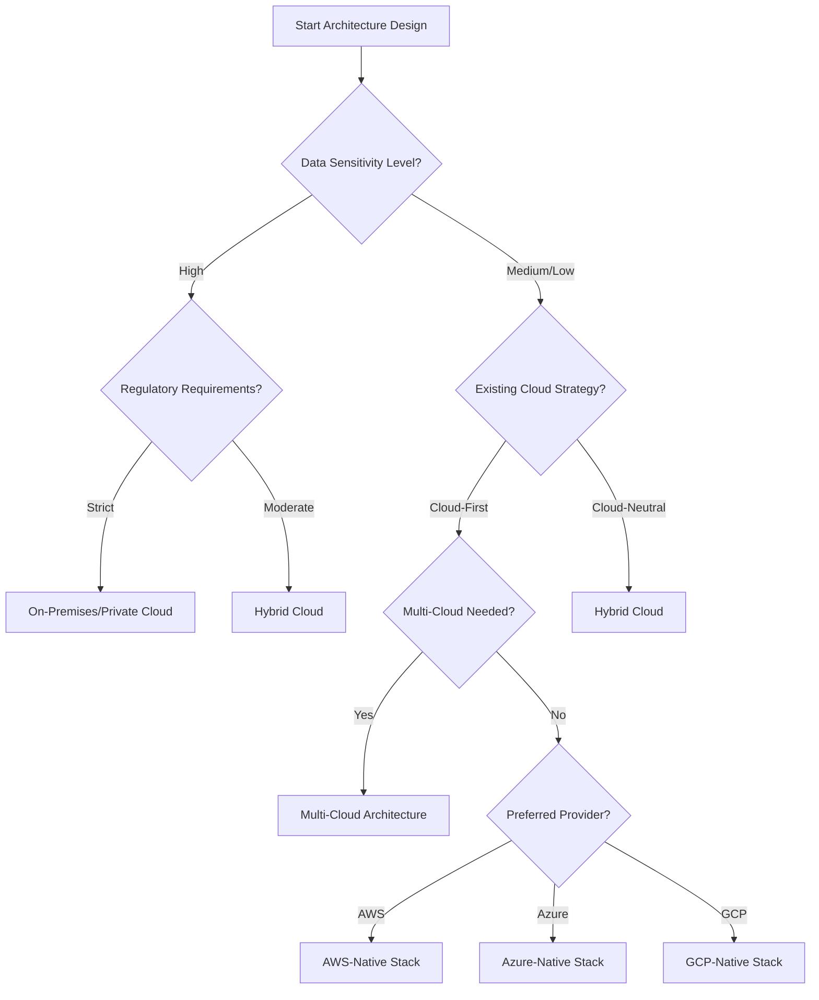

[⬅️ Back to Main SDLC Page](00_data_platform_sdlc.md)

# Architecture & Design for Data Platform Projects
## LLM-Optimized Framework for Solution Architecture

**Purpose:** This document provides a comprehensive, actionable framework for designing data platform architectures, specifically optimized for LLM-assisted solution design and technical decision-making.

---

## 1. 🤖 LLM Architecture Assistant Guide

### LLM Roles in Architecture & Design

**1. Solution Architect**
- Analyze requirements and generate architecture recommendations
- Evaluate technology options using structured comparison frameworks
- Create architecture documentation from high-level specifications

**2. Technical Reviewer**
- Validate architecture decisions against best practices
- Identify potential risks and design flaws
- Suggest improvements and alternatives

**3. Documentation Generator**
- Create ADRs (Architecture Decision Records) from design discussions
- Generate technical specifications and diagrams
- Maintain architecture artifact consistency

**4. Decision Facilitator**
- Guide technology selection using decision trees
- Facilitate architecture review sessions
- Help resolve technical trade-offs and conflicts

### LLM Prompt Templates

**Architecture Analysis:**
```
Analyze the following requirements and generate a high-level data platform architecture:
Requirements: [REQUIREMENTS_SUMMARY]
Constraints: [TECHNICAL_CONSTRAINTS]
Use the architecture patterns from Section 4 and component selection criteria from Section 3.
Output format: Use the architecture template from Section 8.1
```

**Technology Selection:**
```
Recommend technology stack for a [PROJECT_TYPE] data platform with these characteristics:
- Data volume: [VOLUME_SPECS]
- Processing requirements: [BATCH/STREAMING/HYBRID]
- Cloud preference: [AWS/AZURE/GCP/HYBRID]
- Budget constraints: [BUDGET_LEVEL]
Use the decision matrices from Section 3 and provide rationale for each choice.
```

**Architecture Review:**
```
Review this architecture design against the validation criteria in Section 7:
[ARCHITECTURE_DESCRIPTION]
Check for: scalability, security, compliance, cost optimization, and maintainability.
Identify risks and suggest improvements using the review templates.
```

---

## 2. 📊 Architecture Decision Framework

### Decision Tree: Deployment Model Selection



### Decision Matrix: Processing Architecture Pattern

| Use Case Characteristics | Lambda Architecture | Kappa Architecture | Data Mesh | Traditional DW |
|-------------------------|-------------------|-------------------|-----------|----------------|
| **Real-time + Batch** | ✅ Excellent | ⚠️ Complex | ✅ Good | ❌ Poor |
| **Stream-only** | ⚠️ Overkill | ✅ Excellent | ✅ Good | ❌ Poor |
| **Batch-only** | ⚠️ Overkill | ❌ Poor | ✅ Good | ✅ Excellent |
| **Multiple Domains** | ⚠️ Complex | ⚠️ Complex | ✅ Excellent | ⚠️ Monolithic |
| **Single Domain** | ✅ Good | ✅ Good | ⚠️ Overkill | ✅ Excellent |
| **High Complexity** | ✅ Good | ⚠️ Challenging | ✅ Excellent | ⚠️ Limited |

### Technology Selection Scoring Framework

**JSON Template (for automated scoring):**
```json
{
  "evaluation_criteria": {
    "technical_fit": {
      "weight": 0.3,
      "factors": ["performance", "scalability", "reliability"]
    },
    "operational_fit": {
      "weight": 0.25,
      "factors": ["ease_of_use", "monitoring", "maintenance"]
    },
    "strategic_fit": {
      "weight": 0.25,
      "factors": ["vendor_alignment", "skill_availability", "future_roadmap"]
    },
    "cost_efficiency": {
      "weight": 0.2,
      "factors": ["licensing_cost", "operational_cost", "total_cost_of_ownership"]
    }
  },
  "scoring_scale": {
    "5": "Excellent - Exceeds requirements",
    "4": "Good - Meets requirements well",
    "3": "Adequate - Meets basic requirements",
    "2": "Poor - Partially meets requirements",
    "1": "Inadequate - Does not meet requirements"
  }
}
```

**Markdown Table (for manual evaluation):**

| Criteria | Weight | Technology A Score (1-5) | Technology B Score (1-5) | Technology A Weighted | Technology B Weighted |
|---|---|---|---|---|---|
| **Technical Fit** | 30% | | | | |
| **Operational Fit** | 25% | | | | |
| **Strategic Fit** | 25% | | | | |
| **Cost Efficiency** | 20% | | | | |
| **Total** | **100%** | | | **(Sum)** | **(Sum)** |

---

## 3. 🔧 Component Selection Toolkit

### 3.1 Data Ingestion Layer

#### Batch Ingestion Tools Comparison

| Tool | Best For | Pros | Cons | Cost Model |
|------|----------|------|------|------------|
| **AWS Glue** | AWS-native ETL | Serverless, auto-scaling, integrated | AWS lock-in, limited real-time | Pay-per-use |
| **Azure Data Factory** | Azure-native ETL | Visual interface, hybrid connectivity | Azure lock-in, complex pricing | Pay-per-pipeline |
| **Apache Airflow** | Complex workflows | Open source, flexible, extensible | Operational overhead, steep learning curve | Infrastructure cost |
| **Talend** | Enterprise ETL | Rich connectors, data quality features | Expensive licensing, resource intensive | License-based |

#### Streaming Ingestion Tools Comparison

| Tool | Best For | Throughput | Latency | Complexity |
|------|----------|------------|---------|------------|
| **Apache Kafka** | High-volume streaming | Very High | Low | High |
| **AWS Kinesis** | AWS-native streaming | High | Low | Medium |
| **Azure Event Hubs** | Azure-native streaming | High | Low | Medium |
| **Google Pub/Sub** | GCP-native messaging | High | Very Low | Low |

#### Ingestion Tool Selection Template

**JSON Template (for system integration):**
```json
{
  "ingestion_requirement": {
    "requirement_id": "ING-001",
    "data_sources": ["source_types"],
    "volume_requirements": {
      "records_per_second": "number",
      "data_size_per_day": "size_with_units"
    },
    "latency_requirements": {
      "acceptable_delay": "time_specification",
      "processing_type": "batch|streaming|micro-batch"
    },
    "integration_needs": ["target_systems"],
    "transformation_complexity": "simple|moderate|complex",
    "recommended_tools": [
      {
        "tool_name": "selected_tool",
        "rationale": "selection_reasoning",
        "score": "calculated_score"
      }
    ]
  }
}
```

**Markdown Table (for easy use in documents):**

| Requirement ID | Data Sources | Volume | Latency | Recommended Tool | Rationale |
|---|---|---|---|---|---|
| ING-001 | | | | | |
| ING-002 | | | | | |
| ING-003 | | | | | |

### 3.2 Data Storage Layer

#### Storage Architecture Decision Matrix

| Data Characteristics | Data Lake | Data Warehouse | Lakehouse | Operational DB |
|---------------------|-----------|----------------|-----------|----------------|
| **Structured Data** | ✅ Good | ✅ Excellent | ✅ Excellent | ✅ Excellent |
| **Semi-structured** | ✅ Excellent | ⚠️ Limited | ✅ Excellent | ⚠️ Limited |
| **Unstructured** | ✅ Excellent | ❌ Poor | ✅ Good | ❌ Poor |
| **Real-time Analytics** | ❌ Poor | ✅ Good | ✅ Excellent | ✅ Excellent |
| **Historical Analysis** | ✅ Excellent | ✅ Excellent | ✅ Excellent | ⚠️ Limited |
| **Cost for Large Data** | ✅ Excellent | ⚠️ Expensive | ✅ Good | ❌ Very Expensive |

#### Cloud Storage Service Comparison

```json
{
  "storage_services": {
    "aws": {
      "data_lake": "S3 + Glue Catalog",
      "data_warehouse": "Redshift",
      "lakehouse": "S3 + Athena/EMR",
      "operational": "RDS/DynamoDB"
    },
    "azure": {
      "data_lake": "ADLS Gen2 + Purview",
      "data_warehouse": "Synapse Analytics",
      "lakehouse": "ADLS + Synapse",
      "operational": "SQL Database/Cosmos DB"
    },
    "gcp": {
      "data_lake": "Cloud Storage + Dataproc",
      "data_warehouse": "BigQuery",
      "lakehouse": "BigQuery + Cloud Storage",
      "operational": "Cloud SQL/Firestore"
    }
  }
}
```

### 3.3 Data Processing Layer

#### Processing Engine Selection Guide

**Apache Spark:**
- **Best for:** Large-scale batch processing, complex transformations
- **Strengths:** Mature ecosystem, multiple language support, unified batch/stream
- **Weaknesses:** Resource intensive, complex tuning
- **Use cases:** ETL pipelines, machine learning, complex analytics

**Apache Flink:**
- **Best for:** Low-latency stream processing, event-driven applications
- **Strengths:** True streaming, low latency, exactly-once processing
- **Weaknesses:** Smaller ecosystem, steeper learning curve
- **Use cases:** Real-time analytics, fraud detection, IoT processing

**Cloud-Native Options:**
```json
{
  "cloud_processing_services": {
    "aws": {
      "batch": "EMR, Glue, Batch",
      "streaming": "Kinesis Analytics, EMR",
      "serverless": "Lambda, Glue"
    },
    "azure": {
      "batch": "HDInsight, Databricks, Synapse",
      "streaming": "Stream Analytics, Databricks",
      "serverless": "Functions, Logic Apps"
    },
    "gcp": {
      "batch": "Dataproc, Dataflow",
      "streaming": "Dataflow, Pub/Sub",
      "serverless": "Cloud Functions, Cloud Run"
    }
  }
}
```

---

## 4. 🏗️ Architecture Pattern Library

### 4.1 Lambda Architecture

**When to Use:**
- Need both real-time and batch processing
- Historical data reprocessing requirements
- Different SLAs for real-time vs batch analytics

**Components:**
```json
{
  "lambda_architecture": {
    "batch_layer": {
      "purpose": "comprehensive_and_accurate_views",
      "technologies": ["Hadoop", "Spark", "Hive"],
      "characteristics": ["high_latency", "high_throughput", "fault_tolerant"]
    },
    "speed_layer": {
      "purpose": "real_time_views",
      "technologies": ["Storm", "Flink", "Kafka_Streams"],
      "characteristics": ["low_latency", "approximate_results", "incremental"]
    },
    "serving_layer": {
      "purpose": "query_interface",
      "technologies": ["HBase", "Cassandra", "ElasticSearch"],
      "characteristics": ["random_access", "low_latency_queries"]
    }
  }
}
```

**Implementation Template:**
```yaml
lambda_architecture:
  ingestion:
    - kafka_cluster: "high-throughput message broker"
    - batch_ingestion: "scheduled data loads"
  
  batch_processing:
    - spark_cluster: "historical data processing"
    - data_lake: "raw data storage"
    - batch_views: "pre-computed aggregations"
  
  stream_processing:
    - flink_cluster: "real-time processing"
    - real_time_views: "incremental updates"
  
  serving:
    - query_engine: "unified query interface"
    - caching_layer: "performance optimization"
```

### 4.2 Kappa Architecture

**When to Use:**
- Stream-first processing requirements
- Simplified architecture preferred
- Reprocessing can be handled by replaying streams

**Implementation Pattern:**
```json
{
  "kappa_architecture": {
    "stream_processing": {
      "primary_path": "all_data_as_streams",
      "reprocessing": "replay_from_log",
      "technologies": ["Kafka", "Flink", "Kafka_Streams"]
    },
    "advantages": [
      "simplified_architecture",
      "single_code_base",
      "easier_maintenance"
    ],
    "challenges": [
      "stream_reprocessing_complexity",
      "state_management",
      "exactly_once_semantics"
    ]
  }
}
```

### 4.3 Data Mesh Architecture

**When to Use:**
- Large organization with multiple domains
- Decentralized data ownership model
- Need for domain-specific data products

**Core Principles:**
```json
{
  "data_mesh_principles": {
    "domain_ownership": {
      "description": "domain_teams_own_their_data",
      "implementation": "decentralized_data_products"
    },
    "data_as_product": {
      "description": "treat_data_as_product",
      "implementation": "product_thinking_for_data"
    },
    "self_serve_platform": {
      "description": "infrastructure_as_platform",
      "implementation": "common_data_infrastructure"
    },
    "federated_governance": {
      "description": "global_standards_local_implementation",
      "implementation": "governance_automation"
    }
  }
}
```

---

## 5. 📋 Architecture Documentation Templates

### 5.1 Architecture Decision Record (ADR) Template

```markdown
# ADR-001: [Decision Title]

## Status
[Proposed | Accepted | Deprecated | Superseded]

## Context
[Describe the forces at play, including technological, political, social, and project local]

## Decision
[State the architecture decision and explain why this particular solution was chosen]

## Consequences
### Positive
- [List positive outcomes]

### Negative
- [List negative outcomes and risks]

### Neutral
- [List neutral consequences]

## Alternatives Considered
1. **Alternative 1**: [Description and why rejected]
2. **Alternative 2**: [Description and why rejected]

## Implementation Notes
[Any specific implementation guidance or constraints]

## Related Decisions
- [Links to related ADRs]
```

### 5.2 High-Level Architecture Template

```json
{
  "architecture_overview": {
    "project_name": "project_identifier",
    "architecture_style": "lambda|kappa|data_mesh|traditional",
    "deployment_model": "cloud|hybrid|on_premises",
    "primary_cloud_provider": "aws|azure|gcp|multi_cloud",
    
    "data_flow": {
      "ingestion_layer": {
        "batch_tools": ["tool_list"],
        "streaming_tools": ["tool_list"],
        "data_sources": ["source_list"]
      },
      "storage_layer": {
        "raw_data": "storage_solution",
        "processed_data": "storage_solution",
        "serving_layer": "storage_solution"
      },
      "processing_layer": {
        "batch_processing": "processing_engine",
        "stream_processing": "processing_engine",
        "orchestration": "workflow_tool"
      },
      "consumption_layer": {
        "analytics_tools": ["tool_list"],
        "api_layer": "api_technology",
        "visualization": "bi_tools"
      }
    },
    
    "cross_cutting_concerns": {
      "security": "security_approach",
      "monitoring": "monitoring_solution",
      "governance": "governance_framework",
      "disaster_recovery": "dr_strategy"
    }
  }
}
```

### 5.3 Non-Functional Requirements Matrix

| Category | Requirement | Target | Measurement | Priority |
|----------|-------------|---------|-------------|----------|
| **Performance** | Data Processing Throughput | X records/second | Processing metrics | High |
| **Performance** | Query Response Time | < X seconds | Query performance logs | High |
| **Availability** | System Uptime | 99.9% | Monitoring dashboards | High |
| **Scalability** | Data Volume Growth | X% per year | Storage metrics | Medium |
| **Security** | Data Encryption | At rest and in transit | Security audits | High |
| **Compliance** | Data Retention | X years | Governance reports | High |
| **Cost** | Monthly Operating Cost | < $X | Cost monitoring | Medium |

---

## 6. 🔒 Security & Compliance Architecture

### 6.1 Security Architecture Template

```json
{
  "security_architecture": {
    "identity_and_access": {
      "authentication": {
        "methods": ["SSO", "MFA", "API_keys"],
        "providers": ["Azure_AD", "AWS_IAM", "LDAP"]
      },
      "authorization": {
        "model": "RBAC|ABAC|ACL",
        "granularity": "table|column|row_level",
        "implementation": "native|external_service"
      }
    },
    
    "data_protection": {
      "encryption": {
        "at_rest": {
          "method": "AES_256|customer_managed_keys",
          "key_management": "cloud_kms|hsm|external"
        },
        "in_transit": {
          "method": "TLS_1.3|mTLS",
          "certificate_management": "automated|manual"
        }
      },
      "data_masking": {
        "techniques": ["tokenization", "pseudonymization", "anonymization"],
        "scope": ["development", "testing", "analytics"]
      }
    },
    
    "network_security": {
      "network_isolation": "VPC|VNET|private_networks",
      "firewall_rules": "restrictive_by_default",
      "monitoring": "network_traffic_analysis"
    },
    
    "audit_and_compliance": {
      "logging": {
        "scope": ["access_logs", "data_changes", "admin_actions"],
        "retention": "compliance_requirements",
        "analysis": "SIEM_integration"
      },
      "compliance_frameworks": ["GDPR", "HIPAA", "SOX", "PCI_DSS"]
    }
  }
}
```

### 6.2 Compliance Requirements Checklist

**GDPR Compliance:**
- [ ] Data subject consent management
- [ ] Right to be forgotten implementation
- [ ] Data portability capabilities
- [ ] Privacy by design principles
- [ ] Data protection impact assessments

**HIPAA Compliance (Healthcare):**
- [ ] Administrative safeguards
- [ ] Physical safeguards
- [ ] Technical safeguards
- [ ] Business associate agreements
- [ ] Breach notification procedures

**SOX Compliance (Financial):**
- [ ] Data integrity controls
- [ ] Access controls and segregation of duties
- [ ] Change management processes
- [ ] Audit trail maintenance
- [ ] Financial reporting controls

---

## 7. ✅ Architecture Validation & Review Framework

### 7.1 Architecture Review Checklist

**Scalability Assessment:**
- [ ] Horizontal scaling capabilities identified
- [ ] Vertical scaling limits documented
- [ ] Auto-scaling policies defined
- [ ] Performance bottlenecks analyzed
- [ ] Capacity planning completed

**Security Review:**
- [ ] Threat model completed
- [ ] Security controls implemented
- [ ] Compliance requirements addressed
- [ ] Penetration testing planned
- [ ] Security monitoring configured

**Operational Readiness:**
- [ ] Monitoring and alerting designed
- [ ] Backup and recovery procedures defined
- [ ] Disaster recovery plan created
- [ ] Operational runbooks prepared
- [ ] Support procedures documented

**Cost Optimization:**
- [ ] Cost model developed
- [ ] Resource optimization opportunities identified
- [ ] Reserved capacity planning completed
- [ ] Cost monitoring and alerting configured
- [ ] Regular cost review process defined

### 7.2 Architecture Quality Gates

**Gate 1: Conceptual Architecture**
- High-level architecture approved
- Technology stack selected
- Major design decisions documented
- Stakeholder alignment achieved

**Gate 2: Detailed Design**
- Detailed component specifications completed
- Integration points defined
- Security architecture validated
- Performance requirements addressed

**Gate 3: Implementation Readiness**
- Implementation plan approved
- Resource requirements confirmed
- Risk mitigation strategies defined
- Go-live criteria established

### 7.3 Risk Assessment Framework

```json
{
  "architecture_risks": {
    "technical_risks": [
      {
        "risk": "technology_vendor_lock_in",
        "probability": "medium",
        "impact": "high",
        "mitigation": "multi_cloud_strategy"
      },
      {
        "risk": "performance_bottlenecks",
        "probability": "medium",
        "impact": "medium",
        "mitigation": "performance_testing_and_monitoring"
      }
    ],
    "operational_risks": [
      {
        "risk": "skills_gap",
        "probability": "high",
        "impact": "medium",
        "mitigation": "training_and_knowledge_transfer"
      }
    ],
    "business_risks": [
      {
        "risk": "changing_requirements",
        "probability": "medium",
        "impact": "medium",
        "mitigation": "flexible_architecture_design"
      }
    ]
  }
}
```

---

## 8. 📚 Architecture Scenarios & Examples

### 8.1 Scenario: E-commerce Analytics Platform

**Business Context:**
Large e-commerce company needs real-time personalization and batch analytics for business intelligence.

**Requirements:**
- Real-time product recommendations (< 100ms)
- Daily business reports and dashboards
- Customer behavior analysis
- Inventory optimization
- Fraud detection

**Recommended Architecture:**
```json
{
  "ecommerce_architecture": {
    "architecture_pattern": "lambda_architecture",
    "cloud_provider": "aws",
    
    "ingestion_layer": {
      "real_time": "Amazon Kinesis Data Streams",
      "batch": "AWS Glue",
      "data_sources": ["web_clickstream", "mobile_app", "transaction_system"]
    },
    
    "storage_layer": {
      "raw_data": "Amazon S3 Data Lake",
      "processed_data": "Amazon Redshift",
      "real_time_cache": "Amazon ElastiCache"
    },
    
    "processing_layer": {
      "batch": "Amazon EMR (Spark)",
      "streaming": "Amazon Kinesis Analytics",
      "orchestration": "AWS Step Functions"
    },
    
    "serving_layer": {
      "analytics": "Amazon QuickSight",
      "api": "Amazon API Gateway + Lambda",
      "ml_models": "Amazon SageMaker"
    },
    
    "key_decisions": [
      {
        "decision": "lambda_architecture",
        "rationale": "need_both_real_time_and_batch_processing"
      },
      {
        "decision": "aws_native_stack",
        "rationale": "existing_aws_infrastructure_and_expertise"
      }
    ]
  }
}
```

### 8.2 Scenario: IoT Data Processing System

**Business Context:**
Manufacturing company needs to process sensor data from factory equipment for predictive maintenance.

**Requirements:**
- Process 1M+ sensor readings per second
- Real-time anomaly detection
- Historical trend analysis
- Predictive maintenance models
- Equipment dashboard and alerts

**Recommended Architecture:**
```json
{
  "iot_architecture": {
    "architecture_pattern": "kappa_architecture",
    "cloud_provider": "azure",
    
    "ingestion_layer": {
      "iot_gateway": "Azure IoT Hub",
      "message_broker": "Azure Event Hubs",
      "protocol_support": ["MQTT", "HTTPS", "AMQP"]
    },
    
    "processing_layer": {
      "stream_processing": "Azure Stream Analytics",
      "complex_processing": "Azure Databricks",
      "ml_pipeline": "Azure Machine Learning"
    },
    
    "storage_layer": {
      "hot_path": "Azure Cosmos DB",
      "warm_path": "Azure SQL Database",
      "cold_path": "Azure Data Lake Storage"
    },
    
    "analytics_layer": {
      "real_time_dashboard": "Power BI",
      "alerts": "Azure Monitor",
      "api": "Azure Functions"
    },
    
    "key_decisions": [
      {
        "decision": "kappa_architecture",
        "rationale": "stream_first_processing_requirements"
      },
      {
        "decision": "azure_iot_suite",
        "rationale": "integrated_iot_capabilities"
      }
    ]
  }
}
```

---

## 9. 🔄 Architecture Evolution & Maintenance

### 9.1 Architecture Lifecycle Management

**Continuous Architecture Review:**
- Quarterly architecture health checks
- Technology roadmap alignment reviews
- Performance and cost optimization reviews
- Security and compliance updates

**Evolution Triggers:**
- Business requirement changes
- Technology advancement opportunities
- Performance or scalability issues
- Security or compliance updates
- Cost optimization opportunities

### 9.2 Architecture Debt Management

```json
{
  "architecture_debt": {
    "identification": {
      "technical_debt": "outdated_technologies_or_patterns",
      "design_debt": "suboptimal_architectural_decisions",
      "documentation_debt": "outdated_or_missing_documentation"
    },
    "prioritization": {
      "criteria": ["business_impact", "technical_risk", "maintenance_cost"],
      "scoring": "weighted_scoring_model"
    },
    "remediation": {
      "planning": "incremental_improvement_roadmap",
      "execution": "phased_modernization_approach"
    }
  }
}
```

---

## 10. 🚀 Implementation Transition

### 10.1 Architecture to Implementation Handoff

**Documentation Package:**
- [ ] High-level and detailed architecture diagrams
- [ ] Technology selection rationale (ADRs)
- [ ] Non-functional requirements specifications
- [ ] Security and compliance requirements
- [ ] Integration specifications and APIs
- [ ] Deployment and infrastructure requirements

**Knowledge Transfer:**
- [ ] Architecture walkthrough sessions
- [ ] Technology deep-dive sessions
- [ ] Implementation guidance and best practices
- [ ] Risk mitigation strategies
- [ ] Performance and monitoring requirements

### 10.2 Implementation Validation

**Architecture Compliance Checks:**
- [ ] Implementation matches approved design
- [ ] Technology choices align with ADRs
- [ ] Security controls properly implemented
- [ ] Performance requirements validated
- [ ] Integration points tested

---

## 11. 📖 Quick Reference

### LLM Architecture Prompts

**Generate Architecture Options:**
```
Based on these requirements: [REQUIREMENTS], generate 3 architecture options:
1. Conservative approach (proven technologies, lower risk)
2. Balanced approach (mix of proven and modern technologies)
3. Innovative approach (cutting-edge technologies, higher risk)
For each option, provide: technology stack, pros/cons, cost estimate, implementation timeline.
```

**Technology Comparison:**
```
Compare [TECHNOLOGY_A] vs [TECHNOLOGY_B] for [USE_CASE] using the scoring framework from Section 2.
Consider: technical fit, operational fit, strategic fit, cost efficiency.
Provide recommendation with rationale.
```

**Architecture Validation:**
```
Validate this architecture against the quality gates in Section 7.2:
[ARCHITECTURE_SPECIFICATION]
Check compliance with: scalability, security, operational readiness, cost optimization.
```

### Common Architecture Anti-Patterns

1. **Technology-First Design:** Choosing technologies before understanding requirements
2. **Over-Engineering:** Building complex solutions for simple problems
3. **Vendor Lock-in Blindness:** Ignoring multi-cloud or hybrid strategies
4. **Security Afterthought:** Adding security controls after architecture design
5. **Monolithic Data Platform:** Single large system instead of modular components

### Architecture Success Patterns

1. **Requirements-Driven Design:** Architecture decisions based on clear requirements
2. **Modular Architecture:** Loosely coupled components with clear interfaces
3. **Cloud-Native Thinking:** Leveraging cloud services and patterns effectively
4. **Security by Design:** Integrating security controls from the beginning
5. **Evolutionary Architecture:** Designing for change and continuous improvement

---

*This document is designed for LLM-assisted architecture design sessions. Use the templates, frameworks, and decision matrices to guide comprehensive and effective data platform architecture development.*
