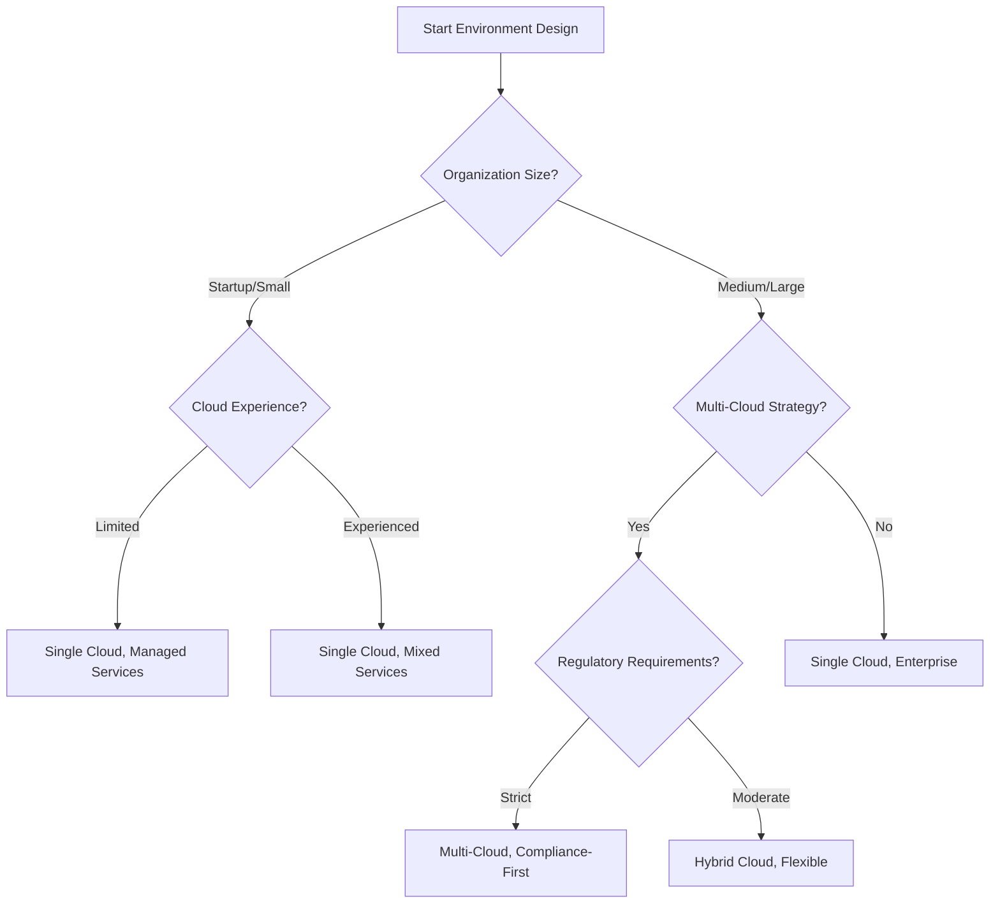

[⬅️ Back to Main SDLC Page](00_data_platform_sdlc.md)

# Environment Setup & Provisioning for Data Platform Projects
## LLM-Optimized Framework for Infrastructure Automation

**Purpose:** This document provides a comprehensive, actionable framework for setting up and provisioning data platform environments, specifically optimized for LLM-assisted infrastructure automation and DevOps practices.

---

## 1. 🤖 LLM Environment Assistant Guide

### LLM Roles in Environment Setup

**1. Infrastructure Architect**
- Generate infrastructure-as-code from requirements
- Design environment topology and resource allocation
- Create security and networking configurations

**2. DevOps Engineer**
- Build and optimize CI/CD pipelines
- Automate deployment and rollback procedures
- Configure monitoring and alerting systems

**3. Security Validator**
- Validate security configurations against best practices
- Generate compliance reports and remediation plans
- Implement identity and access management policies

**4. Cost Optimizer**
- Analyze resource utilization and costs
- Recommend optimization strategies
- Generate cost monitoring and alerting configurations

### LLM Prompt Templates

**Infrastructure Generation:**
```
Generate infrastructure-as-code for a [CLOUD_PROVIDER] data platform with these requirements:
- Environment type: [DEV/TEST/PROD]
- Data volume: [VOLUME_SPECS]
- Processing needs: [BATCH/STREAMING/HYBRID]
- Security requirements: [COMPLIANCE_FRAMEWORKS]
- Budget constraints: [COST_LIMITS]
Use the templates from Section 3 and security patterns from Section 4.
```

**Pipeline Configuration:**
```
Create a CI/CD pipeline for [PROJECT_TYPE] with these characteristics:
- Source control: [GIT_PROVIDER]
- Target environments: [ENVIRONMENT_LIST]
- Deployment strategy: [BLUE_GREEN/CANARY/ROLLING]
- Testing requirements: [TEST_TYPES]
Use the pipeline templates from Section 5 and include automated validation.
```

**Troubleshooting Assistant:**
```
Diagnose this environment issue: [PROBLEM_DESCRIPTION]
Environment details: [ENVIRONMENT_SPECS]
Error logs: [ERROR_LOGS]
Provide step-by-step troubleshooting using the diagnostic framework from Section 8.
```

---

## 2. 📊 Environment Strategy Decision Framework

### Decision Tree: Environment Architecture



### Environment Tier Strategy Matrix

| Organization Type | Dev Environment | Test Environment | Prod Environment | DR Strategy |
|------------------|-----------------|------------------|------------------|-------------|
| **Startup** | Shared, Cost-Optimized | Prod-Like, Scaled Down | Single Region, Managed | Backup + RTO 24h |
| **SMB** | Individual, Basic | Dedicated, Prod-Like | Multi-AZ, Managed | Active-Passive |
| **Enterprise** | Individual, Full-Featured | Multiple Tiers | Multi-Region | Active-Active |
| **Regulated** | Isolated, Compliant | Prod Mirror | Geo-Distributed | Zero-Downtime |

### Infrastructure-as-Code Tool Selection

**JSON Template (for system integration):**
```json
{
  "iac_tool_comparison": {
    "terraform": {
      "strengths": ["multi_cloud", "large_ecosystem", "mature"],
      "weaknesses": ["state_management", "learning_curve"],
      "best_for": ["multi_cloud", "complex_infrastructure", "team_collaboration"],
      "cost_model": "open_source_plus_enterprise_features"
    },
    "aws_cloudformation": {
      "strengths": ["aws_native", "integrated", "no_state_files"],
      "weaknesses": ["aws_only", "verbose_syntax"],
      "best_for": ["aws_only", "simple_to_medium_complexity"],
      "cost_model": "free"
    },
    "azure_bicep": {
      "strengths": ["azure_native", "clean_syntax", "type_safety"],
      "weaknesses": ["azure_only", "newer_ecosystem"],
      "best_for": ["azure_only", "modern_development"],
      "cost_model": "free"
    },
    "pulumi": {
      "strengths": ["programming_languages", "testing", "policy_as_code"],
      "weaknesses": ["complexity", "smaller_community"],
      "best_for": ["developer_teams", "complex_logic", "testing"],
      "cost_model": "open_source_plus_saas"
    }
  }
}
```

**Markdown Table (for easy comparison):**

| Tool | Best For | Strengths | Weaknesses |
|---|---|---|---|
| **Terraform** | Multi-cloud, complex infrastructure | Multi-cloud, large ecosystem, mature | State management, learning curve |
| **AWS CloudFormation** | AWS-only, simple to medium complexity | AWS-native, integrated, no state files | AWS-only, verbose syntax |
| **Azure Bicep** | Azure-only, modern development | Azure-native, clean syntax, type safety | Azure-only, newer ecosystem |
| **Pulumi** | Developer teams, complex logic | Uses programming languages, testing | Complexity, smaller community |

---

## 3. 🏗️ Infrastructure-as-Code Toolkit

### 3.1 Multi-Cloud Environment Templates

#### AWS Data Platform Template (Terraform)

```hcl
# AWS Data Platform - Production Environment
terraform {
  required_providers {
    aws = {
      source  = "hashicorp/aws"
      version = "~> 5.0"
    }
  }
  backend "s3" {
    bucket = "your-terraform-state-bucket"
    key    = "data-platform/prod/terraform.tfstate"
    region = "us-west-2"
  }
}

# Variables
variable "environment" {
  description = "Environment name"
  type        = string
  default     = "prod"
}

variable "project_name" {
  description = "Project name for resource naming"
  type        = string
}

variable "data_retention_days" {
  description = "Data retention period in days"
  type        = number
  default     = 2555  # 7 years
}

# VPC and Networking
resource "aws_vpc" "data_platform" {
  cidr_block           = "10.0.0.0/16"
  enable_dns_hostnames = true
  enable_dns_support   = true

  tags = {
    Name        = "${var.project_name}-${var.environment}-vpc"
    Environment = var.environment
    Project     = var.project_name
  }
}

resource "aws_subnet" "private" {
  count             = 3
  vpc_id            = aws_vpc.data_platform.id
  cidr_block        = "10.0.${count.index + 1}.0/24"
  availability_zone = data.aws_availability_zones.available.names[count.index]

  tags = {
    Name = "${var.project_name}-${var.environment}-private-${count.index + 1}"
    Type = "Private"
  }
}

# S3 Data Lake
resource "aws_s3_bucket" "data_lake" {
  bucket = "${var.project_name}-${var.environment}-data-lake"

  tags = {
    Name        = "${var.project_name}-${var.environment}-data-lake"
    Environment = var.environment
    Purpose     = "DataLake"
  }
}

resource "aws_s3_bucket_versioning" "data_lake" {
  bucket = aws_s3_bucket.data_lake.id
  versioning_configuration {
    status = "Enabled"
  }
}

resource "aws_s3_bucket_encryption" "data_lake" {
  bucket = aws_s3_bucket.data_lake.id

  server_side_encryption_configuration {
    rule {
      apply_server_side_encryption_by_default {
        sse_algorithm = "AES256"
      }
    }
  }
}

# Redshift Data Warehouse
resource "aws_redshift_cluster" "data_warehouse" {
  cluster_identifier     = "${var.project_name}-${var.environment}-dw"
  database_name         = "datawarehouse"
  master_username       = "admin"
  master_password       = random_password.redshift_password.result
  node_type            = "dc2.large"
  cluster_type         = "multi-node"
  number_of_nodes      = 2
  
  vpc_security_group_ids = [aws_security_group.redshift.id]
  db_subnet_group_name   = aws_redshift_subnet_group.main.name
  
  encrypted = true
  
  tags = {
    Name        = "${var.project_name}-${var.environment}-dw"
    Environment = var.environment
  }
}

# EMR Cluster for Processing
resource "aws_emr_cluster" "data_processing" {
  name          = "${var.project_name}-${var.environment}-emr"
  release_label = "emr-6.15.0"
  applications  = ["Spark", "Hadoop", "Hive"]

  ec2_attributes {
    subnet_id                         = aws_subnet.private[0].id
    emr_managed_master_security_group = aws_security_group.emr_master.id
    emr_managed_slave_security_group  = aws_security_group.emr_slave.id
    instance_profile                  = aws_iam_instance_profile.emr_profile.arn
  }

  master_instance_group {
    instance_type = "m5.xlarge"
  }

  core_instance_group {
    instance_type  = "m5.large"
    instance_count = 2

    ebs_config {
      size                 = 40
      type                 = "gp2"
      volumes_per_instance = 1
    }
  }

  tags = {
    Name        = "${var.project_name}-${var.environment}-emr"
    Environment = var.environment
  }

  service_role = aws_iam_role.emr_service_role.arn
}

# Outputs
output "data_lake_bucket" {
  value = aws_s3_bucket.data_lake.bucket
}

output "redshift_endpoint" {
  value = aws_redshift_cluster.data_warehouse.endpoint
}

output "emr_cluster_id" {
  value = aws_emr_cluster.data_processing.id
}
```

#### Azure Data Platform Template (Bicep)

```bicep
// Azure Data Platform - Production Environment
@description('Environment name')
param environment string = 'prod'

@description('Project name for resource naming')
param projectName string

@description('Location for all resources')
param location string = resourceGroup().location

@description('Data retention period in days')
param dataRetentionDays int = 2555

// Variables
var resourcePrefix = '${projectName}-${environment}'

// Virtual Network
resource vnet 'Microsoft.Network/virtualNetworks@2023-04-01' = {
  name: '${resourcePrefix}-vnet'
  location: location
  properties: {
    addressSpace: {
      addressPrefixes: [
        '10.0.0.0/16'
      ]
    }
    subnets: [
      {
        name: 'data-subnet'
        properties: {
          addressPrefix: '10.0.1.0/24'
          serviceEndpoints: [
            {
              service: 'Microsoft.Storage'
            }
            {
              service: 'Microsoft.Sql'
            }
          ]
        }
      }
    ]
  }
  tags: {
    Environment: environment
    Project: projectName
  }
}

// Storage Account for Data Lake
resource dataLakeStorage 'Microsoft.Storage/storageAccounts@2023-01-01' = {
  name: '${replace(resourcePrefix, '-', '')}datalake'
  location: location
  sku: {
    name: 'Standard_LRS'
  }
  kind: 'StorageV2'
  properties: {
    isHnsEnabled: true
    encryption: {
      services: {
        blob: {
          enabled: true
        }
        file: {
          enabled: true
        }
      }
      keySource: 'Microsoft.Storage'
    }
    networkAcls: {
      defaultAction: 'Deny'
      virtualNetworkRules: [
        {
          id: '${vnet.id}/subnets/data-subnet'
          action: 'Allow'
        }
      ]
    }
  }
  tags: {
    Environment: environment
    Project: projectName
    Purpose: 'DataLake'
  }
}

// Synapse Analytics Workspace
resource synapseWorkspace 'Microsoft.Synapse/workspaces@2021-06-01' = {
  name: '${resourcePrefix}-synapse'
  location: location
  properties: {
    defaultDataLakeStorage: {
      accountUrl: dataLakeStorage.properties.primaryEndpoints.dfs
      filesystem: 'default'
    }
    sqlAdministratorLogin: 'sqladmin'
    sqlAdministratorLoginPassword: 'P@ssw0rd123!' // Use Key Vault in production
  }
  identity: {
    type: 'SystemAssigned'
  }
  tags: {
    Environment: environment
    Project: projectName
  }
}

// Dedicated SQL Pool
resource sqlPool 'Microsoft.Synapse/workspaces/sqlPools@2021-06-01' = {
  parent: synapseWorkspace
  name: 'datawarehouse'
  location: location
  sku: {
    name: 'DW100c'
  }
  properties: {
    createMode: 'Default'
    collation: 'SQL_Latin1_General_CP1_CI_AS'
  }
  tags: {
    Environment: environment
    Project: projectName
  }
}

// Apache Spark Pool
resource sparkPool 'Microsoft.Synapse/workspaces/bigDataPools@2021-06-01' = {
  parent: synapseWorkspace
  name: 'sparkpool'
  location: location
  properties: {
    nodeCount: 3
    nodeSizeFamily: 'MemoryOptimized'
    nodeSize: 'Small'
    autoScale: {
      enabled: true
      minNodeCount: 3
      maxNodeCount: 10
    }
    autoPause: {
      enabled: true
      delayInMinutes: 15
    }
    sparkVersion: '3.3'
  }
  tags: {
    Environment: environment
    Project: projectName
  }
}

// Outputs
output dataLakeStorageAccount string = dataLakeStorage.name
output synapseWorkspaceName string = synapseWorkspace.name
output sqlPoolName string = sqlPool.name
output sparkPoolName string = sparkPool.name
```

### 3.2 Environment Configuration Templates

#### Environment Variables Template

**JSON Template (for IaC automation):**
```json
{
  "environment_config": {
    "development": {
      "resource_sizing": "small",
      "auto_scaling": false,
      "backup_retention": 7,
      "monitoring_level": "basic",
      "cost_optimization": "aggressive",
      "security_level": "standard"
    },
    "testing": {
      "resource_sizing": "medium",
      "auto_scaling": true,
      "backup_retention": 30,
      "monitoring_level": "detailed",
      "cost_optimization": "moderate",
      "security_level": "enhanced"
    },
    "production": {
      "resource_sizing": "large",
      "auto_scaling": true,
      "backup_retention": 2555,
      "monitoring_level": "comprehensive",
      "cost_optimization": "balanced",
      "security_level": "maximum"
    }
  },
  "resource_templates": {
    "small": {
      "compute_instances": "t3.medium",
      "storage_tier": "standard",
      "database_size": "db.t3.micro"
    },
    "medium": {
      "compute_instances": "m5.large",
      "storage_tier": "standard",
      "database_size": "db.m5.large"
    },
    "large": {
      "compute_instances": "m5.2xlarge",
      "storage_tier": "premium",
      "database_size": "db.m5.2xlarge"
    }
  }
}
```

**Markdown Table (for easy reference):**

| Environment | Resource Sizing | Auto Scaling | Backup Retention (Days) | Monitoring | Cost Strategy |
|---|---|---|---|---|---|
| **Development** | Small | Off | 7 | Basic | Aggressive |
| **Testing** | Medium | On | 30 | Detailed | Moderate |
| **Production** | Large | On | 2555 | Comprehensive | Balanced |

---

## 4. 🔒 Security & Compliance Automation

### 4.1 Security Baseline Templates

#### AWS Security Configuration

```yaml
# AWS Security Baseline - Terraform Variables
security_config:
  encryption:
    s3_default_encryption: "AES256"
    rds_encryption: true
    ebs_encryption: true
    kms_key_rotation: true
  
  network_security:
    vpc_flow_logs: true
    security_groups:
      default_ingress: "deny_all"
      ssh_access: "bastion_only"
      database_access: "private_subnets_only"
  
  access_control:
    mfa_required: true
    password_policy:
      min_length: 14
      require_symbols: true
      require_numbers: true
      require_uppercase: true
      require_lowercase: true
    session_timeout: 3600
  
  monitoring:
    cloudtrail_enabled: true
    config_enabled: true
    guardduty_enabled: true
    security_hub_enabled: true
  
  compliance:
    frameworks: ["SOC2", "ISO27001", "GDPR"]
    data_classification: "required"
    audit_logging: "comprehensive"
```

#### Security Group Templates

```hcl
# Web Tier Security Group
resource "aws_security_group" "web_tier" {
  name_prefix = "${var.project_name}-${var.environment}-web-"
  vpc_id      = aws_vpc.data_platform.id

  ingress {
    from_port   = 443
    to_port     = 443
    protocol    = "tcp"
    cidr_blocks = ["0.0.0.0/0"]
    description = "HTTPS from internet"
  }

  ingress {
    from_port   = 80
    to_port     = 80
    protocol    = "tcp"
    cidr_blocks = ["0.0.0.0/0"]
    description = "HTTP from internet"
  }

  egress {
    from_port   = 0
    to_port     = 0
    protocol    = "-1"
    cidr_blocks = ["0.0.0.0/0"]
    description = "All outbound traffic"
  }

  tags = {
    Name = "${var.project_name}-${var.environment}-web-sg"
    Tier = "Web"
  }
}

# Application Tier Security Group
resource "aws_security_group" "app_tier" {
  name_prefix = "${var.project_name}-${var.environment}-app-"
  vpc_id      = aws_vpc.data_platform.id

  ingress {
    from_port       = 8080
    to_port         = 8080
    protocol        = "tcp"
    security_groups = [aws_security_group.web_tier.id]
    description     = "Application port from web tier"
  }

  egress {
    from_port   = 0
    to_port     = 0
    protocol    = "-1"
    cidr_blocks = ["0.0.0.0/0"]
    description = "All outbound traffic"
  }

  tags = {
    Name = "${var.project_name}-${var.environment}-app-sg"
    Tier = "Application"
  }
}

# Database Tier Security Group
resource "aws_security_group" "db_tier" {
  name_prefix = "${var.project_name}-${var.environment}-db-"
  vpc_id      = aws_vpc.data_platform.id

  ingress {
    from_port       = 5432
    to_port         = 5432
    protocol        = "tcp"
    security_groups = [aws_security_group.app_tier.id]
    description     = "PostgreSQL from application tier"
  }

  ingress {
    from_port       = 5439
    to_port         = 5439
    protocol        = "tcp"
    security_groups = [aws_security_group.app_tier.id]
    description     = "Redshift from application tier"
  }

  tags = {
    Name = "${var.project_name}-${var.environment}-db-sg"
    Tier = "Database"
  }
}
```

### 4.2 Identity and Access Management Templates

#### IAM Role Templates

```json
{
  "iam_roles": {
    "data_engineer_role": {
      "description": "Role for data engineers with data platform access",
      "policies": [
        {
          "policy_name": "DataLakeAccess",
          "permissions": [
            "s3:GetObject",
            "s3:PutObject",
            "s3:DeleteObject",
            "s3:ListBucket"
          ],
          "resources": [
            "arn:aws:s3:::${data_lake_bucket}/*",
            "arn:aws:s3:::${data_lake_bucket}"
          ]
        },
        {
          "policy_name": "EMRAccess",
          "permissions": [
            "emr:DescribeCluster",
            "emr:ListClusters",
            "emr:SubmitJob",
            "emr:CancelSteps"
          ],
          "resources": ["*"]
        }
      ],
      "trust_policy": {
        "principals": ["arn:aws:iam::${account_id}:user/data-engineers/*"]
      }
    },
    "data_scientist_role": {
      "description": "Role for data scientists with read access",
      "policies": [
        {
          "policy_name": "DataLakeReadAccess",
          "permissions": [
            "s3:GetObject",
            "s3:ListBucket"
          ],
          "resources": [
            "arn:aws:s3:::${data_lake_bucket}/processed/*",
            "arn:aws:s3:::${data_lake_bucket}"
          ]
        },
        {
          "policy_name": "RedshiftReadAccess",
          "permissions": [
            "redshift:DescribeClusters",
            "redshift-data:ExecuteStatement",
            "redshift-data:GetStatementResult"
          ],
          "resources": ["*"]
        }
      ]
    }
  }
}
```

### 4.3 Compliance Automation

#### GDPR Compliance Checklist

```yaml
gdpr_compliance:
  data_protection:
    - name: "Data Encryption at Rest"
      requirement: "All personal data must be encrypted at rest"
      implementation: "Enable encryption on all storage services"
      validation: "aws s3api get-bucket-encryption --bucket ${bucket_name}"
      status: "automated"
    
    - name: "Data Encryption in Transit"
      requirement: "All data transmission must use TLS 1.2+"
      implementation: "Configure TLS on all endpoints"
      validation: "Check SSL/TLS configuration"
      status: "automated"
    
    - name: "Data Minimization"
      requirement: "Collect only necessary personal data"
      implementation: "Data classification and retention policies"
      validation: "Manual review of data collection practices"
      status: "manual"
  
  access_control:
    - name: "Role-Based Access Control"
      requirement: "Implement least privilege access"
      implementation: "IAM roles with minimal permissions"
      validation: "aws iam simulate-principal-policy"
      status: "automated"
    
    - name: "Access Logging"
      requirement: "Log all access to personal data"
      implementation: "CloudTrail and application logging"
      validation: "Check log completeness and retention"
      status: "automated"
  
  data_subject_rights:
    - name: "Right to Access"
      requirement: "Provide data subject access to their data"
      implementation: "Data export functionality"
      validation: "Test data export process"
      status: "semi_automated"
    
    - name: "Right to Erasure"
      requirement: "Delete personal data on request"
      implementation: "Data deletion procedures"
      validation: "Test data deletion process"
      status: "semi_automated"
```

---

## 5. 🚀 CI/CD Pipeline Library

### 5.1 GitHub Actions Pipeline Templates

#### Data Platform Deployment Pipeline

```yaml
# .github/workflows/data-platform-deploy.yml
name: Data Platform Deployment

on:
  push:
    branches: [main, develop]
  pull_request:
    branches: [main]

env:
  TERRAFORM_VERSION: '1.6.0'
  AWS_REGION: 'us-west-2'

jobs:
  validate:
    name: Validate Infrastructure
    runs-on: ubuntu-latest
    steps:
      - name: Checkout code
        uses: actions/checkout@v4

      - name: Setup Terraform
        uses: hashicorp/setup-terraform@v3
        with:
          terraform_version: ${{ env.TERRAFORM_VERSION }}

      - name: Terraform Format Check
        run: terraform fmt -check -recursive

      - name: Terraform Init
        run: terraform init -backend=false

      - name: Terraform Validate
        run: terraform validate

      - name: Run TFLint
        uses: terraform-linters/setup-tflint@v4
        with:
          tflint_version: latest

      - name: TFLint
        run: tflint --recursive

  security-scan:
    name: Security Scan
    runs-on: ubuntu-latest
    steps:
      - name: Checkout code
        uses: actions/checkout@v4

      - name: Run Checkov
        uses: bridgecrewio/checkov-action@master
        with:
          directory: .
          framework: terraform
          output_format: sarif
          output_file_path: checkov-results.sarif

      - name: Upload Checkov results
        uses: github/codeql-action/upload-sarif@v3
        if: always()
        with:
          sarif_file: checkov-results.sarif

  plan:
    name: Terraform Plan
    runs-on: ubuntu-latest
    needs: [validate, security-scan]
    if: github.event_name == 'pull_request'
    steps:
      - name: Checkout code
        uses: actions/checkout@v4

      - name: Configure AWS credentials
        uses: aws-actions/configure-aws-credentials@v4
        with:
          aws-access-key-id: ${{ secrets.AWS_ACCESS_KEY_ID }}
          aws-secret-access-key: ${{ secrets.AWS_SECRET_ACCESS_KEY }}
          aws-region: ${{ env.AWS_REGION }}

      - name: Setup Terraform
        uses: hashicorp/setup-terraform@v3
        with:
          terraform_version: ${{ env.TERRAFORM_VERSION }}

      - name: Terraform Init
        run: terraform init

      - name: Terraform Plan
        run: terraform plan -no-color -out=tfplan
        continue-on-error: true

      - name: Comment PR with Plan
        uses: actions/github-script@v7
        with:
          script: |
            const fs = require('fs');
            const plan = fs.readFileSync('tfplan.txt', 'utf8');
            const maxGitHubBodyCharacters = 65536;
            
            function chunkSubstr(str, size) {
              const numChunks = Math.ceil(str.length / size)
              const chunks = new Array(numChunks)
              for (let i = 0, o = 0; i < numChunks; ++i, o += size) {
                chunks[i] = str.substr(o, size)
              }
              return chunks
            }
            
            const body = plan.length > maxGitHubBodyCharacters ? 
              `${plan.substring(0, maxGitHubBodyCharacters)}...` : plan;
            
            github.rest.issues.createComment({
              issue_number: context.issue.number,
              owner: context.repo.owner,
              repo: context.repo.repo,
              body: `## Terraform Plan\n\`\`\`\n${body}\n\`\`\``
            });

  deploy-dev:
    name: Deploy to Development
    runs-on: ubuntu-latest
    needs: [validate, security-scan]
    if: github.ref == 'refs/heads/develop'
    environment: development
    steps:
      - name: Checkout code
        uses: actions/checkout@v4

      - name: Configure AWS credentials
        uses: aws-actions/configure-aws-credentials@v4
        with:
          aws-access-key-id: ${{ secrets.AWS_ACCESS_KEY_ID }}
          aws-secret-access-key: ${{ secrets.AWS_SECRET_ACCESS_KEY }}
          aws-region: ${{ env.AWS_REGION }}

      - name: Setup Terraform
        uses: hashicorp/setup-terraform@v3
        with:
          terraform_version: ${{ env.TERRAFORM_VERSION }}

      - name: Terraform Init
        run: terraform init

      - name: Terraform Apply
        run: terraform apply -auto-approve -var="environment=dev"

  deploy-prod:
    name: Deploy to Production
    runs-on: ubuntu-latest
    needs: [validate, security-scan]
    if: github.ref == 'refs/heads/main'
    environment: production
    steps:
      - name: Checkout code
        uses: actions/checkout@v4

      - name: Configure AWS credentials
        uses: aws-actions/configure-aws-credentials@v4
        with:
          aws-access-key-id: ${{ secrets.AWS_ACCESS_KEY_ID }}
          aws-secret-access-key: ${{ secrets.AWS_SECRET_ACCESS_KEY }}
          aws-region: ${{ env.AWS_REGION }}

      - name: Setup Terraform
        uses: hashicorp/setup-terraform@v3
        with:
          terraform_version: ${{ env.TERRAFORM_VERSION }}

      - name: Terraform Init
        run: terraform init

      - name: Terraform Plan
        run: terraform plan -var="environment=prod"

      - name: Manual Approval
        uses: trstringer/manual-approval@v1
        with:
          secret: ${{ github.TOKEN }}
          approvers: data-platform-admins
          minimum-approvals: 2

      - name: Terraform Apply
        run: terraform apply -auto-approve -var="environment=prod"

  post-deployment:
    name: Post-Deployment Tests
    runs-on: ubuntu-latest
    needs: [deploy-dev, deploy-prod]
    if: always() && (needs.deploy-dev.result == 'success' || needs.deploy-prod.result == 'success')
    steps:
      - name: Checkout code
        uses: actions/checkout@v4

      - name: Run Infrastructure Tests
        run: |
          # Add infrastructure validation tests
          echo "Running post-deployment validation..."
          # Test database connectivity
          # Validate data pipeline functionality
          # Check monitoring and alerting
```

### 5.2 Azure DevOps Pipeline Template

```yaml
# azure-pipelines.yml
trigger:
  branches:
    include:
      - main
      - develop

variables:
  - group: data-platform-variables
  - name: terraformVersion
    value: '1.6.0'
  - name: azureServiceConnection
    value: 'azure-service-connection'

stages:
  - stage: Validate
    displayName: 'Validate Infrastructure'
    jobs:
      - job: ValidateInfrastructure
        displayName: 'Validate Terraform'
        pool:
          vmImage: 'ubuntu-latest'
        steps:
          - task: TerraformInstaller@0
            displayName: 'Install Terraform'
            inputs:
              terraformVersion: $(terraformVersion)

          - task: TerraformTaskV4@4
            displayName: 'Terraform Init'
            inputs:
              provider: 'azurerm'
              command: 'init'
              backendServiceArm: $(azureServiceConnection)
              backendAzureRmResourceGroupName: 'terraform-state-rg'
              backendAzureRmStorageAccountName: 'terraformstate'
              backendAzureRmContainerName: 'tfstate'
              backendAzureRmKey: 'data-platform.tfstate'

          - task: TerraformTaskV4@4
            displayName: 'Terraform Validate'
            inputs:
              provider: 'azurerm'
              command: 'validate'

  - stage: Deploy
    displayName: 'Deploy Infrastructure'
    dependsOn: Validate
    condition: succeeded()
    jobs:
      - deployment: DeployInfrastructure
        displayName: 'Deploy to Azure'
        pool:
          vmImage: 'ubuntu-latest'
        environment: 'production'
        strategy:
          runOnce:
            deploy:
              steps:
                - task: TerraformTaskV4@4
                  displayName: 'Terraform Apply'
                  inputs:
                    provider: 'azurerm'
                    command: 'apply'
                    environmentServiceNameAzureRM: $(azureServiceConnection)
```

---

## 6. 📊 Monitoring & Observability Setup

### 6.1 Infrastructure Monitoring Templates

#### CloudWatch Dashboard Configuration

```json
{
  "cloudwatch_dashboard": {
    "dashboard_name": "DataPlatform-Infrastructure",
    "widgets": [
      {
        "type": "metric",
        "properties": {
          "metrics": [
            ["AWS/S3", "BucketSizeBytes", "BucketName", "${data_lake_bucket}"],
            ["AWS/S3", "NumberOfObjects", "BucketName", "${data_lake_bucket}"]
          ],
          "period": 300,
          "stat": "Average",
          "region": "us-west-2",
          "title": "Data Lake Storage Metrics"
        }
      },
      {
        "type": "metric",
        "properties": {
          "metrics": [
            ["AWS/Redshift", "CPUUtilization", "ClusterIdentifier", "${redshift_cluster}"],
            ["AWS/Redshift", "DatabaseConnections", "ClusterIdentifier", "${redshift_cluster}"]
          ],
          "period": 300,
          "stat": "Average",
          "region": "us-west-2",
          "title": "Data Warehouse Performance"
        }
      }
    ]
  }
}
```

#### Alerting Rules Template

```yaml
alerting_rules:
  - name: "infrastructure_alerts"
    rules:
      - alert: "HighCPUUtilization"
        expr: "aws_ec2_cpuutilization_average > 80"
        for: "5m"
        labels:
          severity: "warning"
        annotations:
          summary: "High CPU utilization detected"
          description: "CPU utilization is above 80% for 5 minutes"
      
      - alert: "DataLakeStorageGrowth"
        expr: "increase(aws_s3_bucket_size_bytes[1d]) > 1000000000"
        for: "1h"
        labels:
          severity: "info"
        annotations:
          summary: "Significant data lake growth"
          description: "Data lake grew by more than 1GB in the last day"
```

---

## 7. 💰 Cost Optimization Framework

### 7.1 Cost Monitoring Templates

#### AWS Cost Allocation Tags

```json
{
  "cost_allocation_tags": {
    "required_tags": [
      {
        "key": "Environment",
        "values": ["dev", "test", "prod"],
        "enforcement": "required"
      },
      {
        "key": "Project",
        "values": ["data-platform"],
        "enforcement": "required"
      },
      {
        "key": "Owner",
        "values": ["team-name"],
        "enforcement": "required"
      },
      {
        "key": "CostCenter",
        "values": ["engineering", "analytics"],
        "enforcement": "required"
      }
    ],
    "optional_tags": [
      {
        "key": "Application",
        "description": "Specific application or service"
      },
      {
        "key": "Schedule",
        "description": "Resource scheduling information"
      }
    ]
  }
}
```

#### Cost Optimization Automation

```python
# cost_optimization.py
import boto3
import json
from datetime import datetime, timedelta

class CostOptimizer:
    def __init__(self):
        self.ec2 = boto3.client('ec2')
        self.rds = boto3.client('rds')
        self.s3 = boto3.client('s3')
    
    def identify_unused_resources(self):
        """Identify unused resources for cost optimization"""
        unused_resources = {
            'ec2_instances': [],
            'ebs_volumes': [],
            'rds_instances': [],
            's3_buckets': []
        }
        
        # Find stopped EC2 instances
        stopped_instances = self.ec2.describe_instances(
            Filters=[{'Name': 'instance-state-name', 'Values': ['stopped']}]
        )
        
        for reservation in stopped_instances['Reservations']:
            for instance in reservation['Instances']:
                launch_time = instance['LaunchTime']
                if (datetime.now(launch_time.tzinfo) - launch_time).days > 7:
                    unused_resources['ec2_instances'].append({
                        'instance_id': instance['InstanceId'],
                        'launch_time': launch_time.isoformat(),
                        'recommendation': 'terminate_if_unused'
                    })
        
        return unused_resources
    
    def generate_rightsizing_recommendations(self):
        """Generate rightsizing recommendations"""
        recommendations = []
        
        # Get CloudWatch metrics for running instances
        running_instances = self.ec2.describe_instances(
            Filters=[{'Name': 'instance-state-name', 'Values': ['running']}]
        )
        
        for reservation in running_instances['Reservations']:
            for instance in reservation['Instances']:
                # Analyze CPU utilization and recommend smaller instance types
                # This is a simplified example
                recommendations.append({
                    'instance_id': instance['InstanceId'],
                    'current_type': instance['InstanceType'],
                    'recommended_type': 'analyze_and_recommend',
                    'potential_savings': 'calculate_savings'
                })
        
        return recommendations
```

---

## 8. 🔧 Troubleshooting & Diagnostics

### 8.1 Common Issues and Solutions

#### Infrastructure Deployment Issues

```yaml
troubleshooting_guide:
  terraform_issues:
    - issue: "State file locked"
      symptoms: ["Error acquiring the state lock", "DynamoDB lock table"]
      diagnosis: "terraform force-unlock <lock-id>"
      prevention: "Implement proper CI/CD with state locking"
    
    - issue: "Resource already exists"
      symptoms: ["AlreadyExistsException", "Resource conflict"]
      diagnosis: "terraform import <resource_type>.<name> <resource_id>"
      prevention: "Use terraform plan before apply"
    
    - issue: "Insufficient permissions"
      symptoms: ["AccessDenied", "UnauthorizedOperation"]
      diagnosis: "Check IAM policies and permissions"
      prevention: "Use least privilege principle"

  networking_issues:
    - issue: "Cannot connect to database"
      symptoms: ["Connection timeout", "Network unreachable"]
      diagnosis: "Check security groups and NACLs"
      solution: "Update security group rules"
    
    - issue: "DNS resolution failures"
      symptoms: ["Name resolution failed", "DNS timeout"]
      diagnosis: "Check VPC DNS settings"
      solution: "Enable DNS hostnames and resolution"

  performance_issues:
    - issue: "Slow query performance"
      symptoms: ["High query execution time", "Database locks"]
      diagnosis: "Analyze query execution plans"
      solution: "Optimize queries and add indexes"
```

#### Diagnostic Scripts

```bash
#!/bin/bash
# infrastructure_health_check.sh

echo "=== Infrastructure Health Check ==="

# Check AWS CLI configuration
echo "Checking AWS CLI configuration..."
aws sts get-caller-identity

# Check Terraform state
echo "Checking Terraform state..."
terraform show -json | jq '.values.root_module.resources | length'

# Check resource connectivity
echo "Checking database connectivity..."
nc -zv $DB_HOST $DB_PORT

# Check S3 bucket access
echo "Checking S3 bucket access..."
aws s3 ls s3://$DATA_LAKE_BUCKET --region $AWS_REGION

# Check EMR cluster status
echo "Checking EMR cluster status..."
aws emr describe-cluster --cluster-id $EMR_CLUSTER_ID --region $AWS_REGION

echo "=== Health Check Complete ==="
```

---

## 9. 📚 Environment Scenarios & Examples

### 9.1 Startup Data Platform Setup

**Scenario:** Small startup needs cost-effective data platform for analytics

**Requirements:**
- Budget: <$2,000/month
- Data volume: <100GB/day
- Team size: 2-3 data engineers
- Simple analytics and reporting

**Recommended Setup:**
```json
{
  "startup_environment": {
    "cloud_provider": "aws",
    "architecture": "serverless_first",
    "components": {
      "ingestion": "AWS Glue (serverless)",
      "storage": "S3 Standard-IA",
      "processing": "AWS Glue + Lambda",
      "analytics": "Amazon Athena + QuickSight",
      "orchestration": "AWS Step Functions"
    },
    "estimated_cost": "$800-1500/month",
    "scaling_path": "Add EMR when processing needs grow"
  }
}
```

### 9.2 Enterprise Multi-Cloud Setup

**Scenario:** Large enterprise with multi-cloud strategy and compliance requirements

**Requirements:**
- Multi-cloud (AWS + Azure)
- GDPR and SOX compliance
- High availability and disaster recovery
- 500+ users across multiple regions

**Recommended Setup:**
```json
{
  "enterprise_environment": {
    "architecture": "multi_cloud_hybrid",
    "primary_cloud": "aws",
    "secondary_cloud": "azure",
    "components": {
      "data_lake": {
        "primary": "AWS S3 + Glue Catalog",
        "secondary": "Azure ADLS Gen2 + Purview"
      },
      "processing": {
        "primary": "AWS EMR + Databricks",
        "secondary": "Azure Synapse Analytics"
      },
      "networking": "AWS Transit Gateway + Azure Virtual WAN",
      "security": "Centralized identity with Azure AD",
      "monitoring": "Unified monitoring with Datadog"
    },
    "disaster_recovery": "Active-Active with cross-cloud replication",
    "estimated_cost": "$50,000-100,000/month"
  }
}
```

---

## 10. 📖 Quick Reference

### LLM Environment Prompts

**Infrastructure Generation:**
```
Generate complete infrastructure-as-code for [CLOUD_PROVIDER] data platform:
Requirements: [DETAILED_REQUIREMENTS]
Include: networking, security, storage, compute, monitoring
Output: Terraform/Bicep with variables and outputs
```

**Cost Optimization:**
```
Analyze this infrastructure configuration for cost optimization:
[INFRASTRUCTURE_CONFIG]
Provide: rightsizing recommendations, reserved capacity opportunities, unused resources
Include: estimated savings and implementation steps
```

**Troubleshooting:**
```
Diagnose infrastructure issue: [PROBLEM_DESCRIPTION]
Environment: [ENVIRONMENT_DETAILS]
Logs: [ERROR_LOGS]
Provide: root cause analysis, step-by-step resolution, prevention measures
```

### Common Anti-Patterns

1. **Manual Infrastructure:** Creating resources manually instead of using IaC
2. **Shared Environments:** Using single environment for dev/test/prod
3. **Weak Security:** Default security groups and unencrypted storage
4. **No Monitoring:** Deploying without proper monitoring and alerting
5. **Cost Blindness:** Not implementing cost monitoring and optimization

### Success Patterns

1. **Infrastructure as Code:** Everything defined in version-controlled code
2. **Environment Parity:** Consistent environments across dev/test/prod
3. **Security by Default:** Secure configurations from the start
4. **Comprehensive Monitoring:** Full observability and alerting
5. **Cost Awareness:** Continuous cost monitoring and optimization

---

*This document is designed for LLM-assisted environment setup and infrastructure automation. Use the templates, scripts, and frameworks to guide comprehensive and effective data platform environment provisioning.*
