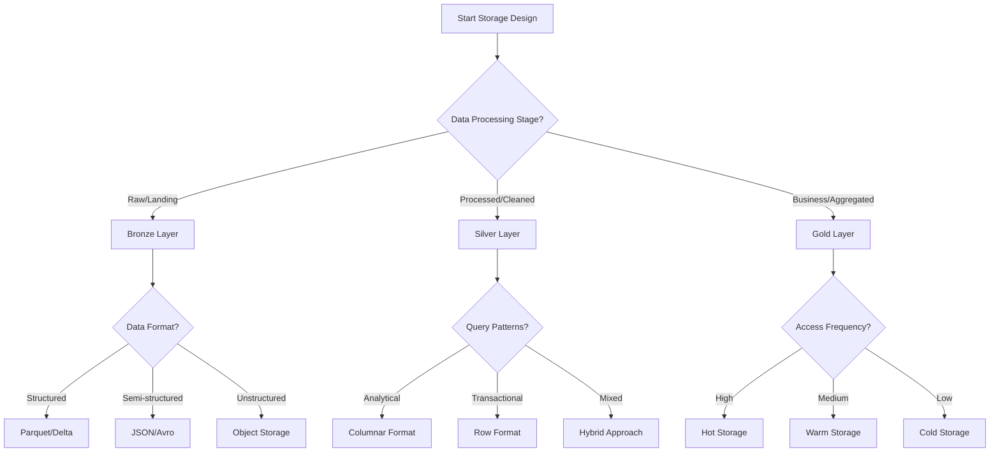

[⬅️ Back to Main SDLC Page](00_data_platform_sdlc.md)

# Data Storage & Management for Data Platform Projects
## LLM-Optimized Framework for Storage Architecture

**Purpose:** This document provides a comprehensive, actionable framework for designing and implementing data storage solutions, specifically optimized for LLM-assisted storage architecture and data management.

**📋 Document Structure:**
- **Part 1 (This Document):** Core storage architecture, technology selection, and implementation patterns
- **Part 2:** [Advanced Storage Topics](05b_data_storage_advanced.md) - Performance optimization, monitoring, and real-world scenarios

---

## 🤖 LLM Data Storage Assistant Guide

### LLM Roles in Data Storage

**1. Storage Architect**
- Design multi-layer storage architectures and data lake patterns
- Select optimal storage technologies based on requirements
- Create data partitioning and organization strategies

**2. Data Engineer**
- Implement storage configurations and optimization techniques
- Build data lifecycle management and archival processes
- Configure monitoring and performance tuning systems

**3. Performance Optimizer**
- Analyze query patterns and optimize storage layouts
- Implement caching and materialization strategies
- Design compression and encoding optimizations

**4. Lifecycle Manager**
- Create data retention and archival policies
- Implement cost optimization and tiering strategies
- Design compliance and governance frameworks

### LLM Prompt Templates

**Storage Architecture Design:**
```
Design a complete data storage architecture for this use case:
- Data types: [STRUCTURED/SEMI_STRUCTURED/UNSTRUCTURED]
- Volume: [DATA_SIZE_AND_GROWTH]
- Access patterns: [BATCH/STREAMING/INTERACTIVE]
- Performance requirements: [LATENCY/THROUGHPUT]
- Budget constraints: [COST_LIMITS]
Use the patterns from Section 3 and optimization techniques from Part 2.
```

**Technology Selection:**
```
Recommend optimal storage technologies for these requirements:
- Cloud provider: [AWS/AZURE/GCP/MULTI_CLOUD]
- Workload type: [ANALYTICS/TRANSACTIONAL/MIXED]
- Data characteristics: [VOLUME/VELOCITY/VARIETY]
- Compliance needs: [GDPR/HIPAA/SOX]
Include configuration templates from Section 4 and governance patterns.
```

**Performance Optimization:**
```
Optimize this storage configuration for better performance:
[STORAGE_CONFIGURATION]
Current bottlenecks: [PERFORMANCE_ISSUES]
Query patterns: [ACCESS_PATTERNS]
Provide: partitioning strategies, indexing recommendations, format optimizations
```

---

## 📊 Storage Architecture Decision Framework

### Decision Tree: Storage Layer Design



### Storage Technology Selection Matrix

| Use Case | Volume | Latency | Cost Priority | Recommended Technology |
|----------|--------|---------|---------------|----------------------|
| **Data Lake** | Very High | Medium | Low | S3/ADLS + Parquet/Delta |
| **Data Warehouse** | High | Low | Medium | Redshift/Synapse/BigQuery |
| **Real-time Analytics** | Medium | Very Low | High | ClickHouse/Druid/Pinot |
| **Transactional** | Medium | Very Low | Medium | PostgreSQL/SQL Server |
| **Document Store** | High | Low | Low | MongoDB/CosmosDB |
| **Time Series** | Very High | Low | Low | InfluxDB/TimescaleDB |

### Multi-Cloud Storage Strategy Framework

```json
{
  "multi_cloud_storage": {
    "primary_cloud": {
      "selection_criteria": ["data_residency", "compliance", "existing_infrastructure"],
      "recommended_services": {
        "aws": ["S3", "Redshift", "Glue"],
        "azure": ["ADLS_Gen2", "Synapse", "Purview"],
        "gcp": ["Cloud_Storage", "BigQuery", "Dataflow"]
      }
    },
    "secondary_cloud": {
      "purpose": ["disaster_recovery", "cost_optimization", "vendor_diversification"],
      "replication_strategy": ["active_passive", "active_active", "backup_only"]
    },
    "data_distribution": {
      "by_geography": "compliance_and_latency_optimization",
      "by_workload": "performance_and_cost_optimization",
      "by_sensitivity": "security_and_governance_requirements"
    }
  }
}
```

---

## 🏗️ Comprehensive Storage Technology Toolkit

### 3.1 AWS Storage Architecture Templates

#### Complete Data Lake on AWS

```yaml
# aws_data_lake_architecture.yaml
AWSTemplateFormatVersion: '2010-09-09'
Description: 'Complete Data Lake Architecture on AWS'

Parameters:
  ProjectName:
    Type: String
    Description: 'Project name for resource naming'
  Environment:
    Type: String
    Default: 'prod'
    AllowedValues: ['dev', 'test', 'prod']

Resources:
  # S3 Buckets for Data Lake Layers
  BronzeDataBucket:
    Type: AWS::S3::Bucket
    Properties:
      BucketName: !Sub '${ProjectName}-${Environment}-bronze-data'
      VersioningConfiguration:
        Status: Enabled
      LifecycleConfiguration:
        Rules:
          - Id: TransitionToIA
            Status: Enabled
            Transitions:
              - TransitionInDays: 30
                StorageClass: STANDARD_IA
          - Id: TransitionToGlacier
            Status: Enabled
            Transitions:
              - TransitionInDays: 90
                StorageClass: GLACIER
          - Id: TransitionToDeepArchive
            Status: Enabled
            Transitions:
              - TransitionInDays: 365
                StorageClass: DEEP_ARCHIVE
      PublicAccessBlockConfiguration:
        BlockPublicAcls: true
        BlockPublicPolicy: true
        IgnorePublicAcls: true
        RestrictPublicBuckets: true
      BucketEncryption:
        ServerSideEncryptionConfiguration:
          - ServerSideEncryptionByDefault:
              SSEAlgorithm: AES256

  SilverDataBucket:
    Type: AWS::S3::Bucket
    Properties:
      BucketName: !Sub '${ProjectName}-${Environment}-silver-data'
      VersioningConfiguration:
        Status: Enabled
      LifecycleConfiguration:
        Rules:
          - Id: TransitionToIA
            Status: Enabled
            Transitions:
              - TransitionInDays: 60
                StorageClass: STANDARD_IA
          - Id: TransitionToGlacier
            Status: Enabled
            Transitions:
              - TransitionInDays: 180
                StorageClass: GLACIER
      PublicAccessBlockConfiguration:
        BlockPublicAcls: true
        BlockPublicPolicy: true
        IgnorePublicAcls: true
        RestrictPublicBuckets: true
      BucketEncryption:
        ServerSideEncryptionConfiguration:
          - ServerSideEncryptionByDefault:
              SSEAlgorithm: AES256

  GoldDataBucket:
    Type: AWS::S3::Bucket
    Properties:
      BucketName: !Sub '${ProjectName}-${Environment}-gold-data'
      VersioningConfiguration:
        Status: Enabled
      LifecycleConfiguration:
        Rules:
          - Id: TransitionToIA
            Status: Enabled
            Transitions:
              - TransitionInDays: 90
                StorageClass: STANDARD_IA
      PublicAccessBlockConfiguration:
        BlockPublicAcls: true
        BlockPublicPolicy: true
        IgnorePublicAcls: true
        RestrictPublicBuckets: true
      BucketEncryption:
        ServerSideEncryptionConfiguration:
          - ServerSideEncryptionByDefault:
              SSEAlgorithm: AES256

  # Glue Data Catalog
  GlueDatabase:
    Type: AWS::Glue::Database
    Properties:
      CatalogId: !Ref AWS::AccountId
      DatabaseInput:
        Name: !Sub '${ProjectName}_${Environment}_catalog'
        Description: 'Data catalog for the data lake'

  # Lake Formation Configuration
  LakeFormationDataLakeSettings:
    Type: AWS::LakeFormation::DataLakeSettings
    Properties:
      Admins:
        - DataLakePrincipalIdentifier: !Sub 'arn:aws:iam::${AWS::AccountId}:role/LakeFormationServiceRole'

  # Redshift Data Warehouse
  RedshiftCluster:
    Type: AWS::Redshift::Cluster
    Properties:
      ClusterIdentifier: !Sub '${ProjectName}-${Environment}-dw'
      DBName: 'datawarehouse'
      MasterUsername: 'admin'
      MasterUserPassword: !Ref RedshiftPassword
      NodeType: 'dc2.large'
      ClusterType: 'multi-node'
      NumberOfNodes: 2
      VpcSecurityGroupIds:
        - !Ref RedshiftSecurityGroup
      ClusterSubnetGroupName: !Ref RedshiftSubnetGroup
      Encrypted: true
      Tags:
        - Key: 'Environment'
          Value: !Ref Environment
        - Key: 'Project'
          Value: !Ref ProjectName

  RedshiftPassword:
    Type: AWS::SSM::Parameter::Value<String>
    Default: '/dataplatform/redshift/password'
    NoEcho: true

Outputs:
  BronzeDataBucket:
    Description: 'Bronze layer S3 bucket'
    Value: !Ref BronzeDataBucket
    Export:
      Name: !Sub '${ProjectName}-${Environment}-bronze-bucket'

  SilverDataBucket:
    Description: 'Silver layer S3 bucket'
    Value: !Ref SilverDataBucket
    Export:
      Name: !Sub '${ProjectName}-${Environment}-silver-bucket'

  GoldDataBucket:
    Description: 'Gold layer S3 bucket'
    Value: !Ref GoldDataBucket
    Export:
      Name: !Sub '${ProjectName}-${Environment}-gold-bucket'

  GlueDatabase:
    Description: 'Glue Data Catalog Database'
    Value: !Ref GlueDatabase
    Export:
      Name: !Sub '${ProjectName}-${Environment}-glue-database'

  RedshiftClusterEndpoint:
    Description: 'Redshift cluster endpoint'
    Value: !GetAtt RedshiftCluster.Endpoint.Address
    Export:
      Name: !Sub '${ProjectName}-${Environment}-redshift-endpoint'
```

#### S3 Intelligent Tiering Configuration

```python
# s3_lifecycle_management.py
import boto3
import json
from typing import Dict, List
import logging

class S3LifecycleManager:
    def __init__(self, region_name: str = 'us-west-2'):
        self.s3_client = boto3.client('s3', region_name=region_name)
        self.logger = logging.getLogger(__name__)
    
    def create_intelligent_tiering_config(self, bucket_name: str, config_id: str = 'EntireBucket') -> Dict:
        """Create intelligent tiering configuration for S3 bucket"""
        
        intelligent_tiering_config = {
            'Id': config_id,
            'Status': 'Enabled',
            'Filter': {
                'Prefix': ''  # Apply to entire bucket
            },
            'Tiering': {
                'Days': 1,
                'AccessTier': 'ARCHIVE_ACCESS'
            },
            'OptionalFields': {
                'BucketKeyEnabled': True
            }
        }
        
        try:
            response = self.s3_client.put_bucket_intelligent_tiering_configuration(
                Bucket=bucket_name,
                Id=config_id,
                IntelligentTieringConfiguration=intelligent_tiering_config
            )
            
            self.logger.info(f"Intelligent tiering configured for bucket {bucket_name}")
            return response
            
        except Exception as e:
            self.logger.error(f"Failed to configure intelligent tiering: {e}")
            raise
    
    def create_lifecycle_policy(self, bucket_name: str, rules: List[Dict]) -> Dict:
        """Create comprehensive lifecycle policy"""
        
        lifecycle_config = {
            'Rules': rules
        }
        
        try:
            response = self.s3_client.put_bucket_lifecycle_configuration(
                Bucket=bucket_name,
                LifecycleConfiguration=lifecycle_config
            )
            
            self.logger.info(f"Lifecycle policy applied to bucket {bucket_name}")
            return response
            
        except Exception as e:
            self.logger.error(f"Failed to apply lifecycle policy: {e}")
            raise
    
    def get_optimized_lifecycle_rules(self, data_type: str) -> List[Dict]:
        """Get optimized lifecycle rules based on data type"""
        
        rules_templates = {
            'raw_data': [
                {
                    'ID': 'RawDataLifecycle',
                    'Status': 'Enabled',
                    'Filter': {'Prefix': 'raw/'},
                    'Transitions': [
                        {
                            'Days': 30,
                            'StorageClass': 'STANDARD_IA'
                        },
                        {
                            'Days': 90,
                            'StorageClass': 'GLACIER'
                        },
                        {
                            'Days': 365,
                            'StorageClass': 'DEEP_ARCHIVE'
                        }
                    ]
                }
            ],
            'processed_data': [
                {
                    'ID': 'ProcessedDataLifecycle',
                    'Status': 'Enabled',
                    'Filter': {'Prefix': 'processed/'},
                    'Transitions': [
                        {
                            'Days': 60,
                            'StorageClass': 'STANDARD_IA'
                        },
                        {
                            'Days': 180,
                            'StorageClass': 'GLACIER'
                        }
                    ]
                }
            ],
            'analytics_data': [
                {
                    'ID': 'AnalyticsDataLifecycle',
                    'Status': 'Enabled',
                    'Filter': {'Prefix': 'analytics/'},
                    'Transitions': [
                        {
                            'Days': 90,
                            'StorageClass': 'STANDARD_IA'
                        }
                    ]
                }
            ]
        }
        
        return rules_templates.get(data_type, rules_templates['raw_data'])
```

### 3.2 Azure Storage Architecture Templates

#### Azure Data Lake Storage Gen2 Configuration

```bicep
// azure_data_lake_architecture.bicep
@description('Project name for resource naming')
param projectName string

@description('Environment name')
param environment string = 'prod'

@description('Location for all resources')
param location string = resourceGroup().location

// Variables
var resourcePrefix = '${projectName}${environment}'
var storageAccountName = '${replace(resourcePrefix, '-', '')}datalake'

// Data Lake Storage Account
resource dataLakeStorage 'Microsoft.Storage/storageAccounts@2023-01-01' = {
  name: storageAccountName
  location: location
  sku: {
    name: 'Standard_LRS'
  }
  kind: 'StorageV2'
  properties: {
    isHnsEnabled: true // Enable hierarchical namespace for Data Lake
    minimumTlsVersion: 'TLS1_2'
    allowBlobPublicAccess: false
    networkAcls: {
      defaultAction: 'Deny'
      bypass: 'AzureServices'
    }
    encryption: {
      services: {
        blob: {
          enabled: true
          keyType: 'Account'
        }
        file: {
          enabled: true
          keyType: 'Account'
        }
      }
      keySource: 'Microsoft.Storage'
    }
    accessTier: 'Hot'
  }
  tags: {
    Environment: environment
    Project: projectName
    Purpose: 'DataLake'
  }
}

// Data Lake Containers (Bronze, Silver, Gold)
resource bronzeContainer 'Microsoft.Storage/storageAccounts/blobServices/containers@2023-01-01' = {
  name: '${dataLakeStorage.name}/default/bronze'
  properties: {
    publicAccess: 'None'
    metadata: {
      layer: 'bronze'
      description: 'Raw data ingestion layer'
    }
  }
}

resource silverContainer 'Microsoft.Storage/storageAccounts/blobServices/containers@2023-01-01' = {
  name: '${dataLakeStorage.name}/default/silver'
  properties: {
    publicAccess: 'None'
    metadata: {
      layer: 'silver'
      description: 'Processed and cleaned data layer'
    }
  }
}

resource goldContainer 'Microsoft.Storage/storageAccounts/blobServices/containers@2023-01-01' = {
  name: '${dataLakeStorage.name}/default/gold'
  properties: {
    publicAccess: 'None'
    metadata: {
      layer: 'gold'
      description: 'Business-ready analytics layer'
    }
  }
}

// Lifecycle Management Policy
resource lifecyclePolicy 'Microsoft.Storage/storageAccounts/managementPolicies@2023-01-01' = {
  name: 'default'
  parent: dataLakeStorage
  properties: {
    policy: {
      rules: [
        {
          name: 'BronzeDataLifecycle'
          enabled: true
          type: 'Lifecycle'
          definition: {
            filters: {
              blobTypes: ['blockBlob']
              prefixMatch: ['bronze/']
            }
            actions: {
              baseBlob: {
                tierToCool: {
                  daysAfterModificationGreaterThan: 30
                }
                tierToArchive: {
                  daysAfterModificationGreaterThan: 90
                }
                delete: {
                  daysAfterModificationGreaterThan: 2555 // 7 years
                }
              }
            }
          }
        }
        {
          name: 'SilverDataLifecycle'
          enabled: true
          type: 'Lifecycle'
          definition: {
            filters: {
              blobTypes: ['blockBlob']
              prefixMatch: ['silver/']
            }
            actions: {
              baseBlob: {
                tierToCool: {
                  daysAfterModificationGreaterThan: 60
                }
                tierToArchive: {
                  daysAfterModificationGreaterThan: 180
                }
              }
            }
          }
        }
        {
          name: 'GoldDataLifecycle'
          enabled: true
          type: 'Lifecycle'
          definition: {
            filters: {
              blobTypes: ['blockBlob']
              prefixMatch: ['gold/']
            }
            actions: {
              baseBlob: {
                tierToCool: {
                  daysAfterModificationGreaterThan: 90
                }
              }
            }
          }
        }
      ]
    }
  }
}

// Synapse Analytics Workspace
resource synapseWorkspace 'Microsoft.Synapse/workspaces@2021-06-01' = {
  name: '${resourcePrefix}-synapse'
  location: location
  properties: {
    defaultDataLakeStorage: {
      accountUrl: dataLakeStorage.properties.primaryEndpoints.dfs
      filesystem: 'gold'
    }
    sqlAdministratorLogin: 'sqladmin'
    sqlAdministratorLoginPassword: 'ComplexP@ssw0rd123!'
  }
  identity: {
    type: 'SystemAssigned'
  }
  tags: {
    Environment: environment
    Project: projectName
  }
}

// Outputs
output dataLakeStorageAccount string = dataLakeStorage.name
output synapseWorkspaceName string = synapseWorkspace.name
output bronzeContainerName string = 'bronze'
output silverContainerName string = 'silver'
output goldContainerName string = 'gold'
```

### 3.3 GCP Storage Architecture Templates

#### BigQuery Data Warehouse Configuration

```sql
-- bigquery_data_warehouse_setup.sql
-- Create datasets for different data layers

-- Bronze layer dataset
CREATE SCHEMA IF NOT EXISTS `${PROJECT_ID}.bronze_data`
OPTIONS (
  description = "Raw data ingestion layer",
  location = "US",
  labels = [("environment", "${ENVIRONMENT}"), ("layer", "bronze")]
);

-- Silver layer dataset  
CREATE SCHEMA IF NOT EXISTS `${PROJECT_ID}.silver_data`
OPTIONS (
  description = "Processed and cleaned data layer",
  location = "US", 
  labels = [("environment", "${ENVIRONMENT}"), ("layer", "silver")]
);

-- Gold layer dataset
CREATE SCHEMA IF NOT EXISTS `${PROJECT_ID}.gold_data`
OPTIONS (
  description = "Business-ready analytics layer",
  location = "US",
  labels = [("environment", "${ENVIRONMENT}"), ("layer", "gold")]
);

-- Create external table for Cloud Storage data
CREATE OR REPLACE EXTERNAL TABLE `${PROJECT_ID}.bronze_data.raw_events`
OPTIONS (
  format = 'PARQUET',
  uris = ['gs://${BUCKET_NAME}/raw/events/*.parquet']
);

-- Create partitioned table with clustering
CREATE OR REPLACE TABLE `${PROJECT_ID}.silver_data.processed_events`
(
  event_id STRING NOT NULL,
  user_id STRING NOT NULL,
  event_timestamp TIMESTAMP NOT NULL,
  event_type STRING NOT NULL,
  properties JSON,
  processed_at TIMESTAMP DEFAULT CURRENT_TIMESTAMP()
)
PARTITION BY DATE(event_timestamp)
CLUSTER BY user_id, event_type
OPTIONS (
  description = "Processed events with partitioning and clustering",
  partition_expiration_days = 365,
  require_partition_filter = true
);
```

---

## 🏛️ Data Lake Architecture Patterns

### 4.1 Medallion Architecture Implementation

#### Bronze Layer Configuration

```python
# bronze_layer_manager.py
import pandas as pd
from datetime import datetime
from typing import Dict, List, Optional
import logging
from pathlib import Path

class BronzeLayerManager:
    def __init__(self, storage_config: Dict):
        self.storage_config = storage_config
        self.logger = logging.getLogger(__name__)
    
    def ingest_raw_data(self, source_name: str, data: pd.DataFrame, 
                       partition_columns: List[str] = None) -> str:
        """Ingest raw data into bronze layer with metadata"""
        
        # Add ingestion metadata
        data['_ingestion_timestamp'] = datetime.now()
        data['_source_system'] = source_name
        data['_file_name'] = f"{source_name}_{datetime.now().strftime('%Y%m%d_%H%M%S')}"
        
        # Create partition path
        partition_path = self._create_partition_path(source_name, partition_columns, data)
        
        # Save to bronze layer
        output_path = f"{self.storage_config['bronze_path']}/{partition_path}"
        
        try:
            # Save as Parquet with compression
            data.to_parquet(
                output_path,
                engine='pyarrow',
                compression='snappy',
                index=False,
                partition_cols=partition_columns
            )
            
            self.logger.info(f"Successfully ingested {len(data)} records to {output_path}")
            return output_path
            
        except Exception as e:
            self.logger.error(f"Failed to ingest data to bronze layer: {e}")
            raise
    
    def _create_partition_path(self, source_name: str, partition_columns: List[str], 
                             data: pd.DataFrame) -> str:
        """Create hierarchical partition path"""
        
        base_path = f"source={source_name}"
        
        if partition_columns:
            # Add partition columns to path
            for col in partition_columns:
                if col in data.columns:
                    # Use first value for partition (assuming homogeneous partition)
                    partition_value = data[col].iloc[0]
                    base_path += f"/{col}={partition_value}"
        
        # Add date partition
        current_date = datetime.now()
        base_path += f"/year={current_date.year}/month={current_date.month:02d}/day={current_date.day:02d}"
        
        return base_path
    
    def create_data_quality_report(self, data: pd.DataFrame) -> Dict:
        """Generate data quality report for bronze layer"""
        
        report = {
            'timestamp': datetime.now().isoformat(),
            'record_count': len(data),
            'column_count': len(data.columns),
            'data_types': data.dtypes.astype(str).to_dict(),
            'null_counts': data.isnull().sum().to_dict(),
            'duplicate_count': data.duplicated().sum(),
            'memory_usage_mb': data.memory_usage(deep=True).sum() / 1024 / 1024
        }
        
        # Add column-specific statistics
        numeric_columns = data.select_dtypes(include=['number']).columns
        if len(numeric_columns) > 0:
            report['numeric_stats'] = data[numeric_columns].describe().to_dict()
        
        return report
```

#### Silver Layer Transformation Framework

```python
# silver_layer_processor.py
import pandas as pd
import numpy as np
from typing import Dict, List, Callable, Optional
import logging
from datetime import datetime

class SilverLayerProcessor:
    def __init__(self, storage_config: Dict):
        self.storage_config = storage_config
        self.logger = logging.getLogger(__name__)
        self.transformation_rules = {}
    
    def register_transformation(self, source_name: str, transformation_func: Callable):
        """Register transformation function for specific source"""
        self.transformation_rules[source_name] = transformation_func
    
    def process_bronze_to_silver(self, source_name: str, bronze_path: str) -> str:
        """Process bronze data to silver layer with transformations"""
        
        try:
            # Read bronze data
            bronze_data = pd.read_parquet(bronze_path)
            self.logger.info(f"Loaded {len(bronze_data)} records from bronze layer")
            
            # Apply transformations
            silver_data = self._apply_transformations(source_name, bronze_data)
            
            # Add processing metadata
            silver_data['_processed_timestamp'] = datetime.now()
            silver_data['_processing_version'] = '1.0'
            
            # Save to silver layer
            silver_path = self._create_silver_path(source_name)
            silver_data.to_parquet(
                silver_path,
                engine='pyarrow',
                compression='snappy',
                index=False
            )
            
            self.logger.info(f"Successfully processed {len(silver_data)} records to silver layer")
            return silver_path
            
        except Exception as e:
            self.logger.error(f"Failed to process bronze to silver: {e}")
            raise
    
    def _apply_transformations(self, source_name: str, data: pd.DataFrame) -> pd.DataFrame:
        """Apply registered transformations"""
        
        if source_name in self.transformation_rules:
            transformation_func = self.transformation_rules[source_name]
            return transformation_func(data)
        else:
            # Apply default transformations
            return self._default_transformations(data)
    
    def _default_transformations(self, data: pd.DataFrame) -> pd.DataFrame:
        """Apply default data cleaning and standardization"""
        
        # Remove duplicate records
        data = data.drop_duplicates()
        
        # Standardize column names
        data.columns = data.columns.str.lower().str.replace(' ', '_')
        
        # Handle missing values
        for column in data.columns:
            if data[column].dtype == 'object':
                data[column] = data[column].fillna('UNKNOWN')
            elif data[column].dtype in ['int64', 'float64']:
                data[column] = data[column].fillna(0)
        
        # Add data validation flags
        data['_is_valid'] = True
        data['_validation_errors'] = ''
        
        return data
    
    def _create_silver_path(self, source_name: str) -> str:
        """Create silver layer path"""
        current_date = datetime.now()
        return f"{self.storage_config['silver_path']}/source={source_name}/year={current_date.year}/month={current_date.month:02d}/day={current_date.day:02d}"

# Example transformation functions
def transform_customer_data(data: pd.DataFrame) -> pd.DataFrame:
    """Transform customer data for silver layer"""
    
    # Standardize email addresses
    data['email'] = data['email'].str.lower().str.strip()
    
    # Parse and validate phone numbers
    data['phone_cleaned'] = data['phone'].str.replace(r'[^\d]', '', regex=True)
    
    # Create derived fields
    data['email_domain'] = data['email'].str.split('@').str[1]
    data['customer_age_days'] = (datetime.now() - pd.to_datetime(data['created_at'])).dt.days
    
    # Data validation
    data['_is_valid'] = (
        data['email'].str.contains('@') & 
        (data['phone_cleaned'].str.len() >= 10) &
        (data['customer_age_days'] >= 0)
    )
    
    return data

def transform_transaction_data(data: pd.DataFrame) -> pd.DataFrame:
    """Transform transaction data for silver layer"""
    
    # Convert amounts to standard currency
    data['amount_usd'] = data['amount'] * data['exchange_rate'].fillna(1.0)
    
    # Categorize transactions
    data['transaction_category'] = data['amount_usd'].apply(
        lambda x: 'large' if x > 1000 else 'medium' if x > 100 else 'small'
    )
    
    # Ad
