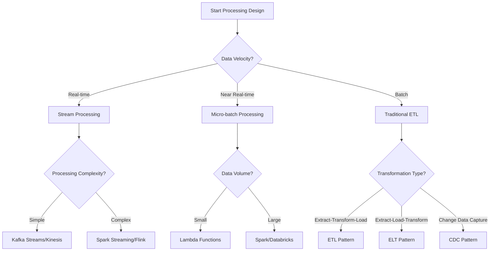

[⬅️ Back to Main SDLC Page](00_data_platform_sdlc.md)

# Data Processing & Transformation for Data Platform Projects
## LLM-Optimized Framework for Processing Architecture

**Purpose:** This document provides a comprehensive, actionable framework for designing and implementing data processing solutions, specifically optimized for LLM-assisted processing architecture and transformation workflows.

**📋 Document Structure:**
- **Part 1 (This Document):** Core processing architecture, ETL/ELT patterns, and transformation frameworks
- **Part 2:** [Advanced Processing Topics](06b_data_processing_advanced.md) - Stream processing, ML pipelines, and optimization strategies

---

## 🤖 LLM Data Processing Assistant Guide

### LLM Roles in Data Processing

**1. Processing Architect**
- Design ETL/ELT workflows and data transformation pipelines
- Select optimal processing technologies and frameworks
- Create scalable and maintainable processing architectures

**2. Transformation Engineer**
- Implement data transformation logic and business rules
- Build data quality and validation frameworks
- Optimize processing performance and resource utilization

**3. Pipeline Developer**
- Create orchestration workflows and scheduling systems
- Implement error handling and retry mechanisms
- Build monitoring and alerting for processing pipelines

**4. Performance Optimizer**
- Analyze processing bottlenecks and optimize workflows
- Implement parallel processing and distributed computing
- Design caching and materialization strategies

### LLM Prompt Templates

**Processing Architecture Design:**
```
Design a complete data processing architecture for this use case:
- Data volume: [RECORDS_PER_DAY/SIZE_PER_DAY]
- Processing type: [BATCH/STREAMING/HYBRID]
- Transformation complexity: [SIMPLE/MODERATE/COMPLEX]
- Latency requirements: [REAL_TIME/NEAR_REAL_TIME/BATCH]
- Technology constraints: [CLOUD_PROVIDER/BUDGET/EXISTING_TOOLS]
Use the patterns from Section 3 and optimization techniques from Part 2.
```

**ETL Pipeline Implementation:**
```
Create an ETL pipeline for this data transformation:
- Source systems: [DATA_SOURCES]
- Target systems: [DESTINATIONS]
- Business rules: [TRANSFORMATION_LOGIC]
- Data quality requirements: [VALIDATION_RULES]
- Performance requirements: [SLA_REQUIREMENTS]
Include error handling, monitoring, and recovery mechanisms.
```

**Performance Optimization:**
```
Optimize this data processing pipeline for better performance:
[PIPELINE_CONFIGURATION]
Current bottlenecks: [PERFORMANCE_ISSUES]
Processing patterns: [WORKLOAD_CHARACTERISTICS]
Provide: parallelization strategies, resource optimization, caching recommendations
```

---

## 📊 Processing Architecture Decision Framework

### Decision Tree: Processing Pattern Selection



### Processing Technology Selection Matrix

| Use Case | Data Volume | Latency | Complexity | Recommended Technology |
|----------|-------------|---------|------------|----------------------|
| **Real-time Analytics** | Medium-High | < 1 second | Medium | Kafka Streams, Flink |
| **Batch Processing** | Very High | Hours | High | Spark, Databricks |
| **Stream Processing** | High | < 10 seconds | Medium | Spark Streaming, Kinesis |
| **ETL Workflows** | High | Minutes-Hours | High | Airflow + Spark |
| **Data Integration** | Medium | Minutes | Low | Azure Data Factory, Glue |
| **ML Feature Engineering** | High | Minutes | High | Spark MLlib, Databricks |

### Processing Pattern Framework

```json
{
  "processing_patterns": {
    "etl_pattern": {
      "description": "Extract, Transform, Load - Transform before loading",
      "use_cases": ["data_warehousing", "reporting", "analytics"],
      "advantages": ["data_validation", "consistent_format", "optimized_storage"],
      "disadvantages": ["processing_overhead", "storage_requirements", "latency"]
    },
    "elt_pattern": {
      "description": "Extract, Load, Transform - Transform after loading",
      "use_cases": ["data_lakes", "exploratory_analysis", "flexible_schemas"],
      "advantages": ["faster_ingestion", "raw_data_preservation", "flexibility"],
      "disadvantages": ["storage_costs", "compute_on_demand", "data_quality_risks"]
    },
    "streaming_pattern": {
      "description": "Continuous processing of data streams",
      "use_cases": ["real_time_analytics", "fraud_detection", "monitoring"],
      "advantages": ["low_latency", "real_time_insights", "event_driven"],
      "disadvantages": ["complexity", "state_management", "exactly_once_semantics"]
    }
  }
}
```

---

## 🏗️ Comprehensive Processing Technology Toolkit

### 3.1 Apache Spark Processing Framework

#### Spark ETL Pipeline Template

```python
# spark_etl_pipeline.py
from pyspark.sql import SparkSession
from pyspark.sql.functions import *
from pyspark.sql.types import *
from typing import Dict, List, Optional
import logging
from datetime import datetime

class SparkETLPipeline:
    def __init__(self, app_name: str, config: Dict):
        self.config = config
        self.logger = logging.getLogger(__name__)
        
        # Initialize Spark session
        self.spark = SparkSession.builder \
            .appName(app_name) \
            .config("spark.sql.adaptive.enabled", "true") \
            .config("spark.sql.adaptive.coalescePartitions.enabled", "true") \
            .config("spark.sql.adaptive.skewJoin.enabled", "true") \
            .getOrCreate()
        
        # Set log level
        self.spark.sparkContext.setLogLevel("WARN")
    
    def extract_data(self, source_config: Dict) -> Dict:
        """Extract data from multiple sources"""
        
        extracted_data = {}
        
        for source_name, source_info in source_config.items():
            try:
                if source_info['type'] == 'jdbc':
                    df = self._extract_from_jdbc(source_info)
                elif source_info['type'] == 'parquet':
                    df = self._extract_from_parquet(source_info)
                elif source_info['type'] == 'json':
                    df = self._extract_from_json(source_info)
                elif source_info['type'] == 'csv':
                    df = self._extract_from_csv(source_info)
                else:
                    raise ValueError(f"Unsupported source type: {source_info['type']}")
                
                # Add metadata
                df = df.withColumn("_source_system", lit(source_name)) \
                      .withColumn("_extraction_timestamp", current_timestamp())
                
                extracted_data[source_name] = df
                self.logger.info(f"Extracted {df.count()} records from {source_name}")
                
            except Exception as e:
                self.logger.error(f"Failed to extract from {source_name}: {e}")
                raise
        
        return extracted_data
    
    def transform_data(self, extracted_data: Dict, transformation_config: Dict) -> Dict:
        """Apply transformations to extracted data"""
        
        transformed_data = {}
        
        for dataset_name, df in extracted_data.items():
            try:
                # Apply dataset-specific transformations
                if dataset_name in transformation_config:
                    transforms = transformation_config[dataset_name]
                    transformed_df = self._apply_transformations(df, transforms)
                else:
                    # Apply default transformations
                    transformed_df = self._apply_default_transformations(df)
                
                # Add processing metadata
                transformed_df = transformed_df.withColumn(
                    "_processing_timestamp", current_timestamp()
                ).withColumn(
                    "_processing_version", lit("1.0")
                )
                
                transformed_data[dataset_name] = transformed_df
                self.logger.info(f"Transformed {dataset_name} dataset")
                
            except Exception as e:
                self.logger.error(f"Failed to transform {dataset_name}: {e}")
                raise
        
        return transformed_data
    
    def load_data(self, transformed_data: Dict, target_config: Dict) -> None:
        """Load transformed data to target systems"""
        
        for dataset_name, df in transformed_data.items():
            try:
                if dataset_name in target_config:
                    target_info = target_config[dataset_name]
                    
                    if target_info['type'] == 'parquet':
                        self._load_to_parquet(df, target_info)
                    elif target_info['type'] == 'delta':
                        self._load_to_delta(df, target_info)
                    elif target_info['type'] == 'jdbc':
                        self._load_to_jdbc(df, target_info)
                    else:
                        raise ValueError(f"Unsupported target type: {target_info['type']}")
                    
                    self.logger.info(f"Loaded {dataset_name} to {target_info['type']}")
                
            except Exception as e:
                self.logger.error(f"Failed to load {dataset_name}: {e}")
                raise
    
    def _extract_from_jdbc(self, source_info: Dict):
        """Extract data from JDBC source"""
        return self.spark.read \
            .format("jdbc") \
            .option("url", source_info['url']) \
            .option("dbtable", source_info['table']) \
            .option("user", source_info['user']) \
            .option("password", source_info['password']) \
            .option("driver", source_info.get('driver', 'org.postgresql.Driver')) \
            .load()
    
    def _extract_from_parquet(self, source_info: Dict):
        """Extract data from Parquet files"""
        return self.spark.read.parquet(source_info['path'])
    
    def _extract_from_json(self, source_info: Dict):
        """Extract data from JSON files"""
        return self.spark.read.json(source_info['path'])
    
    def _extract_from_csv(self, source_info: Dict):
        """Extract data from CSV files"""
        return self.spark.read \
            .option("header", source_info.get('header', True)) \
            .option("inferSchema", source_info.get('inferSchema', True)) \
            .csv(source_info['path'])
    
    def _apply_transformations(self, df, transforms: List[Dict]):
        """Apply list of transformations to DataFrame"""
        
        for transform in transforms:
            transform_type = transform['type']
            
            if transform_type == 'filter':
                df = df.filter(transform['condition'])
            elif transform_type == 'select':
                df = df.select(*transform['columns'])
            elif transform_type == 'rename':
                for old_name, new_name in transform['mapping'].items():
                    df = df.withColumnRenamed(old_name, new_name)
            elif transform_type == 'add_column':
                df = df.withColumn(transform['name'], expr(transform['expression']))
            elif transform_type == 'drop_duplicates':
                df = df.dropDuplicates(transform.get('subset', None))
            elif transform_type == 'join':
                other_df = transform['other_df']
                df = df.join(other_df, transform['condition'], transform.get('how', 'inner'))
            elif transform_type == 'aggregate':
                df = df.groupBy(*transform['group_by']).agg(*transform['aggregations'])
            else:
                self.logger.warning(f"Unknown transformation type: {transform_type}")
        
        return df
    
    def _apply_default_transformations(self, df):
        """Apply default data cleaning transformations"""
        
        # Remove completely null rows
        df = df.dropna(how='all')
        
        # Add data quality flags
        df = df.withColumn("_is_valid", lit(True)) \
              .withColumn("_validation_errors", lit(""))
        
        return df
    
    def _load_to_parquet(self, df, target_info: Dict):
        """Load DataFrame to Parquet format"""
        writer = df.write.mode(target_info.get('mode', 'overwrite'))
        
        if 'partition_by' in target_info:
            writer = writer.partitionBy(*target_info['partition_by'])
        
        writer.parquet(target_info['path'])
    
    def _load_to_delta(self, df, target_info: Dict):
        """Load DataFrame to Delta Lake format"""
        writer = df.write.format("delta").mode(target_info.get('mode', 'overwrite'))
        
        if 'partition_by' in target_info:
            writer = writer.partitionBy(*target_info['partition_by'])
        
        writer.save(target_info['path'])
    
    def _load_to_jdbc(self, df, target_info: Dict):
        """Load DataFrame to JDBC target"""
        df.write \
            .format("jdbc") \
            .option("url", target_info['url']) \
            .option("dbtable", target_info['table']) \
            .option("user", target_info['user']) \
            .option("password", target_info['password']) \
            .option("driver", target_info.get('driver', 'org.postgresql.Driver')) \
            .mode(target_info.get('mode', 'overwrite')) \
            .save()
    
    def run_pipeline(self, pipeline_config: Dict) -> None:
        """Execute complete ETL pipeline"""
        
        try:
            self.logger.info("Starting ETL pipeline execution")
            
            # Extract phase
            extracted_data = self.extract_data(pipeline_config['sources'])
            
            # Transform phase
            transformed_data = self.transform_data(
                extracted_data, 
                pipeline_config.get('transformations', {})
            )
            
            # Load phase
            self.load_data(transformed_data, pipeline_config['targets'])
            
            self.logger.info("ETL pipeline completed successfully")
            
        except Exception as e:
            self.logger.error(f"ETL pipeline failed: {e}")
            raise
        finally:
            self.spark.stop()

# Example usage configuration
pipeline_config = {
    "sources": {
        "customers": {
            "type": "jdbc",
            "url": "jdbc:postgresql://localhost:5432/source_db",
            "table": "customers",
            "user": "user",
            "password": "password"
        },
        "orders": {
            "type": "parquet",
            "path": "s3://data-lake/raw/orders/"
        }
    },
    "transformations": {
        "customers": [
            {
                "type": "filter",
                "condition": "status = 'active'"
            },
            {
                "type": "add_column",
                "name": "customer_tier",
                "expression": "CASE WHEN total_orders > 100 THEN 'premium' ELSE 'standard' END"
            }
        ],
        "orders": [
            {
                "type": "drop_duplicates",
                "subset": ["order_id"]
            },
            {
                "type": "add_column",
                "name": "order_year",
                "expression": "year(order_date)"
            }
        ]
    },
    "targets": {
        "customers": {
            "type": "delta",
            "path": "s3://data-lake/processed/customers/",
            "mode": "overwrite",
            "partition_by": ["customer_tier"]
        },
        "orders": {
            "type": "parquet",
            "path": "s3://data-lake/processed/orders/",
            "mode": "overwrite",
            "partition_by": ["order_year"]
        }
    }
}
```

#### Spark Data Quality Framework

```python
# spark_data_quality.py
from pyspark.sql import DataFrame
from pyspark.sql.functions import *
from pyspark.sql.types import *
from typing import Dict, List, Tuple
import logging

class DataQualityFramework:
    def __init__(self, spark_session):
        self.spark = spark_session
        self.logger = logging.getLogger(__name__)
    
    def validate_data_quality(self, df: DataFrame, rules: List[Dict]) -> Tuple[DataFrame, Dict]:
        """Apply data quality rules and return validated DataFrame with metrics"""
        
        quality_metrics = {
            'total_records': df.count(),
            'validation_results': {},
            'failed_records': 0,
            'quality_score': 0.0
        }
        
        validated_df = df
        
        for rule in rules:
            rule_name = rule['name']
            rule_type = rule['type']
            
            try:
                if rule_type == 'not_null':
                    validated_df, rule_metrics = self._validate_not_null(
                        validated_df, rule['columns'], rule_name
                    )
                elif rule_type == 'unique':
                    validated_df, rule_metrics = self._validate_unique(
                        validated_df, rule['columns'], rule_name
                    )
                elif rule_type == 'range':
                    validated_df, rule_metrics = self._validate_range(
                        validated_df, rule['column'], rule['min'], rule['max'], rule_name
                    )
                elif rule_type == 'pattern':
                    validated_df, rule_metrics = self._validate_pattern(
                        validated_df, rule['column'], rule['pattern'], rule_name
                    )
                elif rule_type == 'custom':
                    validated_df, rule_metrics = self._validate_custom(
                        validated_df, rule['condition'], rule_name
                    )
                else:
                    self.logger.warning(f"Unknown validation rule type: {rule_type}")
                    continue
                
                quality_metrics['validation_results'][rule_name] = rule_metrics
                
            except Exception as e:
                self.logger.error(f"Failed to apply validation rule {rule_name}: {e}")
                quality_metrics['validation_results'][rule_name] = {
                    'status': 'error',
                    'error': str(e)
                }
        
        # Calculate overall quality score
        quality_metrics['quality_score'] = self._calculate_quality_score(
            quality_metrics['validation_results']
        )
        
        return validated_df, quality_metrics
    
    def _validate_not_null(self, df: DataFrame, columns: List[str], rule_name: str) -> Tuple[DataFrame, Dict]:
        """Validate that specified columns are not null"""
        
        null_condition = " OR ".join([f"{col} IS NULL" for col in columns])
        
        # Count null violations
        null_count = df.filter(null_condition).count()
        
        # Add validation flag
        df_validated = df.withColumn(
            f"_validation_{rule_name}",
            when(expr(null_condition), False).otherwise(True)
        )
        
        metrics = {
            'rule_type': 'not_null',
            'columns': columns,
            'violations': null_count,
            'pass_rate': (df.count() - null_count) / df.count() if df.count() > 0 else 0
        }
        
        return df_validated, metrics
    
    def _validate_unique(self, df: DataFrame, columns: List[str], rule_name: str) -> Tuple[DataFrame, Dict]:
        """Validate uniqueness of specified columns"""
        
        # Count duplicates
        total_count = df.count()
        unique_count = df.select(*columns).distinct().count()
        duplicate_count = total_count - unique_count
        
        # Add row numbers to identify duplicates
        window_spec = Window.partitionBy(*columns).orderBy(*columns)
        df_with_row_num = df.withColumn("_row_num", row_number().over(window_spec))
        
        # Add validation flag
        df_validated = df_with_row_num.withColumn(
            f"_validation_{rule_name}",
            when(col("_row_num") == 1, True).otherwise(False)
        ).drop("_row_num")
        
        metrics = {
            'rule_type': 'unique',
            'columns': columns,
            'violations': duplicate_count,
            'pass_rate': unique_count / total_count if total_count > 0 else 0
        }
        
        return df_validated, metrics
    
    def _validate_range(self, df: DataFrame, column: str, min_val, max_val, rule_name: str) -> Tuple[DataFrame, Dict]:
        """Validate that column values are within specified range"""
        
        range_condition = f"{column} < {min_val} OR {column} > {max_val}"
        
        # Count range violations
        violation_count = df.filter(range_condition).count()
        
        # Add validation flag
        df_validated = df.withColumn(
            f"_validation_{rule_name}",
            when(expr(range_condition), False).otherwise(True)
        )
        
        metrics = {
            'rule_type': 'range',
            'column': column,
            'min_value': min_val,
            'max_value': max_val,
            'violations': violation_count,
            'pass_rate': (df.count() - violation_count) / df.count() if df.count() > 0 else 0
        }
        
        return df_validated, metrics
    
    def _validate_pattern(self, df: DataFrame, column: str, pattern: str, rule_name: str) -> Tuple[DataFrame, Dict]:
        """Validate that column values match specified regex pattern"""
        
        # Count pattern violations
        violation_count = df.filter(~col(column).rlike(pattern)).count()
        
        # Add validation flag
        df_validated = df.withColumn(
            f"_validation_{rule_name}",
            when(col(column).rlike(pattern), True).otherwise(False)
        )
        
        metrics = {
            'rule_type': 'pattern',
            'column': column,
            'pattern': pattern,
            'violations': violation_count,
            'pass_rate': (df.count() - violation_count) / df.count() if df.count() > 0 else 0
        }
        
        return df_validated, metrics
    
    def _validate_custom(self, df: DataFrame, condition: str, rule_name: str) -> Tuple[DataFrame, Dict]:
        """Validate using custom condition"""
        
        # Count custom condition violations
        violation_count = df.filter(f"NOT ({condition})").count()
        
        # Add validation flag
        df_validated = df.withColumn(
            f"_validation_{rule_name}",
            when(expr(condition), True).otherwise(False)
        )
        
        metrics = {
            'rule_type': 'custom',
            'condition': condition,
            'violations': violation_count,
            'pass_rate': (df.count() - violation_count) / df.count() if df.count() > 0 else 0
        }
        
        return df_validated, metrics
    
    def _calculate_quality_score(self, validation_results: Dict) -> float:
        """Calculate overall data quality score"""
        
        if not validation_results:
            return 0.0
        
        total_pass_rate = sum(
            result.get('pass_rate', 0) 
            for result in validation_results.values() 
            if isinstance(result, dict) and 'pass_rate' in result
        )
        
        return total_pass_rate / len(validation_results)
    
    def generate_quality_report(self, quality_metrics: Dict) -> str:
        """Generate human-readable quality report"""
        
        report = f"""
Data Quality Report
==================
Total Records: {quality_metrics['total_records']:,}
Overall Quality Score: {quality_metrics['quality_score']:.2%}

Validation Results:
"""
        
        for rule_name, metrics in quality_metrics['validation_results'].items():
            if isinstance(metrics, dict) and 'violations' in metrics:
                report += f"""
{rule_name}:
  - Rule Type: {metrics['rule_type']}
  - Violations: {metrics['violations']:,}
  - Pass Rate: {metrics['pass_rate']:.2%}
"""
        
        return report

# Example data quality rules
quality_rules = [
    {
        'name': 'customer_id_not_null',
        'type': 'not_null',
        'columns': ['customer_id']
    },
    {
        'name': 'customer_id_unique',
        'type': 'unique',
        'columns': ['customer_id']
    },
    {
        'name': 'age_range',
        'type': 'range',
        'column': 'age',
        'min': 0,
        'max': 120
    },
    {
        'name': 'email_pattern',
        'type': 'pattern',
        'column': 'email',
        'pattern': r'^[a-zA-Z0-9._%+-]+@[a-zA-Z0-9.-]+\.[a-zA-Z]{2,}$'
    },
    {
        'name': 'order_amount_positive',
        'type': 'custom',
        'condition': 'order_amount > 0'
    }
]
```

### 3.2 Apache Airflow Orchestration

#### Airflow DAG Template for ETL Workflows

```python
# airflow_etl_dag.py
from datetime import datetime, timedelta
from airflow import DAG
from airflow.operators.python import PythonOperator
from airflow.operators.bash import BashOperator
from airflow.providers.postgres.operators.postgres import PostgresOperator
from airflow.providers.amazon.aws.operators.s3 import S3CreateBucketOperator
from airflow.providers.apache.spark.operators.spark_submit import SparkSubmitOperator
from airflow.sensors.s3_key_sensor import S3KeySensor
from airflow.utils.task_group import TaskGroup
import logging

# Default arguments for the DAG
default_args = {
    'owner': 'data-engineering',
    'depends_on_past': False,
    'start_date': datetime(2024, 1, 1),
    'email_on_failure': True,
    'email_on_retry': False,
    'retries': 2,
    'retry_delay': timedelta(minutes=5),
    'catchup': False
}

# Create DAG
dag = DAG(
    'comprehensive_etl_pipeline',
    default_args=default_args,
    description='Comprehensive ETL pipeline with data quality checks',
    schedule_interval='@daily',
    max_active_runs=1,
    tags=['etl', 'data-processing', 'production']
)

def validate_data_sources(**context):
    """Validate that all required data sources are available"""
    logging.info("Validating data sources...")
    
    # Add validation logic here
    required_sources = [
        's3://data-lake/raw/customers/',
        's3://data-lake/raw/orders/',
        's3://data-lake/raw/products/'
    ]
    
    for source in required_sources:
        # Check if source exists and has data
        logging.info(f"Validating source: {source}")
    
    return "Data sources validated successfully"

def extract_and_validate(**context):
    """Extract data and perform initial validation"""
    logging.info("Starting data extraction and validation...")
    
    # This would typically call your Spark ETL pipeline
    extraction_config = {
        'sources': context['dag_run'].conf.get('sources', {}),
        'validation_rules': context['dag_run'].conf.get('validation_rules', []),
        'output_path': f"s3://data-lake/staging/{context['ds']}/"
    }
    
    logging.info(f"Extraction config: {extraction_config}")
    return "Data extraction completed"

def transform_data(**context):
    """Apply business transformations"""
    logging.info("Starting data transformation...")
    
    transformation_config = {
        'input_path': f"s3://data-lake/staging/{context['ds']}/",
        'output_path': f"s3://data-lake/processed/{context['ds']}/",
        'business_rules': context['dag_run'].conf.get('business_rules', {})
    }
    
    logging.info(f"Transformation config: {transformation_config}")
    return "Data transformation completed"

def load_to_warehouse(**context):
    """Load processed data to data warehouse"""
    logging.info("Loading data to warehouse...")
    
    load_config = {
        'source_path': f"s3://data-lake/processed/{context['ds']}/",
        'target_tables': context['dag_run'].conf.get('target_tables', []),
        'load_strategy': 'upsert'
    }
    
    logging.info(f"Load config: {load_config}")
    return "Data loaded to warehouse"

def generate_quality_report(**context):
    """Generate data quality report"""
    logging.info("Generating data quality report...")
    
    # Generate quality metrics and reports
    quality_report = {
        'processing_date': context['ds'],
        'records_processed': 1000000,  # This would be actual count
        'quality_score': 0.95,
        'validation_results': {}
    }
    
    logging.info(f"Quality report: {quality_report}")
    return quality_report

def send_completion_notification(**context):
    """Send pipeline completion notification"""
    logging.info("Sending completion notification...")
    
    # Send notification via email, Slack, etc.
    notification_message = f"""
    ETL Pipeline Completed Successfully
    
    Date: {context['ds']}
    Duration: {context['dag_run'].end_date - context['dag_run'].start_date}
    Status: Success
    """
    
    logging.info(notification_message)
    return "Notification sent"

# Task definitions
with dag:
    
    # Data source validation
    validate_sources = PythonOperator(
        task_id='validate_data_sources',
        python_callable=validate_data_sources,
        provide_context=True
    )
    
    # Wait for source data to be available
    wait_for_data = S3KeySensor(
        task_id='wait_for_source_data',
        bucket_name='data-lake',
        bucket_key='raw/customers/{{ ds }}/',
        aws_conn_id='aws_default',
        timeout=300,
        poke_interval=60
    )
    
    # Extraction and validation task group
    with TaskGroup('extraction_group') as extraction_group:
        
        extract_customers = SparkSubmitOperator(
            task_id='extract_customers',
            application='/opt/airflow/dags/spark_jobs/extract_customers.py',
            conn_id='spark_default',
            application_args=['{{ ds }}']
        )
        
        extract_orders = SparkSubmitOperator(
            task_id='extract_orders',
            application='/opt/airflow/dags/spark_jobs/extract_orders.py',
            conn_id='spark_default',
            application_args=['{{ ds }}']
        )
        
        extract_products = SparkSubmitOperator(
            task_id='extract_products',
            application='/opt/airflow/dags/spark_jobs/extract_products.py',
            conn_id='spark_default',
            application_args=['{{ ds }}']
        )
    
    # Data quality validation
    data_quality_check = PythonOperator(
        task_id='data_quality_validation',
        python_callable=extract_and_validate,
        provide_context=True
    )
    
    # Transformation task group
    with TaskGroup('transformation_group') as transformation_group:
        
        transform_customers = SparkSubmitOperator(
            task_id='transform_customers',
            application='/opt/airflow/dags/spark_jobs/transform_customers.py',
            conn_id='spark_default',
            application_args=['{{ ds }}']
        )
        
        transform_orders = SparkSubmitOperator(
            task_id='transform_orders',
            application='/opt/airflow/dags/spark_jobs/transform_orders.py',
            conn_id='spark_default',
            application_args=['{{ ds }}']
        )
        
        create_customer_360 = SparkSubmitOperator(
            task_id='create_customer_360',
            application='/opt/airflow/dags/spark_jobs/create_customer_360.py',
            conn_id='spark_default',
            application_args=['{{ ds }}']
        )
    
    # Loading task group
    with TaskGroup('loading_group') as loading_group:
        
        load_to_warehouse = PythonOperator(
            task_id='load_to_data_warehouse',
            python_callable=load_to_warehouse,
            provide_context=True
        )
        
        update_data_catalog = BashOperator(
            task_id='update_data_catalog',
            bash_command='python /opt/airflow/dags/scripts/update_catalog.py {{ ds }}'
        )
    
    # Quality reporting and notifications
    quality_report = PythonOperator(
        task_id='generate_quality_report',
        python_callable=generate_quality_report,
        provide_context=True
    )
    
    completion_notification = PythonOperator(
        task_id='send_completion_notification',
        python_callable=send_completion_notification,
        provide_context=True
    )
    
    # Define task dependencies
    validate_sources >> wait_for_data >> extraction_group
    extraction_group >> data_quality_check >> transformation_group
    transformation_group >> loading_group
    loading_group >> quality_report >> completion_notification
```

### 3.3 Cloud-Native Processing Services

#### AWS Glue ETL Job Template

```python
# aws_glue_etl_job.py
import sys
from awsglue.transforms import *
from awsglue.utils import getResolvedOptions
from pyspark.context import SparkContext
from awsglue.context import GlueContext
from awsglue.job import Job
from awsglue.dynamicframe import DynamicFrame
from pyspark.sql.functions import *
from pyspark.sql.types import *
import logging

# Initialize Glue context
args = getResolvedOptions(sys.argv, ['JOB_NAME', 'source_database', 'target_database'])
sc = SparkContext()
glueContext = GlueContext(sc)
spark = glueContext.spark_session
job = Job(glueContext)
job.init(args['JOB_NAME'], args)

logger = logging.getLogger(__name__)

def extract_from_catalog(database_name: str, table_name: str) -> DynamicFrame:
    """Extract data from Glue Data Catalog"""
    
    try:
        dynamic_frame = glueContext.create_dynamic_frame.from_catalog(
            database=database_name,
            table_name=table_name,
            transformation_ctx=f"extract_{table_name}"
        )
        
        logger.info(f"Extracted {dynamic_frame.count()} records from {database_name}.{table_name}")
        return dynamic_frame
        
    except Exception as e:
        logger.error(f"Failed to extract from {database_name}.{table_name}: {e}")
        raise

def apply_data_transformations(dynamic_frame: DynamicFrame, transformations: list) -> DynamicFrame:
    """Apply series of transformations to DynamicFrame"""
    
    transformed_frame = dynamic_frame
    
    for transform in transformations:
        transform_type = transform['type']
        
        try:
            if transform_type == 'drop_fields':
                transformed_frame = DropFields.apply(
                    frame=transformed_frame,
                    paths=transform['fields'],
                    transformation_ctx=f"drop_fields_{transform.get('name', 'unnamed')}"
                )
            
            elif transform_type == 'rename_field':
                transformed_frame = RenameField.apply(
                    frame=transformed_frame,
                    old_name=transform['old_name'],
                    new_name=transform['new_name'],
                    transformation_ctx=f"rename_{transform['old_name']}"
                )
            
            elif transform_type == 'apply_mapping':
                transformed_frame = ApplyMapping.apply(
                    frame=transformed_frame,
                    mappings=transform['mappings'],
                    transformation_ctx=f"apply_mapping_{transform.get('name', 'unnamed')}"
                )
            
            elif transform_type == 'resolve_choice':
                transformed_frame = ResolveChoice.apply(
                    frame=transformed_frame,
                    choice=transform['choice'],
                    transformation_ctx=f"resolve_choice_{transform.get('name', 'unnamed')}"
                )
            
            elif transform_type == 'drop_nulls':
                transformed_frame = DropNullFields.apply(
                    frame=transformed_frame,
                    transformation_ctx=f"drop_nulls_{transform.get('name', 'unnamed')}"
                )
            
            elif transform_type == 'custom_transform':
                # Convert to DataFrame for custom transformations
                df = transformed_frame.toDF()
                df = transform['function'](df)
                transformed_frame = DynamicFrame.fromDF(df, glueContext, f"custom_{transform.get('name', 'unnamed')}")
            
            else:
                logger.warning(f"Unknown transformation type: {transform_type}")
        
        except Exception as e:
            logger.error(f"Failed to apply transformation {transform_type}: {e}")
            raise
    
    return transformed_frame

def load_to_target(dynamic_frame: DynamicFrame, target_config: dict) -> None:
    """Load DynamicFrame to target destination"""
    
    target_type = target_config['type']
    
    try:
        if target_type == 's3':
            glueContext.write_dynamic_frame.from_options(
                frame=dynamic_frame,
                connection_type="s3",
                connection_options={
                    "path": target_config['path'],
                    "partitionKeys": target_config.get('partition_keys', [])
                },
                format=target_config.get('format', 'parquet'),
                transformation_ctx=f"load_to_s3_{target_config.get('name', 'unnamed')}"
            )
        
        elif target_type == 'catalog':
            glueContext.write_dynamic_frame.from_catalog(
                frame=dynamic_frame,
                database=target_config['database'],
                table_name=target_config['table'],
                transformation_ctx=f"load_to_catalog_{target_config['table']}"
            )
        
        elif target_type == 'jdbc':
            glueContext.write_dynamic_frame.from_jdbc_conf(
                frame=dynamic_frame,
                catalog_connection=target_config['connection_name'],
                connection_options={
                    "dbtable": target_config['table'],
                    "database": target_config['database']
                },
                transformation_ctx=f"load_to_jdbc_{target_config['table']}"
            )
        
        else:
            raise ValueError(f"Unsupported target type: {target_type}")
        
        logger.info(f"Successfully loaded data to {target_type}")
        
    except Exception as e:
        logger.error(f"Failed to load to {target_type}: {e}")
        raise

# Main ETL logic
def run_etl_job():
    """Execute the main ETL job"""
    
    try:
        # Extract data from multiple sources
        customers_df = extract_from_catalog(args['source_database'], 'customers')
        orders_df = extract_from_catalog(args['source_database'], 'orders')
        
        # Define transformations for customers
        customer_transformations = [
            {
                'type': 'drop_fields',
                'fields': ['internal_notes', 'temp_field'],
                'name': 'cleanup'
            },
            {
                'type': 'apply_mapping',
                'mappings': [
                    ("customer_id", "string", "customer_id", "string"),
                    ("first_name", "string", "first_name", "string"),
                    ("last_name", "string", "last_name", "string"),
                    ("email", "string", "email", "string"),
                    ("created_date", "string", "created_date", "timestamp")
                ],
                'name': 'schema_mapping'
            }
        ]
        
        # Apply transformations
        transformed_customers = apply_data_transformations(customers_df, customer_transformations)
        
        # Load to target
        target_config = {
            'type': 's3',
            'path': f's3://data-lake/processed/customers/',
            'format': 'parquet',
            'partition_keys': ['created_year'],
            'name': 'customers'
        }
        
        load_to_target(transformed_customers, target_config)
        
        logger.info("ETL job completed successfully")
        
    except Exception as e:
        logger.error(f"ETL job failed: {e}")
        raise

# Execute the job
if __name__ == "__main__":
    run_etl_job()
    job.commit()
```

---

## 🏛️ Data Transformation Patterns

### 4.1 Common Transformation Patterns

#### Business Logic Implementation Framework

```python
# business_transformations.py
from pyspark.sql import DataFrame
from pyspark.sql.functions import *
from pyspark.sql.types import *
from typing import Dict, List, Callable
import logging

class BusinessTransformations:
    def __init__(self, spark_session):
        self.spark = spark_session
        self.logger = logging.getLogger(__name__)
    
    def apply_customer_segmentation(self, df: DataFrame) -> DataFrame:
        """Apply customer segmentation logic"""
        
        return df.withColumn(
            "customer_segment",
            when(col("total_spent") > 10000, "VIP")
            .when(col("total_spent") > 5000, "Premium")
            .when(col("total_spent") > 1000, "Standard")
            .otherwise("Basic")
        ).withColumn(
            "segment_score",
            when(col("customer_segment") == "VIP", 4)
            .when(col("customer_segment") == "Premium", 3)
            .when(col("customer_segment") == "Standard", 2)
            .otherwise(1)
        )
    
    def calculate_customer_lifetime_value(self, df: DataFrame) -> DataFrame:
        """Calculate customer lifetime value"""
        
        return df.withColumn(
            "avg_order_value",
            col("total_spent") / col("total_orders")
        ).withColumn(
            "customer_lifetime_value",
            col("avg_order_value") * col("predicted_future_orders") * col("retention_probability")
        )
    
    def apply_data_standardization(self, df: DataFrame, column_mappings: Dict) -> DataFrame:
        """Standardize data formats and values"""
        
        standardized_df = df
        
        for column, rules in column_mappings.items():
            if column in df.columns:
                
                # Apply case standardization
                if rules.get('case') == 'upper':
                    standardized_df = standardized_df.withColumn(column, upper(col(column)))
                elif rules.get('case') == 'lower':
                    standardized_df = standardized_df.withColumn(column, lower(col(column)))
                elif rules.get('case') == 'title':
                    standardized_df = standardized_df.withColumn(column, initcap(col(column)))
                
                # Apply trim
                if rules.get('trim', True):
                    standardized_df = standardized_df.withColumn(column, trim(col(column)))
                
                # Apply value mappings
                if 'value_mappings' in rules:
                    for old_value, new_value in rules['value_mappings'].items():
                        standardized_df = standardized_df.withColumn(
                            column,
                            when(col(column) == old_value, new_value).otherwise(col(column))
                        )
        
        return standardized_df
    
    def create_derived_metrics(self, df: DataFrame, metric_definitions: List[Dict]) -> DataFrame:
        """Create derived metrics based on definitions"""
        
        enhanced_df = df
        
        for metric in metric_definitions:
            metric_name = metric['name']
            metric_expression = metric['expression']
            
            try:
                enhanced_df = enhanced_df.withColumn(metric_name, expr(metric_expression))
                self.logger.info(f"Created derived metric: {metric_name}")
                
            except Exception as e:
                self.logger.error(f"Failed to create metric {metric_name}: {e}")
        
        return enhanced_df
    
    def apply_business_rules(self, df: DataFrame, business_rules: List[Dict]) -> DataFrame:
        """Apply business validation rules"""
        
        validated_df = df
        
        for rule in business_rules:
            rule_name = rule['name']
            condition = rule['condition']
            action = rule['action']
            
            try:
                if action == 'flag':
                    validated_df = validated_df.withColumn(
                        f"rule_{rule_name}",
                        when(expr(condition), True).otherwise(False)
                    )
                elif action == 'filter':
                    validated_df = validated_df.filter(condition)
                elif action == 'transform':
                    validated_df = validated_df.withColumn(
                        rule['target_column'],
                        when(expr(condition), expr(rule['transform_expression']))
                        .otherwise(col(rule['target_column']))
                    )
                
                self.logger.info(f"Applied business rule: {rule_name}")
                
            except Exception as e:
                self.logger.error(f"Failed to apply rule {rule_name}: {e}")
        
        return validated_df

# Example usage configurations
customer_standardization_rules = {
    'first_name': {
        'case': 'title',
        'trim': True
    },
    'last_name': {
        'case': 'title',
        'trim': True
    },
    'email': {
        'case': 'lower',
        'trim': True
    },
    'status': {
        'case': 'upper',
        'value_mappings': {
            'ACTIVE': 'A',
            'INACTIVE': 'I',
            'PENDING': 'P'
        }
    }
}

derived_metrics = [
    {
        'name': 'days_since_last_order',
        'expression': 'datediff(current_date(), last_order_date)'
    },
    {
        'name': 'order_frequency',
        'expression': 'total_orders / datediff(current_date(), first_order_date) * 365'
    },
    {
        'name': 'avg_days_between_orders',
        'expression': 'datediff(last_order_date, first_order_date) / (total_orders - 1)'
    }
]

business_validation_rules = [
    {
        'name': 'valid_email',
        'condition': "email rlike '^[a-zA-Z0-9._%+-]+@[a-zA-Z0-9.-]+\\.[a-zA-Z]{2,}$'",
        'action': 'flag'
    },
    {
        'name': 'reasonable_age',
        'condition': 'age >= 18 AND age <= 120',
        'action': 'flag'
    },
    {
        'name': 'positive_order_amount',
        'condition': 'order_amount <= 0',
        'action': 'filter'
    }
]
```

---

## 📈 Performance Optimization Strategies

### 5.1 Processing Performance Framework

#### Spark Optimization Techniques

```python
# spark_optimization.py
from pyspark.sql import SparkSession
from pyspark.sql.functions import *
from typing import Dict, List
import logging

class SparkOptimizer:
    def __init__(self, spark_session: SparkSession):
        self.spark = spark_session
        self.logger = logging.getLogger(__name__)
    
    def optimize_spark_config(self, workload_type: str) -> Dict:
        """Get optimized Spark configuration for workload type"""
        
        base_config = {
            "spark.sql.adaptive.enabled": "true",
            "spark.sql.adaptive.coalescePartitions.enabled": "true",
            "spark.sql.adaptive.skewJoin.enabled": "true",
            "spark.sql.adaptive.localShuffleReader.enabled": "true"
        }
        
        if workload_type == "etl_heavy":
            etl_config = {
                "spark.sql.shuffle.partitions": "400",
                "spark.sql.adaptive.advisoryPartitionSizeInBytes": "128MB",
                "spark.sql.adaptive.coalescePartitions.minPartitionNum": "1",
                "spark.serializer": "org.apache.spark.serializer.KryoSerializer",
                "spark.sql.execution.arrow.pyspark.enabled": "true"
            }
            base_config.update(etl_config)
        
        elif workload_type == "streaming":
            streaming_config = {
                "spark.sql.streaming.checkpointLocation": "/tmp/checkpoint",
                "spark.sql.streaming.stateStore.providerClass": "org.apache.spark.sql.execution.streaming.state.HDFSBackedStateStoreProvider",
                "spark.sql.streaming.ui.enabled": "true"
            }
            base_config.update(streaming_config)
        
        elif workload_type == "ml_training":
            ml_config = {
                "spark.sql.execution.arrow.maxRecordsPerBatch": "10000",
                "spark.sql.execution.arrow.pyspark.enabled": "true",
                "spark.ml.cache.enabled": "true"
            }
            base_config.update(ml_config)
        
        return base_config
    
    def optimize_dataframe_operations(self, df, optimization_hints: Dict):
        """Apply DataFrame-level optimizations"""
        
        optimized_df = df
        
        # Cache frequently accessed DataFrames
        if optimization_hints.get('cache', False):
            storage_level = optimization_hints.get('storage_level', 'MEMORY_AND_DISK')
            optimized_df = optimized_df.cache()
            self.logger.info(f"Cached DataFrame with storage level: {storage_level}")
        
        # Repartition for better parallelism
        if 'repartition' in optimization_hints:
            partition_config = optimization_hints['repartition']
            if 'num_partitions' in partition_config:
                optimized_df = optimized_df.repartition(partition_config['num_partitions'])
            elif 'columns' in partition_config:
                optimized_df = optimized_df.repartition(*partition_config['columns'])
            
            self.logger.info(f"Repartitioned DataFrame: {partition_config}")
        
        # Coalesce to reduce small files
        if 'coalesce' in optimization_hints:
            num_partitions = optimization_hints['coalesce']
            optimized_df = optimized_df.coalesce(num_partitions)
            self.logger.info(f"Coalesced DataFrame to {num_partitions} partitions")
        
        return optimized_df
    
    def analyze_query_plan(self, df, query_name: str = "unnamed"):
        """Analyze and log query execution plan"""
        
        self.logger.info(f"Query Plan Analysis for: {query_name}")
        self.logger.info("=" * 50)
        
        # Logical plan
        self.logger.info("Logical Plan:")
        self.logger.info(df.explain(extended=False))
        
        # Physical plan with cost
        self.logger.info("Physical Plan:")
        self.logger.info(df.explain(mode="cost"))
        
        # Formatted plan
        self.logger.info("Formatted Plan:")
        self.logger.info(df.explain(mode="formatted"))
    
    def monitor_performance_metrics(self, df, operation_name: str):
        """Monitor key performance metrics"""
        
        # Get partition information
        num_partitions = df.rdd.getNumPartitions()
        
        # Estimate data size (approximate)
        try:
            record_count = df.count()
            self.logger.info(f"Performance Metrics for {operation_name}:")
            self.logger.info(f"  - Record Count: {record_count:,}")
            self.logger.info(f"  - Number of Partitions: {num_partitions}")
            self.logger.info(f"  - Records per Partition: {record_count // num_partitions if num_partitions > 0 else 0:,}")
            
        except Exception as e:
            self.logger.warning(f"Could not collect performance metrics: {e}")

# Example optimization configurations
etl_optimization_config = {
    'cache': True,
    'storage_level': 'MEMORY_AND_DISK_SER',
    'repartition': {
        'columns': ['date_partition', 'customer_segment']
    }
}

streaming_optimization_config = {
    'repartition': {
        'num_partitions': 200
    },
    'coalesce': 50
}
```

---

## 🎯 Implementation Checklist

### Processing Pipeline Checklist

**Phase 1: Architecture Design**
- [ ] Processing pattern selection (ETL/ELT/Streaming)
- [ ] Technology stack evaluation and selection
- [ ] Scalability and performance requirements
- [ ] Data quality and validation framework
- [ ] Error handling and recovery strategies

**Phase 2: Pipeline Development**
- [ ] Source system integration and extraction
- [ ] Transformation logic implementation
- [ ] Data quality validation rules
- [ ] Target system loading mechanisms
- [ ] Orchestration and scheduling setup

**Phase 3: Optimization & Testing**
- [ ] Performance tuning and optimization
- [ ] Unit and integration testing
- [ ] Data quality testing and validation
- [ ] End-to-end pipeline testing
- [ ] Load and stress testing

**Phase 4: Deployment & Monitoring**
- [ ] Production deployment and configuration
- [ ] Monitoring and alerting setup
- [ ] Logging and audit trail implementation
- [ ] Documentation and runbooks
- [ ] Team training and knowledge transfer

---

## 📊 Success Metrics

### Key Performance Indicators

**Processing Performance:**
- Pipeline execution time: Within SLA requirements
- Data throughput: Records processed per hour
- Resource utilization: CPU, memory, and storage efficiency
- Error rates: < 0.1% processing failures

**Data Quality:**
- Data accuracy: > 99.5% correct transformations
- Completeness: > 98% of expected records processed
- Consistency: 100% adherence to business rules
- Timeliness: Data available within defined windows

---

**Next Steps:** Continue to [Advanced Processing Topics](06b_data_processing_advanced.md) for stream processing, ML pipelines, and advanced optimization strategies.
