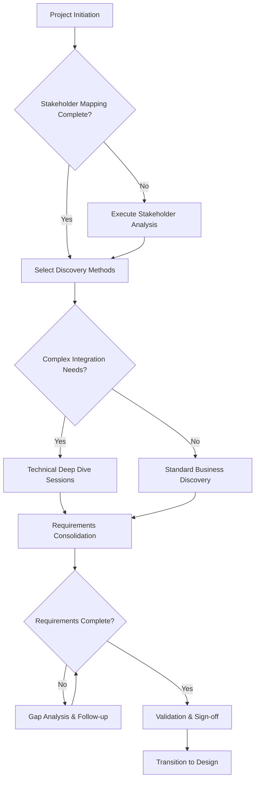

[⬅️ Back to Main SDLC Page](00_data_platform_sdlc.md)

# Discovery & Requirements Gathering for Data Platform Projects
## LLM-Optimized Toolkit for Effective Discovery

**Purpose:** This document provides a comprehensive, actionable framework for conducting discovery and requirements gathering in data platform projects, specifically optimized for LLM-assisted collaboration and pair programming.

---

## 1. 🤖 LLM Collaboration Guide

### LLM Roles in Discovery
The LLM can serve multiple roles during discovery:

**1. Discovery Facilitator**
- Guide stakeholder interviews using structured question frameworks
- Suggest follow-up questions based on responses
- Maintain session focus and ensure comprehensive coverage

**2. Requirements Analyst**
- Structure and categorize gathered information
- Identify gaps and inconsistencies in requirements
- Generate requirement specifications from unstructured input

**3. Documentation Assistant**
- Create structured artifacts from meeting notes
- Maintain traceability between requirements and business goals
- Generate summaries and action items

**4. Quality Validator**
- Check completeness against discovery checklists
- Validate requirement clarity and testability
- Identify potential risks and assumptions

### LLM Prompt Templates

**Discovery Session Initiation:**
```
You are facilitating a discovery session for a [PROJECT_TYPE] data platform project. 
The stakeholder is a [STAKEHOLDER_ROLE] with [EXPERIENCE_LEVEL] experience.
Focus on [DISCOVERY_AREA] and use the structured questions from Section [X].
Maintain a collaborative tone and probe for specific examples and metrics.
```

**Requirements Analysis:**
```
Analyze the following discovery notes and extract:
1. Functional requirements (use template in Section 5.1)
2. Non-functional requirements (use template in Section 5.2)
3. Assumptions and risks (use template in Section 6.1)
4. Missing information that needs follow-up
Format output using the structured templates provided.
```

---

## 2. 📋 Discovery Workflow & Decision Trees

### Discovery Process Flow



### Discovery Method Selection Matrix

| Project Characteristics | Recommended Approach | Key Focus Areas |
|------------------------|---------------------|-----------------|
| **Greenfield, Small Team** | Rapid Discovery Workshops | Business goals, MVP scope, quick wins |
| **Legacy Modernization** | Technical Assessment First | Current state analysis, migration risks |
| **Regulatory/Compliance Heavy** | Governance-Led Discovery | Compliance requirements, audit trails |
| **Multi-Department** | Stakeholder-Intensive | Alignment workshops, consensus building |
| **Real-time Requirements** | Architecture-First | Performance requirements, technical constraints |

---

## 3. 👥 Stakeholder Engagement Toolkit

### Stakeholder Categories & Question Banks

### 3.1 Business Executives
**Role:** Strategic direction, budget approval, success metrics

**Key Questions:**
- What business outcomes are you expecting from this data platform?
- How will you measure the success of this investment? What are the top 3-5 KPIs?
- What are the top 3 business decisions this platform should enable or improve?
- What happens if we don't build this platform? What is the cost of inaction?
- What's your timeline for seeing business value? (e.g., 3 months, 6 months, 1 year)
- Who are the primary beneficiaries of this platform?
- What are the biggest risks to this project from your perspective?
- How does this project align with our broader company goals for this year?

**Follow-up Prompts:**
- "Can you give me a specific example of..."
- "What would 'good enough' look like for..."
- "How does this align with [company strategy/initiative]..."

### 3.2 Data Analysts & Scientists
**Role:** End users, analytical requirements, data quality needs

**Key Questions:**
- What analyses are you currently unable to perform due to data limitations?
- How much time do you spend on data preparation vs. analysis? What are the biggest bottlenecks?
- What data quality issues do you encounter most frequently? Can you provide examples?
- What tools and technologies do you prefer to work with? What are the limitations of your current tools?
- How do you currently share insights with stakeholders? What would make this process better?
- What new data sources would be most valuable to you?
- Describe a recent analysis that was particularly difficult. What made it challenging?
- How do you want to consume data from the new platform (e.g., SQL, Python, BI tool)?

**Technical Deep-Dive:**
- Data access patterns and frequency
- Required data freshness and latency
- Preferred data formats and interfaces
- Integration with existing analytical tools

### 3.3 IT/Technical Teams
**Role:** Implementation, maintenance, technical constraints

**Key Questions:**
- What are our current technical constraints and limitations (e.g., cloud provider, approved technologies)?
- What systems must this platform integrate with? What are the integration patterns (API, DB link, etc.)?
- What are our security and compliance requirements (e.g., data encryption, access control)?
- What's our current operational capacity for new systems? Who will support this platform?
- What technical debt should we address as part of this project?
- What are the non-negotiable technical standards we must adhere to?
- How do you prefer to handle logging, monitoring, and alerting?
- What are the expected SLAs for the systems this platform will depend on?

**Infrastructure Assessment:**
- Current data infrastructure inventory
- Network and security constraints
- Operational procedures and capabilities
- Disaster recovery and backup requirements

### 3.4 Data Owners & Stewards
**Role:** Data governance, quality, access control

**Key Questions:**
- Who owns each data source and what are the access requirements?
- What data governance policies must be enforced (e.g., data classification, usage policies)?
- How is data quality currently monitored and maintained? What are the current data quality metrics?
- What are the data retention and archival requirements for each data domain?
- How should data lineage and audit trails be maintained to meet compliance needs?
- What is the process for requesting access to new data?
- Are there any restrictions on data movement (e.g., cross-border data transfers)?
- How are data quality issues currently reported and resolved?

### Stakeholder Mapping Template

**JSON Template (for system integration):**
```json
{
  "stakeholder_id": "unique_identifier",
  "name": "stakeholder_name",
  "role": "job_title",
  "department": "organizational_unit",
  "influence_level": "high|medium|low",
  "interest_level": "high|medium|low",
  "communication_preference": "email|meetings|slack|formal_docs",
  "availability": "schedule_constraints",
  "key_concerns": ["concern1", "concern2"],
  "success_criteria": ["criteria1", "criteria2"],
  "dependencies": ["other_stakeholder_ids"]
}
```

**Markdown Table (for easy use in documents):**

| Name | Role | Department | Influence | Interest | Key Concerns | Success Criteria |
|---|---|---|---|---|---|---|
| | | | High/Medium/Low | High/Medium/Low | | |
| | | | High/Medium/Low | High/Medium/Low | | |
| | | | High/Medium/Low | High/Medium/Low | | |

---

## 4. 🔍 Data Landscape Assessment Framework

### 4.1 Data Source Inventory Template

**JSON Template (for system integration):**
```json
{
  "data_source": {
    "source_id": "unique_identifier",
    "name": "source_name",
    "type": "database|file|api|stream|manual",
    "owner": "data_owner",
    "steward": "data_steward",
    "location": "system/path/url",
    "access_method": "connection_details",
    "update_frequency": "real-time|hourly|daily|weekly|monthly",
    "data_volume": {
      "current_size": "size_with_units",
      "growth_rate": "percentage_per_period"
    },
    "data_quality": {
      "completeness": "percentage",
      "accuracy": "assessment",
      "consistency": "assessment",
      "timeliness": "assessment"
    },
    "business_criticality": "critical|important|nice-to-have",
    "compliance_requirements": ["gdpr", "sox", "hipaa"],
    "dependencies": ["dependent_systems"],
    "issues": ["known_problems"]
  }
}
```

**Markdown Table (for easy use in documents):**

| Source Name | Owner | Type | Frequency | Volume | Criticality | Data Quality Score |
|---|---|---|---|---|---|---|
| | | Database/File/API | Real-time/Daily/Weekly | | Critical/Important | |
| | | Database/File/API | Real-time/Daily/Weekly | | Critical/Important | |
| | | Database/File/API | Real-time/Daily/Weekly | | Critical/Important | |

### 4.2 Technical Infrastructure Assessment

**Current State Checklist:**
- [ ] Data storage systems (databases, data lakes, warehouses)
- [ ] ETL/ELT tools and processes
- [ ] Data integration platforms
- [ ] Analytics and BI tools
- [ ] Data governance tools
- [ ] Monitoring and alerting systems
- [ ] Security and access control systems
- [ ] Backup and disaster recovery systems

**Capability Gap Analysis:**
```json
{
  "capability": "capability_name",
  "current_state": "description",
  "desired_state": "description",
  "gap_severity": "critical|major|minor",
  "effort_estimate": "high|medium|low",
  "dependencies": ["other_capabilities"],
  "recommended_approach": "build|buy|partner"
}
```

---

## 5. 📝 Requirements Capture Templates

### 5.1 Functional Requirements Template

```json
{
  "requirement_id": "FR-001",
  "title": "requirement_title",
  "description": "detailed_description",
  "business_justification": "why_needed",
  "stakeholder": "requesting_stakeholder",
  "priority": "must_have|should_have|could_have|wont_have",
  "complexity": "high|medium|low",
  "acceptance_criteria": [
    "Given [context] When [action] Then [outcome]"
  ],
  "dependencies": ["other_requirement_ids"],
  "assumptions": ["assumption1", "assumption2"],
  "constraints": ["constraint1", "constraint2"],
  "test_scenarios": ["scenario1", "scenario2"]
}
```

### 5.2 Non-Functional Requirements Template

**Performance Requirements:**
- Data processing throughput: [X records/second]
- Query response time: [X seconds for Y% of queries]
- Data freshness: [maximum acceptable latency]
- Concurrent users: [number of simultaneous users]

**Scalability Requirements:**
- Data volume growth: [expected growth rate]
- User growth: [expected user increase]
- Geographic expansion: [regions/locations]

**Security Requirements:**
- Authentication: [methods and standards]
- Authorization: [role-based access control]
- Data encryption: [at rest and in transit]
- Audit logging: [what to log and retention]

**Compliance Requirements:**
- Regulatory frameworks: [GDPR, SOX, HIPAA, etc.]
- Data retention policies: [retention periods]
- Right to be forgotten: [deletion capabilities]
- Data residency: [geographic restrictions]

### 5.3 Integration Requirements

```json
{
  "integration_id": "INT-001",
  "source_system": "system_name",
  "target_system": "system_name",
  "integration_type": "batch|real-time|api|file-based",
  "data_format": "json|xml|csv|parquet|avro",
  "frequency": "schedule_or_trigger",
  "volume": "records_per_execution",
  "transformation_needed": "yes|no",
  "error_handling": "retry_logic_and_notifications",
  "monitoring_requirements": "what_to_monitor",
  "sla_requirements": "uptime_and_performance"
}
```

---

## 6. ⚠️ Risk & Assumption Management

### 6.1 Risk Assessment Framework

**Risk Categories:**
1. **Technical Risks:** Technology limitations, integration complexity
2. **Data Risks:** Quality issues, availability, compliance
3. **Organizational Risks:** Skills gaps, change resistance, resource constraints
4. **External Risks:** Vendor dependencies, regulatory changes

**Risk Assessment Template:**
```json
{
  "risk_id": "RISK-001",
  "category": "technical|data|organizational|external",
  "description": "risk_description",
  "probability": "high|medium|low",
  "impact": "high|medium|low",
  "risk_score": "calculated_score",
  "mitigation_strategy": "how_to_reduce_risk",
  "contingency_plan": "what_if_risk_occurs",
  "owner": "responsible_person",
  "status": "open|mitigated|closed"
}
```

### 6.2 Assumption Management

**Common Assumptions to Validate:**
- Data source availability and reliability
- Stakeholder availability for requirements validation
- Technical team capacity and skills
- Budget and timeline constraints
- Regulatory environment stability
- Technology vendor roadmaps

**Assumption Template:**
```json
{
  "assumption_id": "ASS-001",
  "description": "assumption_statement",
  "category": "technical|business|organizational",
  "confidence_level": "high|medium|low",
  "validation_method": "how_to_verify",
  "validation_date": "target_date",
  "impact_if_wrong": "consequences",
  "owner": "responsible_person"
}
```

---

## 7. ✅ Validation & Quality Gates

### 7.1 Discovery Completeness Checklist

**Business Understanding:**
- [ ] Business objectives clearly defined and measurable
- [ ] Success criteria agreed upon by all stakeholders
- [ ] Use cases prioritized and scoped
- [ ] Value proposition articulated and validated

**Stakeholder Alignment:**
- [ ] All key stakeholders identified and engaged
- [ ] Roles and responsibilities defined
- [ ] Communication plan established
- [ ] Conflict resolution process agreed

**Technical Assessment:**
- [ ] Current state architecture documented
- [ ] Data sources inventoried and assessed
- [ ] Integration requirements defined
- [ ] Technical constraints identified

**Requirements Quality:**
- [ ] Requirements are specific and measurable
- [ ] Acceptance criteria defined for each requirement
- [ ] Dependencies and assumptions documented
- [ ] Traceability to business objectives established

### 7.2 Readiness Gates

**Gate 1: Stakeholder Alignment**
- All key stakeholders identified and engaged
- Business objectives and success criteria agreed
- Project scope and boundaries defined

**Gate 2: Requirements Completeness**
- Functional and non-functional requirements documented
- Requirements prioritized and approved
- Assumptions and risks identified and assessed

**Gate 3: Technical Feasibility**
- Technical approach validated
- Integration requirements confirmed
- Resource and skill requirements identified

**Gate 4: Design Readiness**
- All discovery artifacts reviewed and approved
- Transition plan to design phase agreed
- Design team briefed and ready

---

## 8. 📚 Example Scenarios & Case Studies

### 8.1 Scenario: Retail Analytics Platform

**Context:** Mid-size retailer wants to build a customer analytics platform to improve personalization and inventory management.

**Key Stakeholders:**
- CMO (business sponsor)
- Head of Merchandising (primary user)
- IT Director (technical lead)
- Data Analysts (end users)

**Discovery Approach:**
1. Executive alignment workshop (business goals, success metrics)
2. Current state assessment (existing systems, data sources)
3. User journey mapping (analyst workflows, pain points)
4. Technical deep dive (integration requirements, performance needs)

**Sample Requirements:**
- **FR-001:** System must integrate customer transaction data from POS systems within 1 hour
- **FR-002:** Platform must support customer segmentation based on purchase behavior
- **NFR-001:** System must handle 10M customer records with sub-second query response
- **NFR-002:** Platform must be available 99.9% during business hours

**Key Risks Identified:**
- Data quality issues in legacy POS systems
- Limited analytics team capacity for new platform adoption
- Seasonal traffic spikes requiring elastic scaling

### 8.2 Scenario: Financial Reporting Modernization

**Context:** Financial services company needs to modernize regulatory reporting to reduce manual effort and improve accuracy.

**Key Stakeholders:**
- CFO (business sponsor)
- Head of Financial Reporting (primary user)
- Compliance Officer (regulatory requirements)
- IT Architecture (technical implementation)

**Discovery Focus Areas:**
1. Regulatory requirements mapping
2. Current reporting process analysis
3. Data lineage and audit trail requirements
4. Integration with core banking systems

**Critical Success Factors:**
- 100% accuracy in regulatory calculations
- Complete audit trail for all data transformations
- Automated reconciliation with source systems
- Flexible reporting framework for regulatory changes

---

## 9. 🔄 Discovery Iteration & Refinement

### 9.1 Feedback Loops

**Weekly Discovery Reviews:**
- Progress against discovery plan
- New information and insights
- Stakeholder feedback and concerns
- Adjustments to approach or scope

**Stakeholder Validation Sessions:**
- Requirements walkthrough and confirmation
- Priority and scope validation
- Assumption and risk review
- Sign-off on discovery artifacts

### 9.2 Discovery Artifacts Maintenance

**Living Documents:**
- Requirements should be version controlled
- Changes must be traced to business justification
- Impact analysis required for scope changes
- Stakeholder approval needed for major changes

**Traceability Matrix:**
```json
{
  "business_objective": "objective_id",
  "use_cases": ["use_case_ids"],
  "requirements": ["requirement_ids"],
  "risks": ["risk_ids"],
  "assumptions": ["assumption_ids"],
  "validation_status": "pending|validated|approved"
}
```

---

## 10. 🚀 Transition to Design Phase

### 10.1 Handoff Checklist

**Documentation Package:**
- [ ] Stakeholder map and contact information
- [ ] Business objectives and success criteria
- [ ] Prioritized requirements with acceptance criteria
- [ ] Technical constraints and integration requirements
- [ ] Risk register and mitigation strategies
- [ ] Assumption log with validation status

**Knowledge Transfer:**
- [ ] Discovery team briefing to design team
- [ ] Key stakeholder introductions
- [ ] Context and rationale for major decisions
- [ ] Outstanding questions and follow-up items

**Design Phase Preparation:**
- [ ] Design team capacity confirmed
- [ ] Architecture review scheduled
- [ ] Stakeholder availability for design reviews
- [ ] Prototype and proof-of-concept planning

---

## 11. 📖 Quick Reference

### LLM Prompt Library

**Generate Stakeholder Questions:**
```
Generate 10 discovery questions for a [STAKEHOLDER_ROLE] in a [PROJECT_TYPE] data platform project. Focus on [SPECIFIC_AREA] and include follow-up probes for each question.
```

**Analyze Discovery Notes:**
```
Review these discovery session notes and extract: 1) Key requirements, 2) Assumptions, 3) Risks, 4) Follow-up actions. Format using the templates in this document.
```

**Validate Requirements:**
```
Check these requirements for completeness using the quality criteria in Section 7.1. Identify any missing information or unclear specifications.
```

### Common Anti-Patterns to Avoid

1. **Solution-First Discovery:** Starting with technology choices before understanding requirements
2. **Stakeholder Tunnel Vision:** Only engaging with immediate requestors, missing broader impact
3. **Analysis Paralysis:** Over-analyzing without making decisions or moving forward
4. **Assumption Overload:** Making too many unvalidated assumptions about requirements or constraints
5. **Documentation Heavy:** Creating extensive documentation that nobody reads or maintains

### Success Patterns

1. **Iterative Validation:** Regular check-ins with stakeholders to validate understanding
2. **Visual Communication:** Using diagrams, mockups, and prototypes to clarify requirements
3. **Collaborative Workshops:** Bringing stakeholders together to resolve conflicts and align priorities
4. **Incremental Delivery:** Planning for phased delivery to validate assumptions early
5. **Change Management:** Preparing organization for new platform adoption from day one

---

*This document is designed for LLM-assisted discovery sessions. Use the templates, prompts, and frameworks to guide comprehensive and effective requirements gathering for data platform projects.*
