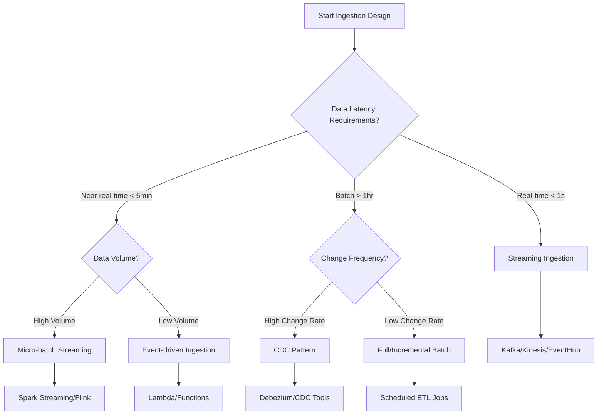

[⬅️ Back to Main SDLC Page](00_data_platform_sdlc.md)

# Data Ingestion & Integration for Data Platform Projects
## LLM-Optimized Framework for Pipeline Development

**Purpose:** This document provides a comprehensive, actionable framework for designing and implementing data ingestion pipelines, specifically optimized for LLM-assisted pipeline development and data integration.

---

## 1. 🤖 LLM Data Ingestion Assistant Guide

### LLM Roles in Data Ingestion

**1. Data Engineer**
- Generate ingestion pipelines from source system specifications
- Design data transformation and validation logic
- Optimize pipeline performance and resource utilization

**2. Integration Architect**
- Analyze source systems and recommend integration patterns
- Design connector architectures and data flow strategies
- Create data mapping and schema evolution frameworks

**3. Pipeline Developer**
- Build and configure data connectors and pipelines
- Implement error handling and retry mechanisms
- Create monitoring and alerting configurations

**4. Quality Validator**
- Generate data quality rules and validation frameworks
- Design data profiling and anomaly detection systems
- Create data cleansing and enrichment processes

### LLM Prompt Templates

**Pipeline Generation:**
```
Generate a complete data ingestion pipeline for this source system:
- Source type: [DATABASE/API/FILE/STREAM]
- Data characteristics: [VOLUME/VELOCITY/VARIETY]
- Target system: [DATA_LAKE/WAREHOUSE/STREAM]
- Requirements: [LATENCY/QUALITY/COMPLIANCE]
Use the templates from Section 3 and patterns from Section 4.
```

**Connector Configuration:**
```
Create connector configuration for [SOURCE_SYSTEM] with these specifications:
- Connection details: [HOST/PORT/CREDENTIALS]
- Data extraction: [FULL/INCREMENTAL/CDC]
- Schedule: [BATCH_FREQUENCY/STREAMING]
- Transformations: [MAPPING/VALIDATION/ENRICHMENT]
Include error handling and monitoring from Section 6.
```

**Troubleshooting Assistant:**
```
Diagnose this ingestion pipeline issue: [PROBLEM_DESCRIPTION]
Pipeline details: [PIPELINE_CONFIG]
Error logs: [ERROR_MESSAGES]
Provide step-by-step resolution using the diagnostic framework from Section 9.
```

---

## 2. 📊 Ingestion Strategy Decision Framework

### Decision Tree: Ingestion Pattern Selection



### Source System Analysis Matrix

| Source Type | Complexity | Latency | Volume Capacity | Recommended Pattern |
|-------------|------------|---------|-----------------|-------------------|
| **RDBMS** | Medium | Batch/CDC | High | CDC for real-time, Batch for historical |
| **REST API** | Low | Real-time | Medium | Event-driven or scheduled polling |
| **File Systems** | Low | Batch | High | Scheduled batch processing |
| **Message Queues** | Medium | Real-time | Very High | Native streaming consumption |
| **SaaS Applications** | High | Batch | Medium | Vendor connectors or API polling |
| **IoT/Sensors** | Medium | Real-time | Very High | Streaming with buffering |

### Ingestion Tool Selection Framework

**JSON Template (for system integration):**
```json
{
  "ingestion_tools": {
    "batch_processing": {
      "apache_airflow": {
        "strengths": ["workflow_orchestration", "extensible", "community"],
        "weaknesses": ["complexity", "resource_intensive"],
        "best_for": ["complex_workflows", "custom_logic", "hybrid_patterns"],
        "cost_model": "infrastructure_based"
      },
      "aws_glue": {
        "strengths": ["serverless", "auto_scaling", "aws_integration"],
        "weaknesses": ["aws_lock_in", "limited_customization"],
        "best_for": ["aws_environments", "simple_etl", "cost_optimization"],
        "cost_model": "pay_per_use"
      },
      "azure_data_factory": {
        "strengths": ["visual_interface", "hybrid_connectivity", "azure_native"],
        "weaknesses": ["azure_lock_in", "complex_pricing"],
        "best_for": ["azure_environments", "citizen_developers", "hybrid_scenarios"],
        "cost_model": "pipeline_execution_based"
      }
    },
    "streaming_processing": {
      "apache_kafka": {
        "strengths": ["high_throughput", "durability", "ecosystem"],
        "weaknesses": ["operational_complexity", "learning_curve"],
        "best_for": ["high_volume_streaming", "event_sourcing", "microservices"],
        "cost_model": "infrastructure_based"
      },
      "aws_kinesis": {
        "strengths": ["managed_service", "aws_integration", "auto_scaling"],
        "weaknesses": ["aws_lock_in", "shard_limitations"],
        "best_for": ["aws_environments", "moderate_throughput", "real_time_analytics"],
        "cost_model": "shard_hour_based"
      },
      "confluent_cloud": {
        "strengths": ["managed_kafka", "enterprise_features", "multi_cloud"],
        "weaknesses": ["cost", "vendor_dependency"],
        "best_for": ["enterprise_kafka", "multi_cloud", "managed_operations"],
        "cost_model": "throughput_based"
      }
    }
  }
}
```

**Markdown Table (for easy comparison):**

| Category | Tool | Best For | Strengths | Weaknesses |
|---|---|---|---|---|
| **Batch** | Apache Airflow | Complex workflows, custom logic | Workflow orchestration, extensible | Complexity, resource intensive |
| **Batch** | AWS Glue | AWS environments, simple ETL | Serverless, auto-scaling | AWS lock-in, limited customization |
| **Batch** | Azure Data Factory | Azure environments, hybrid scenarios | Visual interface, hybrid connectivity | Azure lock-in, complex pricing |
| **Streaming** | Apache Kafka | High-volume streaming, event sourcing | High throughput, durability, ecosystem | Operational complexity, learning curve |
| **Streaming** | AWS Kinesis | AWS environments, real-time analytics | Managed service, auto-scaling | AWS lock-in, shard limitations |
| **Streaming** | Confluent Cloud | Enterprise Kafka, multi-cloud | Managed Kafka, enterprise features | Cost, vendor dependency |

---

## 3. 🔧 Comprehensive Connector Library

### 3.1 Database Connectors

#### PostgreSQL Connector Template

```python
# postgresql_connector.py
import psycopg2
import pandas as pd
from datetime import datetime, timedelta
import logging
from typing import Dict, List, Optional

class PostgreSQLConnector:
    def __init__(self, config: Dict):
        self.config = config
        self.connection = None
        self.logger = logging.getLogger(__name__)
    
    def connect(self):
        """Establish database connection with retry logic"""
        try:
            self.connection = psycopg2.connect(
                host=self.config['host'],
                port=self.config['port'],
                database=self.config['database'],
                user=self.config['username'],
                password=self.config['password'],
                sslmode=self.config.get('sslmode', 'require')
            )
            self.logger.info("Successfully connected to PostgreSQL")
        except Exception as e:
            self.logger.error(f"Failed to connect to PostgreSQL: {e}")
            raise
    
    def extract_full(self, table_name: str, batch_size: int = 10000) -> pd.DataFrame:
        """Extract full table data in batches"""
        query = f"SELECT * FROM {table_name}"
        return self._execute_query_batched(query, batch_size)
    
    def extract_incremental(self, table_name: str, timestamp_column: str, 
                          last_extracted: datetime, batch_size: int = 10000) -> pd.DataFrame:
        """Extract incremental data based on timestamp"""
        query = f"""
        SELECT * FROM {table_name} 
        WHERE {timestamp_column} > %s 
        ORDER BY {timestamp_column}
        """
        return self._execute_query_batched(query, batch_size, (last_extracted,))
    
    def extract_cdc(self, table_name: str, cdc_column: str = 'cdc_timestamp') -> pd.DataFrame:
        """Extract changed data using CDC pattern"""
        query = f"""
        SELECT *, '{datetime.now()}' as extraction_timestamp
        FROM {table_name} 
        WHERE {cdc_column} > (
            SELECT COALESCE(MAX(extraction_timestamp), '1900-01-01') 
            FROM cdc_watermark 
            WHERE table_name = %s
        )
        """
        return self._execute_query_batched(query, 10000, (table_name,))
    
    def _execute_query_batched(self, query: str, batch_size: int, params=None) -> pd.DataFrame:
        """Execute query with batching for large datasets"""
        try:
            cursor = self.connection.cursor()
            cursor.execute(query, params)
            
            all_data = []
            while True:
                batch = cursor.fetchmany(batch_size)
                if not batch:
                    break
                all_data.extend(batch)
            
            columns = [desc[0] for desc in cursor.description]
            return pd.DataFrame(all_data, columns=columns)
            
        except Exception as e:
            self.logger.error(f"Query execution failed: {e}")
            raise
        finally:
            cursor.close()
    
    def get_table_schema(self, table_name: str) -> Dict:
        """Get table schema information"""
        query = """
        SELECT column_name, data_type, is_nullable, column_default
        FROM information_schema.columns
        WHERE table_name = %s
        ORDER BY ordinal_position
        """
        cursor = self.connection.cursor()
        cursor.execute(query, (table_name,))
        
        schema = {
            'columns': [],
            'primary_keys': self._get_primary_keys(table_name)
        }
        
        for row in cursor.fetchall():
            schema['columns'].append({
                'name': row[0],
                'type': row[1],
                'nullable': row[2] == 'YES',
                'default': row[3]
            })
        
        return schema
    
    def _get_primary_keys(self, table_name: str) -> List[str]:
        """Get primary key columns"""
        query = """
        SELECT column_name
        FROM information_schema.key_column_usage
        WHERE table_name = %s AND constraint_name LIKE '%_pkey'
        """
        cursor = self.connection.cursor()
        cursor.execute(query, (table_name,))
        return [row[0] for row in cursor.fetchall()]
```

#### Connector Configuration Template

```yaml
# postgresql_config.yaml
source:
  type: postgresql
  connection:
    host: ${POSTGRES_HOST}
    port: ${POSTGRES_PORT}
    database: ${POSTGRES_DB}
    username: ${POSTGRES_USER}
    password: ${POSTGRES_PASSWORD}
    sslmode: require
  
  tables:
    - name: customers
      extraction_mode: incremental
      timestamp_column: updated_at
      batch_size: 5000
      schedule: "0 */4 * * *"  # Every 4 hours
      
    - name: orders
      extraction_mode: cdc
      cdc_column: cdc_timestamp
      batch_size: 10000
      schedule: "*/15 * * * *"  # Every 15 minutes
      
    - name: products
      extraction_mode: full
      batch_size: 1000
      schedule: "0 2 * * *"  # Daily at 2 AM

validation:
  schema_validation: true
  data_quality_checks:
    - type: not_null
      columns: [id, email, created_at]
    - type: unique
      columns: [id]
    - type: range
      column: age
      min: 0
      max: 150

target:
  type: s3
  bucket: ${DATA_LAKE_BUCKET}
  prefix: raw/postgresql/
  format: parquet
  partitioning:
    - column: extraction_date
      format: "yyyy/MM/dd"

error_handling:
  retry_attempts: 3
  retry_delay: 60
  dead_letter_queue: ${DLQ_TOPIC}
  quarantine_bucket: ${QUARANTINE_BUCKET}
```

### 3.2 API Connectors

#### REST API Connector Template

```python
# rest_api_connector.py
import requests
import json
import time
from datetime import datetime, timedelta
from typing import Dict, List, Optional, Generator
import logging

class RestAPIConnector:
    def __init__(self, config: Dict):
        self.config = config
        self.session = requests.Session()
        self.logger = logging.getLogger(__name__)
        self._setup_authentication()
    
    def _setup_authentication(self):
        """Setup authentication based on config"""
        auth_type = self.config.get('auth_type', 'none')
        
        if auth_type == 'bearer':
            self.session.headers.update({
                'Authorization': f"Bearer {self.config['token']}"
            })
        elif auth_type == 'api_key':
            self.session.headers.update({
                self.config['api_key_header']: self.config['api_key']
            })
        elif auth_type == 'basic':
            self.session.auth = (
                self.config['username'], 
                self.config['password']
            )
    
    def extract_paginated(self, endpoint: str, params: Dict = None) -> Generator[Dict, None, None]:
        """Extract data from paginated API endpoint"""
        url = f"{self.config['base_url']}/{endpoint.lstrip('/')}"
        page = 1
        
        while True:
            current_params = params.copy() if params else {}
            current_params.update({
                self.config.get('page_param', 'page'): page,
                self.config.get('size_param', 'limit'): self.config.get('page_size', 100)
            })
            
            try:
                response = self._make_request('GET', url, params=current_params)
                data = response.json()
                
                # Extract records based on response structure
                records = self._extract_records(data)
                if not records:
                    break
                
                for record in records:
                    yield record
                
                # Check if there are more pages
                if not self._has_more_pages(data, page):
                    break
                
                page += 1
                time.sleep(self.config.get('rate_limit_delay', 0.1))
                
            except Exception as e:
                self.logger.error(f"Error extracting page {page}: {e}")
                break
    
    def extract_incremental(self, endpoint: str, since_timestamp: datetime) -> Generator[Dict, None, None]:
        """Extract incremental data since timestamp"""
        params = {
            self.config.get('timestamp_param', 'since'): since_timestamp.isoformat()
        }
        yield from self.extract_paginated(endpoint, params)
    
    def _make_request(self, method: str, url: str, **kwargs) -> requests.Response:
        """Make HTTP request with retry logic"""
        max_retries = self.config.get('max_retries', 3)
        retry_delay = self.config.get('retry_delay', 1)
        
        for attempt in range(max_retries + 1):
            try:
                response = self.session.request(method, url, **kwargs)
                response.raise_for_status()
                return response
                
            except requests.exceptions.RequestException as e:
                if attempt == max_retries:
                    self.logger.error(f"Request failed after {max_retries} retries: {e}")
                    raise
                
                self.logger.warning(f"Request attempt {attempt + 1} failed: {e}")
                time.sleep(retry_delay * (2 ** attempt))  # Exponential backoff
    
    def _extract_records(self, response_data: Dict) -> List[Dict]:
        """Extract records from API response based on structure"""
        data_path = self.config.get('data_path', 'data')
        
        if isinstance(data_path, str):
            return response_data.get(data_path, [])
        elif isinstance(data_path, list):
            # Navigate nested structure
            current = response_data
            for key in data_path:
                current = current.get(key, {})
            return current if isinstance(current, list) else []
        else:
            return response_data if isinstance(response_data, list) else []
    
    def _has_more_pages(self, response_data: Dict, current_page: int) -> bool:
        """Check if there are more pages to fetch"""
        pagination_info = response_data.get('pagination', {})
        
        if 'has_more' in pagination_info:
            return pagination_info['has_more']
        elif 'total_pages' in pagination_info:
            return current_page < pagination_info['total_pages']
        elif 'next_page' in pagination_info:
            return pagination_info['next_page'] is not None
        else:
            # Fallback: assume no more pages if current page returned no data
            return len(self._extract_records(response_data)) > 0
```

### 3.3 Streaming Connectors

#### Kafka Consumer Template

```python
# kafka_consumer.py
from kafka import KafkaConsumer, TopicPartition
import json
import logging
from typing import Dict, List, Callable, Optional
from datetime import datetime
import threading

class KafkaStreamingConnector:
    def __init__(self, config: Dict):
        self.config = config
        self.consumer = None
        self.logger = logging.getLogger(__name__)
        self.running = False
        self.message_handlers = {}
    
    def connect(self):
        """Initialize Kafka consumer"""
        try:
            self.consumer = KafkaConsumer(
                bootstrap_servers=self.config['bootstrap_servers'],
                group_id=self.config.get('group_id', 'data-ingestion'),
                auto_offset_reset=self.config.get('auto_offset_reset', 'latest'),
                enable_auto_commit=self.config.get('enable_auto_commit', True),
                value_deserializer=lambda x: json.loads(x.decode('utf-8')),
                key_deserializer=lambda x: x.decode('utf-8') if x else None,
                security_protocol=self.config.get('security_protocol', 'PLAINTEXT'),
                sasl_mechanism=self.config.get('sasl_mechanism'),
                sasl_plain_username=self.config.get('username'),
                sasl_plain_password=self.config.get('password'),
                consumer_timeout_ms=self.config.get('timeout_ms', 10000)
            )
            self.logger.info("Successfully connected to Kafka")
        except Exception as e:
            self.logger.error(f"Failed to connect to Kafka: {e}")
            raise
    
    def subscribe_topics(self, topics: List[str]):
        """Subscribe to Kafka topics"""
        self.consumer.subscribe(topics)
        self.logger.info(f"Subscribed to topics: {topics}")
    
    def register_handler(self, topic: str, handler: Callable[[Dict], None]):
        """Register message handler for specific topic"""
        self.message_handlers[topic] = handler
    
    def start_consuming(self, batch_size: int = 100):
        """Start consuming messages in batches"""
        self.running = True
        batch = []
        
        try:
            while self.running:
                message_batch = self.consumer.poll(
                    timeout_ms=self.config.get('poll_timeout', 1000),
                    max_records=batch_size
                )
                
                for topic_partition, messages in message_batch.items():
                    topic = topic_partition.topic
                    handler = self.message_handlers.get(topic, self._default_handler)
                    
                    for message in messages:
                        try:
                            # Enrich message with metadata
                            enriched_message = {
                                'topic': topic,
                                'partition': message.partition,
                                'offset': message.offset,
                                'timestamp': datetime.fromtimestamp(message.timestamp / 1000),
                                'key': message.key,
                                'value': message.value,
                                'headers': dict(message.headers) if message.headers else {}
                            }
                            
                            handler(enriched_message)
                            
                        except Exception as e:
                            self.logger.error(f"Error processing message: {e}")
                            self._handle_error(message, e)
                
                # Commit offsets periodically
                if not self.config.get('enable_auto_commit', True):
                    self.consumer.commit()
                    
        except Exception as e:
            self.logger.error(f"Error in message consumption: {e}")
        finally:
            self.consumer.close()
    
    def _default_handler(self, message: Dict):
        """Default message handler"""
        self.logger.info(f"Received message from {message['topic']}: {message['value']}")
    
    def _handle_error(self, message, error):
        """Handle message processing errors"""
        error_topic = self.config.get('error_topic')
        if error_topic:
            # Send to error topic for later processing
            pass
        
        # Log error with context
        self.logger.error(f"Message processing error: {error}, Message: {message}")
    
    def stop_consuming(self):
        """Stop message consumption"""
        self.running = False
        self.logger.info("Stopping Kafka consumer")
```

---

## 4. 🏗️ Pipeline Development Toolkit

### 4.1 Apache Airflow Pipeline Templates

#### Complete ETL Pipeline Template

```python
# airflow_etl_pipeline.py
from airflow import DAG
from airflow.operators.python import PythonOperator
from airflow.operators.bash import BashOperator
from airflow.providers.postgres.operators.postgres import PostgresOperator
from airflow.providers.amazon.aws.operators.s3 import S3CreateObjectOperator
from airflow.providers.amazon.aws.sensors.s3 import S3KeySensor
from datetime import datetime, timedelta
import pandas as pd
import logging

# Default arguments
default_args = {
    'owner': 'data-engineering',
    'depends_on_past': False,
    'start_date': datetime(2024, 1, 1),
    'email_on_failure': True,
    'email_on_retry': False,
    'retries': 3,
    'retry_delay': timedelta(minutes=5),
    'catchup': False
}

# DAG definition
dag = DAG(
    'customer_data_ingestion',
    default_args=default_args,
    description='Ingest customer data from PostgreSQL to S3',
    schedule_interval='@hourly',
    max_active_runs=1,
    tags=['ingestion', 'customers', 'postgresql']
)

def extract_customer_data(**context):
    """Extract customer data from PostgreSQL"""
    from postgresql_connector import PostgreSQLConnector
    
    config = {
        'host': Variable.get('POSTGRES_HOST'),
        'port': Variable.get('POSTGRES_PORT'),
        'database': Variable.get('POSTGRES_DB'),
        'username': Variable.get('POSTGRES_USER'),
        'password': Variable.get('POSTGRES_PASSWORD')
    }
    
    connector = PostgreSQLConnector(config)
    connector.connect()
    
    # Get last extraction timestamp
    last_extracted = context['prev_ds_nodash']
    
    # Extract incremental data
    df = connector.extract_incremental(
        table_name='customers',
        timestamp_column='updated_at',
        last_extracted=datetime.strptime(last_extracted, '%Y%m%d')
    )
    
    # Save to temporary location
    temp_file = f"/tmp/customers_{context['ds_nodash']}.parquet"
    df.to_parquet(temp_file, index=False)
    
    return temp_file

def validate_data(**context):
    """Validate extracted data"""
    temp_file = context['task_instance'].xcom_pull(task_ids='extract_data')
    df = pd.read_parquet(temp_file)
    
    # Data quality checks
    validation_results = {
        'record_count': len(df),
        'null_checks': {},
        'duplicate_checks': {},
        'range_checks': {}
    }
    
    # Check for nulls in required fields
    required_fields = ['customer_id', 'email', 'created_at']
    for field in required_fields:
        null_count = df[field].isnull().sum()
        validation_results['null_checks'][field] = null_count
        if null_count > 0:
            raise ValueError(f"Found {null_count} null values in required field {field}")
    
    # Check for duplicates
    duplicate_count = df.duplicated(subset=['customer_id']).sum()
    validation_results['duplicate_checks']['customer_id'] = duplicate_count
    if duplicate_count > 0:
        logging.warning(f"Found {duplicate_count} duplicate customer IDs")
    
    # Log validation results
    logging.info(f"Data validation results: {validation_results}")
    
    return validation_results

def transform_data(**context):
    """Transform and enrich data"""
    temp_file = context['task_instance'].xcom_pull(task_ids='extract_data')
    df = pd.read_parquet(temp_file)
    
    # Add extraction metadata
    df['extraction_timestamp'] = datetime.now()
    df['extraction_date'] = context['ds']
    df['pipeline_version'] = '1.0'
    
    # Data transformations
    df['email_domain'] = df['email'].str.split('@').str[1]
    df['customer_age_days'] = (datetime.now() - pd.to_datetime(df['created_at'])).dt.days
    
    # Save transformed data
    transformed_file = f"/tmp/customers_transformed_{context['ds_nodash']}.parquet"
    df.to_parquet(transformed_file, index=False)
    
    return transformed_file

def load_to_s3(**context):
    """Load data to S3 data lake"""
    transformed_file = context['task_instance'].xcom_pull(task_ids='transform_data')
    
    # S3 path with partitioning
    s3_key = f"raw/customers/year={context['ds'][:4]}/month={context['ds'][5:7]}/day={context['ds'][8:10]}/customers_{context['ds_nodash']}.parquet"
    
    # Upload to S3
    from airflow.providers.amazon.aws.hooks.s3 import S3Hook
    s3_hook = S3Hook(aws_conn_id='aws_default')
    s3_hook.load_file(
        filename=transformed_file,
        key=s3_key,
        bucket_name=Variable.get('DATA_LAKE_BUCKET'),
        replace=True
    )
    
    return s3_key

# Task definitions
extract_task = PythonOperator(
    task_id='extract_data',
    python_callable=extract_customer_data,
    dag=dag
)

validate_task = PythonOperator(
    task_id='validate_data',
    python_callable=validate_data,
    dag=dag
)

transform_task = PythonOperator(
    task_id='transform_data',
    python_callable=transform_data,
    dag=dag
)

load_task = PythonOperator(
    task_id='load_to_s3',
    python_callable=load_to_s3,
    dag=dag
)

# Data quality check task
quality_check_task = PostgresOperator(
    task_id='update_data_quality_metrics',
    postgres_conn_id='postgres_default',
    sql="""
    INSERT INTO data_quality_metrics (
        table_name, extraction_date, record_count, 
        quality_score, created_at
    ) VALUES (
        'customers', '{{ ds }}', 
        {{ task_instance.xcom_pull(task_ids='validate_data')['record_count'] }},
        95.0, NOW()
    );
    """,
    dag=dag
)

# Cleanup task
cleanup_task = BashOperator(
    task_id='cleanup_temp_files',
    bash_command='rm -f /tmp/customers_{{ ds_nodash }}*.parquet',
    dag=dag
)

# Task dependencies
extract_task >> validate_task >> transform_task >> load_task >> quality_check_task >> cleanup_task
```

### 4.2 Schema Evolution Framework

#### Schema Registry Integration

```python
# schema_registry.py
import json
import requests
from typing import Dict, List, Optional
from dataclasses import dataclass
from enum import Enum

class SchemaCompatibility(Enum):
    BACKWARD = "BACKWARD"
    FORWARD = "FORWARD"
    FULL = "FULL"
    NONE = "NONE"

@dataclass
class SchemaVersion:
    id: int
    version: int
    schema: str
    compatibility: SchemaCompatibility

class SchemaRegistry:
    def __init__(self, base_url: str, auth: Optional[tuple] = None):
        self.base_url = base_url.rstrip('/')
        self.session = requests.Session()
        if auth:
            self.session.auth = auth
    
    def register_schema(self, subject: str, schema: Dict, 
                       compatibility: SchemaCompatibility = SchemaCompatibility.BACKWARD) -> int:
        """Register new schema version"""
        # Set compatibility level
        self._set_compatibility(subject, compatibility)
        
        # Register schema
        url = f"{self.base_url}/subjects/{subject}/versions"
        payload = {"schema": json.dumps(schema)}
        
        response = self.session.post(url, json=payload)
        response.raise_for_status()
        
        return response.json()["id"]
    
    def get_latest_schema(self, subject: str) -> SchemaVersion:
        """Get latest schema version"""
        url = f"{self.base_url}/subjects/{subject}/versions/latest"
        response = self.session.get(url)
        response.raise_for_status()
        
        data = response.json()
        return SchemaVersion(
            id=data["id"],
            version=data["version"],
            schema=data["schema"],
            compatibility=SchemaCompatibility(self._get_compatibility(subject))
        )
    
    def validate_schema_evolution(self, subject: str, new_schema: Dict) -> bool:
        """Validate if new schema is compatible with existing versions"""
        url = f"{self.base_url}/compatibility/subjects/{subject}/versions/latest"
        payload = {"schema": json.dumps(new_schema)}
        
        response = self.session.post(url, json=payload)
        response.raise_for_status()
        
        return response.json()["is_compatible"]
    
    def _set_compatibility(self, subject: str, compatibility: SchemaCompatibility):
        """Set compatibility level for subject"""
        url = f"{self.base_url}/config/{subject}"
        payload = {"compatibility": compatibility.value}
        
        response = self.session.put(url, json=payload)
        response.raise_for_status()
    
    def _get_compatibility(self, subject: str) -> str:
        """Get compatibility level for subject"""
        url = f"{self.base_url}/config/{subject}"
        response = self.session.get(url)
        response.raise_for_status()
        
        return response.json()["compatibilityLevel"]

# Schema evolution handler
class SchemaEvolutionHandler:
    def __init__(self, schema_registry: SchemaRegistry):
        self.registry = schema_registry
        self.logger = logging.getLogger(__name__)
    
    def handle_schema_change(self, subject: str, new_schema: Dict) -> bool:
        """Handle schema evolution with validation"""
        try:
            # Validate compatibility
            is_compatible = self.registry.validate_schema_evolution(subject, new_schema)
            
            if is_compatible:
                # Register new schema version
                schema_id = self.registry.register_schema(subject, new_schema)
                self.logger.info(f"Successfully registered new schema version {schema_id} for {subject}")
                return True
            else:
                self.logger.error(f"Schema evolution failed: incompatible schema for {subject}")
                return False
                
        except Exception as e:
            self.logger.error(f"Schema evolution error: {e}")
            return False
    
    def get_schema_diff(self, subject: str, new_schema: Dict) -> Dict:
        """Get differences between current and new schema"""
        try:
            current_schema = self.registry.get_latest_schema(subject)
            current_dict = json.loads(current_schema.schema)
            
            return {
                'added_fields': self._get_added_fields(current_dict, new_schema),
                'removed_fields': self._get_removed_fields(current_dict, new_schema),
                'modified_fields': self._get_modified_fields(current_dict, new_schema)
            }
        except Exception as e:
            self.logger.error(f"Error getting schema diff: {e}")
            return {}
    
    def _get_added_fields(self, old_schema: Dict, new_schema: Dict) -> List[str]:
        """Get fields added in new schema"""
        old_fields = set(field['name'] for field in old_schema.get('fields', []))
        new_fields = set(field['name'] for field in new_schema.get('fields', []))
        return list(new_fields - old_fields)
    
    def _get_removed_fields(self, old_schema: Dict, new_schema: Dict) -> List[str]:
        """Get fields removed in new schema"""
        old_fields = set(field['name'] for field in old_schema.get('fields', []))
        new_fields = set(field['name'] for field in new_schema.get('fields', []))
        return list(old_fields - new_fields)
    
    def _get_modified_fields(self, old_schema: Dict, new_schema: Dict) -> List[Dict]:
        """Get fields modified in new schema"""
        old_fields = {field['name']: field for field in old_schema.get('fields', [])}
        new_fields = {field['name']: field for field in new_schema.get('fields', [])}
        
        modified = []
        for field_name in old_fields.keys() & new_fields.keys():
            if old_fields[field_name] != new_fields[field_name]:
                modified.append({
                    'field': field_name,
                    'old': old_fields[field_name],
                    'new': new_fields[field_name]
                })
        
        return modified
```

---

## 5. 📊 Data Quality & Validation Framework

### 5.1 Comprehensive Data Quality Rules

#### Data Quality Engine

```python
# data_quality_engine.py
import pandas as pd
import numpy as np
from typing import Dict, List, Any, Callable
from dataclasses import dataclass
from enum import Enum
import logging

class QualityCheckType(Enum):
    NOT_NULL = "not_null"
    UNIQUE = "unique"
    RANGE = "range"
    PATTERN = "pattern"
    CUSTOM = "custom"
    FRESHNESS = "freshness"
    COMPLETENESS = "completeness"

@dataclass
class QualityRule:
    name: str
    check_type: QualityCheckType
    columns: List[str]
    parameters: Dict[str, Any]
    severity: str = "error"  # error, warning, info
    description: str = ""

@dataclass
class QualityResult:
    rule_name: str
    passed: bool
    failed_count: int
    total_count: int
    error_message: str = ""
    failed_records: List[Dict] = None

class DataQualityEngine:
    def __init__(self):
        self.rules = []
        self.logger = logging.getLogger(__name__)
    
    def add_rule(self, rule: QualityRule):
        """Add data quality rule"""
        self.rules.append(rule)
    
    def validate_dataframe(self, df: pd.DataFrame) -> List[QualityResult]:
        """Validate dataframe against all rules"""
        results = []
        
        for rule in self.rules:
            try:
                result = self._execute_rule(df, rule)
                results.append(result)
                
                if not result.passed and rule.severity == "error":
                    self.logger.error(f"Data quality check failed: {rule.name}")
                elif not result.passed and rule.severity == "warning":
                    self.logger.warning(f"Data quality warning: {rule.name}")
                    
            except Exception as e:
                self.logger.error(f"Error executing rule {rule.name}: {e}")
                results.append(QualityResult(
                    rule_name=rule.name,
                    passed=False,
                    failed_count=0,
                    total_count=len(df),
                    error_message=str(e)
                ))
        
        return results
    
    def _execute_rule(self, df: pd.DataFrame, rule: QualityRule) -> QualityResult:
        """Execute individual quality rule"""
        if rule.check_type == QualityCheckType.NOT_NULL:
            return self._check_not_null(df, rule)
        elif rule.check_type == QualityCheckType.UNIQUE:
            return self._check_unique(df, rule)
        elif rule.check_type == QualityCheckType.RANGE:
            return self._check_range(df, rule)
        elif rule.check_type == QualityCheckType.PATTERN:
            return self._check_pattern(df, rule)
        elif rule.check_type == QualityCheckType.FRESHNESS:
            return self._check_freshness(df, rule)
        elif rule.check_type == QualityCheckType.COMPLETENESS:
            return self._check_completeness(df, rule)
        elif rule.check_type == QualityCheckType.CUSTOM:
            return self._check_custom(df, rule)
        else:
            raise ValueError(f"Unknown check type: {rule.check_type}")
    
    def _check_not_null(self, df: pd.DataFrame, rule: QualityRule) -> QualityResult:
        """Check for null values"""
        failed_records = []
        total_failed = 0
        
        for column in rule.columns:
            null_mask = df[column].isnull()
            column_failed = null_mask.sum()
            total_failed += column_failed
            
            if column_failed > 0:
                failed_records.extend(
                    df[null_mask].to_dict('records')
                )
        
        return QualityResult(
            rule_name=rule.name,
            passed=total_failed == 0,
            failed_count=total_failed,
            total_count=len(df) * len(rule.columns),
            failed_records=failed_records[:100]  # Limit to first 100
        )
    
    def _check_unique(self, df: pd.DataFrame, rule: QualityRule) -> QualityResult:
        """Check for duplicate values"""
        duplicated_mask = df.duplicated(subset=rule.columns, keep=False)
        failed_count = duplicated_mask.sum()
        
        failed_records = df[duplicated_mask].to_dict('records')[:100] if failed_count > 0 else []
        
        return QualityResult(
            rule_name=rule.name,
            passed=failed_count == 0,
            failed_count=failed_count,
            total_count=len(df),
            failed_records=failed_records
        )
    
    def _check_range(self, df: pd.DataFrame, rule: QualityRule) -> QualityResult:
        """Check if values are within specified range"""
        min_val = rule.parameters.get('min')
        max_val = rule.parameters.get('max')
        
        failed_records = []
        total_failed = 0
        
        for column in rule.columns:
            mask = pd.Series([True] * len(df))
            
            if min_val is not None:
                mask &= df[column] >= min_val
            if max_val is not None:
                mask &= df[column] <= max_val
            
            failed_mask = ~mask
            column_failed = failed_mask.sum()
            total_failed += column_failed
            
            if column_failed > 0:
                failed_records.extend(
                    df[failed_mask].to_dict('records')
                )
        
        return QualityResult(
            rule_name=rule.name,
            passed=total_failed == 0,
            failed_count=total_failed,
            total_count=len(df) * len(rule.columns),
            failed_records=failed_records[:100]
        )
    
    def _check_pattern(self, df: pd.DataFrame, rule: QualityRule) -> QualityResult:
        """Check if values match specified pattern"""
        pattern = rule.parameters.get('pattern')
        
        failed_records = []
        total_failed = 0
        
        for column in rule.columns:
            # Convert to string for pattern matching
            str_series = df[column].astype(str)
            match_mask = str_series.str.match(pattern, na=False)
            failed_mask = ~match_mask
            
            column_failed = failed_mask.sum()
            total_failed += column_failed
            
            if column_failed > 0:
                failed_records.extend(
                    df[failed_mask].to_dict('records')
                )
        
        return QualityResult(
            rule_name=rule.name,
            passed=total_failed == 0,
            failed_count=total_failed,
            total_count=len(df) * len(rule.columns),
            failed_records=failed_records[:100]
        )
    
    def _check_freshness(self, df: pd.DataFrame, rule: QualityRule) -> QualityResult:
        """Check data freshness"""
        from datetime import datetime, timedelta
        
        max_age_hours = rule.parameters.get('max_age_hours', 24)
        cutoff_time = datetime.now() - timedelta(hours=max_age_hours)
        
        failed_records = []
        total_failed = 0
        
        for column in rule.columns:
            timestamp_series = pd.to_datetime(df[column])
            stale_mask = timestamp_series < cutoff_time
            
            column_failed = stale_mask.sum()
            total_failed += column_failed
            
            if column_failed > 0:
                failed_records.extend(
                    df[stale_mask].to_dict('records')
                )
        
        return QualityResult(
            rule_name=rule.name,
            passed=total_failed == 0,
            failed_count=total_failed,
            total_count=len(df) * len(rule.columns),
            failed_records=failed_records[:100]
        )
    
    def _check_completeness(self, df: pd.DataFrame, rule: QualityRule) -> QualityResult:
        """Check data completeness percentage"""
        min_completeness = rule.parameters.get('min_completeness', 0.95)
        
        total_failed = 0
        failed_records = []
        
        for column in rule.columns:
            completeness = 1 - (df[column].isnull().sum() / len(df))
            
            if completeness < min_completeness:
                total_failed += 1
                failed_records.append({
                    'column': column,
                    'completeness': completeness,
                    'required': min_completeness
                })
        
        return QualityResult(
            rule_name=rule.name,
            passed=total_failed == 0,
            failed_count=total_failed,
            total_count=len(rule.columns),
            failed_records=failed_records
        )
    
    def _check_custom(self, df: pd.DataFrame, rule: QualityRule) -> QualityResult:
        """Execute custom validation function"""
        custom_function = rule.parameters.get('function')
        
        if not callable(custom_function):
            raise ValueError("Custom rule must provide a callable function")
        
        try:
            result = custom_function(df, rule.parameters)
            
            if isinstance(result, bool):
                return QualityResult(
                    rule_name=rule.name,
                    passed=result,
                    failed_count=0 if result else len(df),
                    total_count=len(df)
                )
            elif isinstance(result, dict):
                return QualityResult(
                    rule_name=rule.name,
                    passed=result.get('passed', False),
                    failed_count=result.get('failed_count', 0),
                    total_count=result.get('total_count', len(df)),
                    failed_records=result.get('failed_records', [])
                )
            else:
                raise ValueError("Custom function must return bool or dict")
                
        except Exception as e:
            raise ValueError(f"Custom function execution failed: {e}")
```

### 5.2 Data Quality Configuration

```yaml
# data_quality_config.yaml
data_quality_rules:
  customers:
    - name: "customer_id_not_null"
      check_type: "not_null"
      columns: ["customer_id"]
      severity: "error"
      description: "Customer ID must not be null"
    
    - name: "customer_id_unique"
      check_type: "unique"
      columns: ["customer_id"]
      severity: "error"
      description: "Customer ID must be unique"
    
    - name: "email_pattern"
      check_type: "pattern"
      columns: ["email"]
      parameters:
        pattern: "^[a-zA-Z0-9._%+-]+@[a-zA-Z0-9.-]+\\.[a-zA-Z]{2,}$"
      severity: "warning"
      description: "Email must be valid format"
    
    - name: "age_range"
      check_type: "range"
      columns: ["age"]
      parameters:
        min: 0
        max: 150
      severity: "error"
      description: "Age must be between 0 and 150"
    
    - name: "data_freshness"
      check_type: "freshness"
      columns: ["created_at", "updated_at"]
      parameters:
        max_age_hours: 48
      severity: "warning"
      description: "Data should not be older than 48 hours"
    
    - name: "email_completeness"
      check_type: "completeness"
      columns: ["email"]
      parameters:
        min_completeness: 0.95
      severity: "warning"
      description: "Email field should be 95% complete"

quarantine_rules:
  - condition: "severity == 'error'"
    action: "quarantine"
    destination: "s3://quarantine-bucket/customers/"
  
  - condition: "severity == 'warning' and failed_count > 100"
    action: "alert"
    destination: "data-quality-alerts"

data_profiling:
  enabled: true
  columns:
    - name: "customer_id"
      profile_type: "categorical"
    - name: "age"
      profile_type: "numerical"
    - name: "email"
      profile_type: "text"
  
  output:
    format: "json"
    destination: "s3://data-profiling/customers/"
```

---

## 6. 🚀 Performance Optimization Guide

### 6.1 Throughput Optimization Strategies

#### Parallel Processing Framework

```python
# parallel_processor.py
import concurrent.futures
import multiprocessing
from typing import List, Callable, Any, Dict
import logging
from dataclasses import dataclass

@dataclass
class ProcessingTask:
    id: str
    data: Any
    parameters: Dict[str, Any]

class ParallelProcessor:
    def __init__(self, max_workers: int = None):
        self.max_workers = max_workers or multiprocessing.cpu_count()
        self.logger = logging.getLogger(__name__)
    
    def process_parallel(self, tasks: List[ProcessingTask], 
                        processor_func: Callable, 
                        use_threads: bool = True) -> List[Any]:
        """Process tasks in parallel using threads or processes"""
        
        executor_class = (concurrent.futures.ThreadPoolExecutor 
                         if use_threads 
                         else concurrent.futures.ProcessPoolExecutor)
        
        results = []
        failed_tasks = []
        
        with executor_class(max_workers=self.max_workers) as executor:
            # Submit all tasks
            future_to_task = {
                executor.submit(processor_func, task.data, task.parameters): task
                for task in tasks
            }
            
            # Collect results
            for future in concurrent.futures.as_completed(future_to_task):
                task = future_to_task[future]
                try:
                    result = future.result()
                    results.append({
                        'task_id': task.id,
                        'result': result,
                        'status': 'success'
                    })
                except Exception as e:
                    self.logger.error(f"Task {task.id} failed: {e}")
                    failed_tasks.append({
                        'task_id': task.id,
                        'error': str(e),
                        'status': 'failed'
                    })
        
        self.logger.info(f"Processed {len(results)} tasks successfully, {len(failed_tasks)} failed")
        return results + failed_tasks
    
    def process_batched(self, data: List[Any], batch_size: int, 
                       processor_func: Callable) -> List[Any]:
        """Process data in batches"""
        batches = [data[i:i + batch_size] for i in range(0, len(data), batch_size)]
        
        tasks = [
            ProcessingTask(
                id=f"batch_{i}",
                data=batch,
                parameters={'batch_index': i}
            )
            for i, batch in enumerate(batches)
        ]
        
        return self.process_parallel(tasks, processor_func)

# Performance monitoring
class PerformanceMonitor:
    def __init__(self):
        self.metrics = {}
        self.logger = logging.getLogger(__name__)
    
    def start_timer(self, operation: str):
        """Start timing an operation"""
        import time
        self.metrics[operation] = {'start_time': time.time()}
    
    def end_timer(self, operation: str, record_count: int = 0):
        """End timing and calculate metrics"""
        import time
        if operation not in self.metrics:
            self.logger.warning(f"Timer for {operation} was not started")
            return
        
        end_time = time.time()
        duration = end_time - self.metrics[operation]['start_time']
        
        self.metrics[operation].update({
            'end_time': end_time,
            'duration': duration,
            'record_count': record_count,
            'records_per_second': record_count / duration if duration > 0 else 0
        })
        
        self.logger.info(f"{operation}: {duration:.2f}s, {record_count} records, "
                        f"{self.metrics[operation]['records_per_second']:.2f} records/sec")
    
    def get_metrics(self) -> Dict:
        """Get all performance metrics"""
        return self.metrics.copy()
```

### 6.2 Resource Optimization Templates

#### Memory-Efficient Data Processing

```python
# memory_efficient_processor.py
import pandas as pd
import numpy as np
from typing import Iterator, Dict, Any, Callable
import logging
import gc

class MemoryEfficientProcessor:
    def __init__(self, chunk_size: int = 10000):
        self.chunk_size = chunk_size
        self.logger = logging.getLogger(__name__)
    
    def process_large_file(self, file_path: str, processor_func: Callable) -> Iterator[pd.DataFrame]:
        """Process large files in chunks to manage memory"""
        try:
            for chunk in pd.read_csv(file_path, chunksize=self.chunk_size):
                processed_chunk = processor_func(chunk)
                yield processed_chunk
                
                # Force garbage collection after each chunk
                gc.collect()
                
        except Exception as e:
            self.logger.error(f"Error processing file {file_path}: {e}")
            raise
    
    def optimize_dataframe_memory(self, df: pd.DataFrame) -> pd.DataFrame:
        """Optimize DataFrame memory usage"""
        original_memory = df.memory_usage(deep=True).sum()
        
        # Optimize numeric columns
        for col in df.select_dtypes(include=[np.number]).columns:
            col_min = df[col].min()
            col_max = df[col].max()
            
            if df[col].dtype == 'int64':
                if col_min >= -128 and col_max <= 127:
                    df[col] = df[col].astype('int8')
                elif col_min >= -32768 and col_max <= 32767:
                    df[col] = df[col].astype('int16')
                elif col_min >= -2147483648 and col_max <= 2147483647:
                    df[col] = df[col].astype('int32')
            
            elif df[col].dtype == 'float64':
                df[col] = pd.to_numeric(df[col], downcast='float')
        
        # Optimize object columns
        for col in df.select_dtypes(include=['object']).columns:
            if df[col].nunique() / len(df) < 0.5:  # If less than 50% unique values
                df[col] = df[col].astype('category')
        
        optimized_memory = df.memory_usage(deep=True).sum()
        memory_reduction = (original_memory - optimized_memory) / original_memory * 100
        
        self.logger.info(f"Memory usage reduced by {memory_reduction:.1f}%")
        return df
```

---

## 7. 📊 Monitoring & Observability

### 7.1 Pipeline Monitoring Dashboard

#### Grafana Dashboard Configuration

```json
{
  "dashboard": {
    "title": "Data Ingestion Pipeline Monitoring",
    "panels": [
      {
        "title": "Pipeline Throughput",
        "type": "graph",
        "targets": [
          {
            "expr": "rate(ingestion_records_processed_total[5m])",
            "legendFormat": "Records/sec - {{pipeline}}"
          }
        ]
      },
      {
        "title": "Pipeline Success Rate",
        "type": "stat",
        "targets": [
          {
            "expr": "rate(ingestion_pipeline_success_total[1h]) / rate(ingestion_pipeline_runs_total[1h]) * 100",
            "legendFormat": "Success Rate %"
          }
        ]
      },
      {
        "title": "Data Quality Scores",
        "type": "heatmap",
        "targets": [
          {
            "expr": "data_quality_score_by_table",
            "legendFormat": "{{table_name}}"
          }
        ]
      },
      {
        "title": "Error Rate by Pipeline",
        "type": "table",
        "targets": [
          {
            "expr": "rate(ingestion_errors_total[1h]) by (pipeline, error_type)",
            "format": "table"
          }
        ]
      }
    ]
  }
}
```

#### Custom Metrics Collection

```python
# metrics_collector.py
from prometheus_client import Counter, Histogram, Gauge, start_http_server
import time
import logging
from typing import Dict, Any

class IngestionMetrics:
    def __init__(self):
        # Counters
        self.records_processed = Counter(
            'ingestion_records_processed_total',
            'Total records processed',
            ['pipeline', 'source', 'status']
        )
        
        self.pipeline_runs = Counter(
            'ingestion_pipeline_runs_total',
            'Total pipeline runs',
            ['pipeline', 'status']
        )
        
        self.errors = Counter(
            'ingestion_errors_total',
            'Total ingestion errors',
            ['pipeline', 'error_type', 'severity']
        )
        
        # Histograms
        self.processing_duration = Histogram(
            'ingestion_processing_duration_seconds',
            'Time spent processing data',
            ['pipeline', 'stage']
        )
        
        self.batch_size = Histogram(
            'ingestion_batch_size',
            'Size of processed batches',
            ['pipeline', 'source']
        )
        
        # Gauges
        self.data_quality_score = Gauge(
            'data_quality_score',
            'Data quality score by table',
            ['table_name', 'rule_type']
        )
        
        self.pipeline_lag = Gauge(
            'ingestion_pipeline_lag_seconds',
            'Pipeline processing lag',
            ['pipeline']
        )
        
        self.logger = logging.getLogger(__name__)
    
    def record_processing(self, pipeline: str, source: str, count: int, status: str = 'success'):
        """Record processed records"""
        self.records_processed.labels(
            pipeline=pipeline, 
            source=source, 
            status=status
        ).inc(count)
    
    def record_pipeline_run(self, pipeline: str, status: str):
        """Record pipeline execution"""
        self.pipeline_runs.labels(pipeline=pipeline, status=status).inc()
    
    def record_error(self, pipeline: str, error_type: str, severity: str = 'error'):
        """Record processing error"""
        self.errors.labels(
            pipeline=pipeline, 
            error_type=error_type, 
            severity=severity
        ).inc()
    
    def time_processing(self, pipeline: str, stage: str):
        """Context manager for timing operations"""
        return self.processing_duration.labels(pipeline=pipeline, stage=stage).time()
    
    def update_quality_score(self, table_name: str, rule_type: str, score: float):
        """Update data quality score"""
        self.data_quality_score.labels(
            table_name=table_name, 
            rule_type=rule_type
        ).set(score)
    
    def update_pipeline_lag(self, pipeline: str, lag_seconds: float):
        """Update pipeline lag"""
        self.pipeline_lag.labels(pipeline=pipeline).set(lag_seconds)

# Usage example
metrics = IngestionMetrics()

def monitored_pipeline_execution(pipeline_name: str, source: str):
    """Example of instrumented pipeline execution"""
    start_time = time.time()
    
    try:
        with metrics.time_processing(pipeline_name, 'extraction'):
            # Extraction logic here
            records_extracted = 1000
            metrics.record_processing(pipeline_name, source, records_extracted, 'extracted')
        
        with metrics.time_processing(pipeline_name, 'validation'):
            # Validation logic here
            quality_score = 0.95
            metrics.update_quality_score('customers', 'completeness', quality_score)
        
        with metrics.time_processing(pipeline_name, 'loading'):
            # Loading logic here
            pass
        
        metrics.record_pipeline_run(pipeline_name, 'success')
        
    except Exception as e:
        metrics.record_error(pipeline_name, type(e).__name__)
        metrics.record_pipeline_run(pipeline_name, 'failure')
        raise
    
    finally:
        # Calculate and record lag
        processing_time = time.time() - start_time
        metrics.update_pipeline_lag(pipeline_name, processing_time)
```

---

## 8. 🔧 Troubleshooting & Diagnostics

### 8.1 Common Issues and Solutions

#### Diagnostic Framework

```yaml
troubleshooting_guide:
  connection_issues:
    - issue: "Database connection timeout"
      symptoms: ["Connection timeout", "Unable to connect to database"]
      diagnosis: "Check network connectivity and database availability"
      solutions:
        - "Verify database host and port"
        - "Check firewall rules"
        - "Validate credentials"
        - "Test connection from application server"
      prevention: "Implement connection pooling and health checks"
    
    - issue: "API rate limiting"
      symptoms: ["HTTP 429 errors", "Request throttling"]
      diagnosis: "API rate limits exceeded"
      solutions:
        - "Implement exponential backoff"
        - "Reduce request frequency"
        - "Use multiple API keys if available"
        - "Implement request queuing"
      prevention: "Monitor API usage and implement rate limiting"

  data_quality_issues:
    - issue: "Schema mismatch"
      symptoms: ["Column not found", "Data type errors"]
      diagnosis: "Source schema has changed"
      solutions:
        - "Update schema mapping"
        - "Implement schema evolution handling"
        - "Add schema validation"
      prevention: "Use schema registry and versioning"
    
    - issue: "Data corruption"
      symptoms: ["Invalid data formats", "Encoding errors"]
      diagnosis: "Data corruption during transmission or storage"
      solutions:
        - "Implement data validation"
        - "Use checksums for data integrity"
        - "Retry with different encoding"
      prevention: "Add data integrity checks and validation"

  performance_issues:
    - issue: "Slow ingestion performance"
      symptoms: ["High processing time", "Pipeline timeouts"]
      diagnosis: "Inefficient processing or resource constraints"
      solutions:
        - "Optimize batch sizes"
        - "Implement parallel processing"
        - "Add resource monitoring"
        - "Optimize queries and transformations"
      prevention: "Regular performance testing and monitoring"
```

#### Automated Diagnostic Scripts

```python
# diagnostic_tools.py
import psutil
import requests
import pandas as pd
from typing import Dict, List, Any
import logging
import time

class PipelineDiagnostics:
    def __init__(self):
        self.logger = logging.getLogger(__name__)
    
    def diagnose_system_resources(self) -> Dict[str, Any]:
        """Diagnose system resource usage"""
        return {
            'cpu_usage': psutil.cpu_percent(interval=1),
            'memory_usage': psutil.virtual_memory().percent,
            'disk_usage': psutil.disk_usage('/').percent,
            'network_io': psutil.net_io_counters()._asdict(),
            'process_count': len(psutil.pids())
        }
    
    def diagnose_database_connection(self, config: Dict) -> Dict[str, Any]:
        """Diagnose database connectivity"""
        import psycopg2
        
        diagnosis = {
            'connection_status': 'unknown',
            'response_time': None,
            'error_message': None
        }
        
        start_time = time.time()
        try:
            conn = psycopg2.connect(
                host=config['host'],
                port=config['port'],
                database=config['database'],
                user=config['username'],
                password=config['password'],
                connect_timeout=10
            )
            
            # Test query
            cursor = conn.cursor()
            cursor.execute("SELECT 1")
            cursor.fetchone()
            cursor.close()
            conn.close()
            
            diagnosis['connection_status'] = 'success'
            diagnosis['response_time'] = time.time() - start_time
            
        except Exception as e:
            diagnosis['connection_status'] = 'failed'
            diagnosis['error_message'] = str(e)
            diagnosis['response_time'] = time.time() - start_time
        
        return diagnosis
    
    def diagnose_api_endpoint(self, url: str, headers: Dict = None) -> Dict[str, Any]:
        """Diagnose API endpoint availability"""
        diagnosis = {
            'status_code': None,
            'response_time': None,
            'error_message': None,
            'rate_limit_info': {}
        }
        
        start_time = time.time()
        try:
            response = requests.get(url, headers=headers, timeout=30)
            diagnosis['status_code'] = response.status_code
            diagnosis['response_time'] = time.time() - start_time
            
            # Check for rate limiting headers
            rate_limit_headers = [
                'X-RateLimit-Limit',
                'X-RateLimit-Remaining',
                'X-RateLimit-Reset',
                'Retry-After'
            ]
            
            for header in rate_limit_headers:
                if header in response.headers:
                    diagnosis['rate_limit_info'][header] = response.headers[header]
                    
        except Exception as e:
            diagnosis['error_message'] = str(e)
            diagnosis['response_time'] = time.time() - start_time
        
        return diagnosis
    
    def diagnose_data_quality(self, df: pd.DataFrame) -> Dict[str, Any]:
        """Diagnose data quality issues"""
        diagnosis = {
            'record_count': len(df),
            'column_count': len(df.columns),
            'null_percentages': {},
            'duplicate_count': 0,
            'data_types': {},
            'memory_usage': df.memory_usage(deep=True).sum()
        }
        
        # Check null percentages
        for column in df.columns:
            null_pct = (df[column].isnull().sum() / len(df)) * 100
            diagnosis['null_percentages'][column] = round(null_pct, 2)
        
        # Check duplicates
        diagnosis['duplicate_count'] = df.duplicated().sum()
        
        # Check data types
        diagnosis['data_types'] = df.dtypes.astype(str).to_dict()
        
        return diagnosis
    
    def generate_diagnostic_report(self, pipeline_config: Dict) -> Dict[str, Any]:
        """Generate comprehensive diagnostic report"""
        report = {
            'timestamp': time.time(),
            'system_resources': self.diagnose_system_resources(),
            'connectivity_tests': {},
            'recommendations': []
        }
        
        # Test database connections
        if 'databases' in pipeline_config:
            for db_name, db_config in pipeline_config['databases'].items():
                report['connectivity_tests'][f'database_{db_name}'] = \
                    self.diagnose_database_connection(db_config)
        
        # Test API endpoints
        if 'apis' in pipeline_config:
            for api_name, api_config in pipeline_config['apis'].items():
                report['connectivity_tests'][f'api_{api_name}'] = \
                    self.diagnose_api_endpoint(api_config['url'], api_config.get('headers'))
        
        # Generate recommendations
        report['recommendations'] = self._generate_recommendations(report)
        
        return report
    
    def _generate_recommendations(self, report: Dict) -> List[str]:
        """Generate recommendations based on diagnostic results"""
        recommendations = []
        
        # System resource recommendations
        resources = report['system_resources']
        if resources['cpu_usage'] > 80:
            recommendations.append("High CPU usage detected. Consider scaling up or optimizing processing logic.")
        
        if resources['memory_usage'] > 80:
            recommendations.append("High memory usage detected. Consider processing data in smaller batches.")
        
        if resources['disk_usage'] > 90:
            recommendations.append("Low disk space. Clean up temporary files or increase storage capacity.")
        
        # Connectivity recommendations
        for test_name, result in report['connectivity_tests'].items():
            if result.get('connection_status') == 'failed':
                recommendations.append(f"Connection failed for {test_name}. Check network and credentials.")
            elif result.get('response_time', 0) > 5:
                recommendations.append(f"Slow response time for {test_name}. Consider connection pooling.")
        
        return recommendations
```

---

## 9. 📚 Real-World Scenarios & Examples

### 9.1 E-commerce Data Integration Hub

**Scenario:** E-commerce company needs to integrate data from multiple sources for real-time analytics

**Requirements:**
- Ingest from: PostgreSQL (orders), REST APIs (inventory, customers), Kafka (clickstream)
- Real-time dashboard updates
- Data quality validation
- 99.9% uptime requirement

**Complete Solution:**

```python
# ecommerce_integration_hub.py
from dataclasses import dataclass
from typing import Dict, List
import asyncio
import logging

@dataclass
class EcommerceDataPipeline:
    """Complete e-commerce data integration solution"""
    
    def __init__(self):
        self.logger = logging.getLogger(__name__)
        self.connectors = {}
        self.quality_engine = DataQualityEngine()
        self.metrics = IngestionMetrics()
    
    async def setup_connectors(self):
        """Initialize all data connectors"""
        # PostgreSQL connector for orders
        self.connectors['orders'] = PostgreSQLConnector({
            'host': 'orders-db.company.com',
            'database': 'ecommerce',
            'username': 'data_reader',
            'password': 'secure_password'
        })
        
        # REST API connector for inventory
        self.connectors['inventory'] = RestAPIConnector({
            'base_url': 'https://api.inventory.company.com',
            'auth_type': 'bearer',
            'token': 'api_token_here'
        })
        
        # Kafka connector for clickstream
        self.connectors['clickstream'] = KafkaStreamingConnector({
            'bootstrap_servers': ['kafka1:9092', 'kafka2:9092'],
            'group_id': 'ecommerce-ingestion'
        })
    
    async def run_batch_ingestion(self):
        """Run batch ingestion for orders and inventory"""
        tasks = [
            self.ingest_orders(),
            self.ingest_inventory()
        ]
        
        results = await asyncio.gather(*tasks, return_exceptions=True)
        
        for i, result in enumerate(results):
            if isinstance(result, Exception):
                self.logger.error(f"Batch ingestion task {i} failed: {result}")
    
    async def ingest_orders(self):
        """Ingest orders from PostgreSQL"""
        with self.metrics.time_processing('ecommerce', 'orders_extraction'):
            df = self.connectors['orders'].extract_incremental(
                'orders', 
                'updated_at', 
                last_extracted=datetime.now() - timedelta(hours=1)
            )
            
            # Data quality validation
            quality_results = self.quality_engine.validate_dataframe(df)
            
            # Process results and load to data lake
            if all(result.passed for result in quality_results):
                # Load to S3/data lake
                self.metrics.record_processing('ecommerce', 'orders', len(df))
            else:
                self.logger.error("Orders data quality validation failed")
                self.metrics.record_error('ecommerce', 'data_quality_failure')
    
    async def start_streaming_ingestion(self):
        """Start real-time clickstream ingestion"""
        def process_clickstream_message(message):
            # Process clickstream data
            enriched_data = self.enrich_clickstream_data(message['value'])
            
            # Send to real-time processing
            self.send_to_realtime_processor(enriched_data)
            
            self.metrics.record_processing('ecommerce', 'clickstream', 1)
        
        self.connectors['clickstream'].register_handler('user_events', process_clickstream_message)
        self.connectors['clickstream'].start_consuming()
```

### 9.2 IoT Sensor Data Pipeline

**Scenario:** Manufacturing company ingesting sensor data from factory equipment

**Requirements:**
- 10,000+ sensors sending data every second
- Real-time anomaly detection
- Historical data for predictive maintenance
- Edge processing capabilities

**Solution Architecture:**

```yaml
# iot_pipeline_config.yaml
pipeline_name: "iot_sensor_ingestion"

sources:
  mqtt_sensors:
    type: "mqtt"
    broker: "mqtt://factory-broker.company.com:1883"
    topics: ["sensors/+/temperature", "sensors/+/vibration", "sensors/+/pressure"]
    qos: 1
    batch_size: 1000
    batch_timeout: 5  # seconds

  edge_gateways:
    type: "http"
    endpoints: ["http://gateway1:8080/data", "http://gateway2:8080/data"]
    polling_interval: 30  # seconds

processing:
  stream_processing:
    engine: "apache_flink"
    parallelism: 16
    checkpointing: 60  # seconds
    
  batch_processing:
    engine: "apache_spark"
    schedule: "0 */6 * * *"  # Every 6 hours
    
data_quality:
  rules:
    - name: "sensor_value_range"
      type: "range"
      parameters:
        temperature: {min: -50, max: 200}
        pressure: {min: 0, max: 1000}
        vibration: {min: 0, max: 100}
    
    - name: "sensor_freshness"
      type: "freshness"
      parameters:
        max_age_seconds: 300  # 5 minutes

targets:
  real_time:
    type: "kafka"
    topic: "processed_sensor_data"
    
  historical:
    type: "s3"
    bucket: "iot-data-lake"
    prefix: "sensors/year={year}/month={month}/day={day}/"
    format: "parquet"
    
  alerts:
    type: "sns"
    topic: "sensor-anomaly-alerts"

monitoring:
  metrics:
    - "records_per_second"
    - "processing_latency"
    - "error_rate"
    - "data_quality_score"
  
  dashboards:
    - "sensor_throughput"
    - "anomaly_detection"
    - "system_health"
```

---

## 10. 📖 Quick Reference

### LLM Ingestion Prompts

**Pipeline Generation:**
```
Generate complete data ingestion pipeline for [SOURCE_TYPE]:
Source details: [CONNECTION_INFO]
Data characteristics: [VOLUME/FREQUENCY/FORMAT]
Target: [DESTINATION_SYSTEM]
Requirements: [LATENCY/QUALITY/COMPLIANCE]
Include: connectors, validation, error handling, monitoring
```

**Performance Optimization:**
```
Optimize this ingestion pipeline for better performance:
[PIPELINE_CONFIGURATION]
Current bottlenecks: [PERFORMANCE_ISSUES]
Target throughput: [RECORDS_PER_SECOND]
Provide: optimization strategies, resource recommendations, code improvements
```

**Troubleshooting:**
```
Diagnose ingestion pipeline issue:
Pipeline: [PIPELINE_NAME]
Error symptoms: [ERROR_DESCRIPTION]
Logs: [ERROR_LOGS]
Environment: [SYSTEM_INFO]
Provide: root cause analysis, step-by-step resolution, prevention measures
```

### Common Anti-Patterns

1. **Monolithic Pipelines:** Single large pipeline instead of modular components
2. **No Error Handling:** Missing retry logic and error recovery mechanisms
3. **Batch Size Extremes:** Too large (memory issues) or too small (inefficient)
4. **Schema Rigidity:** Hard-coded schemas without evolution support
5. **Missing Monitoring:** No observability into pipeline performance and health

### Success Patterns

1. **Modular Design:** Separate extraction, transformation, and loading components
2. **Robust Error Handling:** Comprehensive retry logic and dead letter queues
3. **Adaptive Batching:** Dynamic batch sizing based on system performance
4. **Schema Evolution:** Flexible schema handling with backward compatibility
5. **Comprehensive Monitoring:** Full observability with metrics, logs, and alerts

---

*This document is designed for LLM-assisted data ingestion pipeline development. Use the templates, frameworks, and examples to guide comprehensive and effective data integration solutions.*
